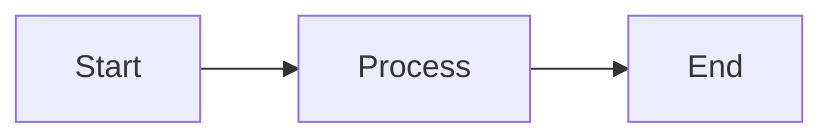

# CSS Reference Document

This document exercises all markdown rendering paths for visual QA.

## Typography & Inline Formatting

Regular paragraph with **bold text**, *italic text*, ~~strikethrough~~, `inline code`, and ==highlighted text==. Links look like [this example](https://example.com).

### Nested Emphasis

Text with ***bold italic***, **bold with `code` inside**, and *italic with ~~strike~~*.

## Lists

### Unordered List
- First item
- Second item with **bold**
  - Nested item one
  - Nested item two
    - Deep nested
- Third item

### Ordered List
1. First numbered
2. Second numbered
   1. Nested numbered
   2. Another nested
3. Third numbered

### Task List
- [x] Completed task
- [ ] Pending task with `code`
  - [x] Nested complete
  - [ ] Nested pending

## Blockquotes

> Simple blockquote with some text.

> Blockquote with **formatting** and `code`.
>
> Second paragraph in quote.
>
> > Nested blockquote inside.

## Code Blocks

Inline: `const x = 42;`

```javascript
// JavaScript with syntax highlighting
function greet(name) {
  return `Hello, ${name}!`;
}

const result = greet("World");
console.log(result);
```

```python
# Python example
def factorial(n):
    if n <= 1:
        return 1
    return n * factorial(n - 1)
```

## Tables

| Feature | Light | Dark | Status |
|---------|-------|------|--------|
| Colors | ✓ | ✓ | Done |
| Spacing | ✓ | ✓ | Done |
| Tokens | ✓ | ✓ | **New** |

## Alerts

> [!NOTE]
> This is a note alert with information.

> [!TIP]
> This is a tip with helpful advice.

> [!IMPORTANT]
> This is an important notice.

> [!WARNING]
> This is a warning message.

> [!CAUTION]
> This is a caution alert.

## Details Block

<details>
<summary>Click to expand</summary>

Hidden content with **formatting** and:
- List item one
- List item two

</details>

## Horizontal Rule

---

## Math

Inline math: $E = mc^2$ and $\sum_{i=1}^{n} x_i$.

Block math:

$$
\int_{-\infty}^{\infty} e^{-x^2} dx = \sqrt{\pi}
$$

## Subscript & Superscript

H~2~O is water. E = mc^2^ uses superscript.

## Wiki Links

Link to [[another document]] and [[page|with display text]].

## Mermaid Diagram



## Footnotes

Here is a sentence with a footnote[^1] and another[^2].

[^1]: This is the first footnote.
[^2]: This is the second footnote with more text.

---

*End of reference document*
