# Mermaid-Diagramme

VMark unterstützt [Mermaid](https://mermaid.js.org/)-Diagramme zum Erstellen von Flussdiagrammen, Sequenzdiagrammen und anderen Visualisierungen direkt in Ihren Markdown-Dokumenten.


## Ein Diagramm einfügen

### Tastaturkürzel verwenden

Geben Sie einen umzäunten Code-Block mit der `mermaid`-Sprachkennung ein:

````markdown
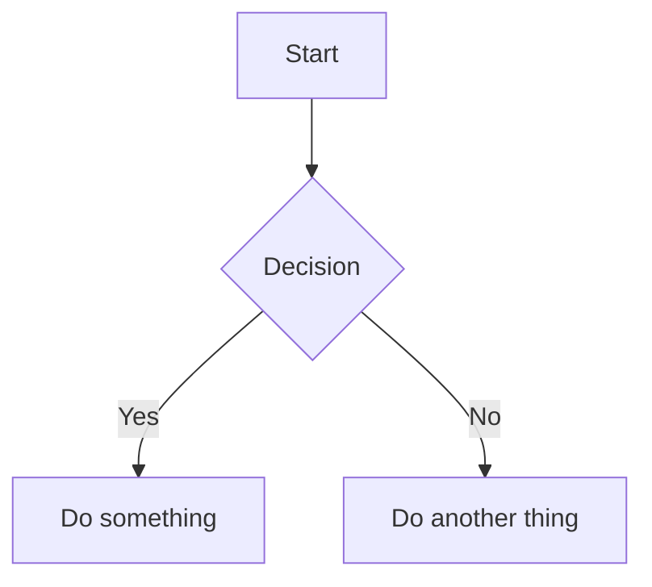
````

### Slash-Befehl verwenden

1. `/` eingeben, um das Befehlsmenü zu öffnen
2. **Mermaid-Diagramm** auswählen
3. Ein Vorlagendiagramm wird für Sie zum Bearbeiten eingefügt

## Bearbeitungsmodi

### Rich-Text-Modus (WYSIWYG)

Im WYSIWYG-Modus werden Mermaid-Diagramme beim Tippen inline gerendert. Klicken Sie auf ein Diagramm, um seinen Quellcode zu bearbeiten.

### Quellmodus mit Live-Vorschau

Im Quellmodus erscheint ein schwebendes Vorschau-Panel, wenn sich Ihr Cursor innerhalb eines Mermaid-Code-Blocks befindet:


| Funktion | Beschreibung |
|----------|--------------|
| **Live-Vorschau** | Gerendertes Diagramm beim Tippen anzeigen (200ms Entprellung) |
| **Ziehen zum Verschieben** | Kopfzeile ziehen, um die Vorschau neu zu positionieren |
| **Größe ändern** | Beliebige Kante oder Ecke ziehen zum Vergrößern/Verkleinern |
| **Zoom** | `−`- und `+`-Schaltflächen verwenden (10% bis 300%) |

Das Vorschau-Panel merkt sich seine Position, wenn Sie es verschieben, sodass Sie Ihren Arbeitsbereich leicht anordnen können.

## Unterstützte Diagrammtypen

VMark unterstützt alle Mermaid-Diagrammtypen:

### Flussdiagramm

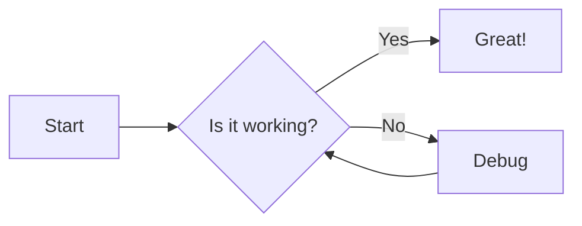

````markdown

````

### Sequenzdiagramm

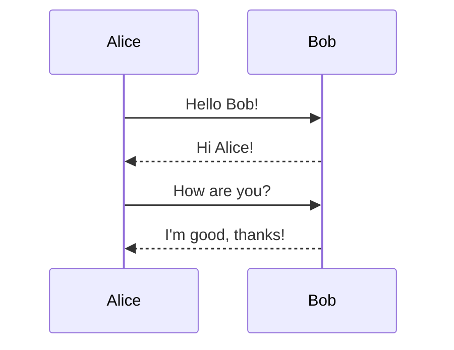

````markdown
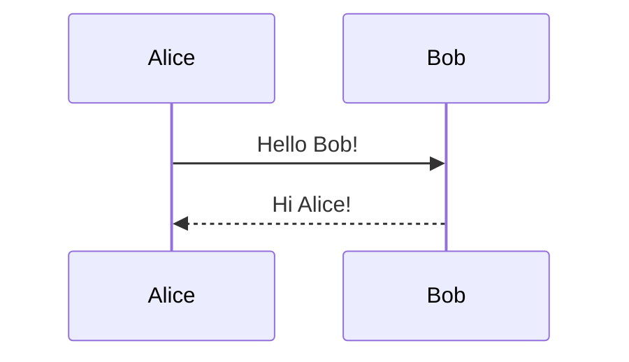
````

### Klassendiagramm

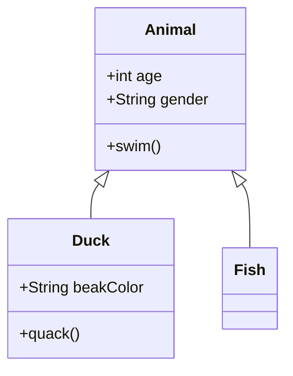

````markdown
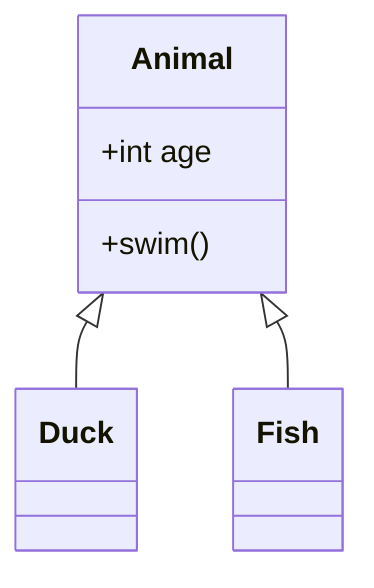
````

### Zustandsdiagramm

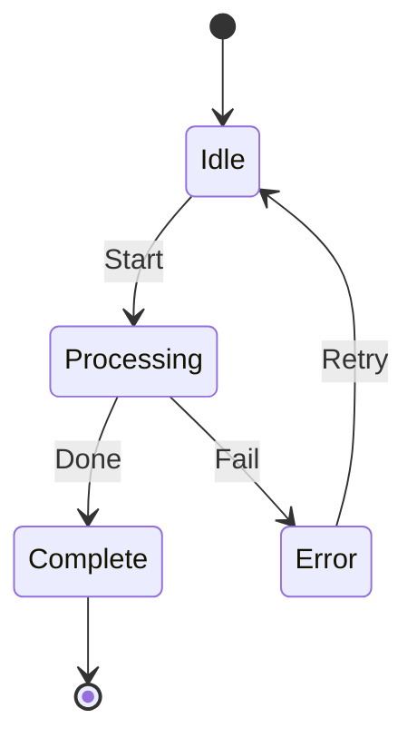

````markdown
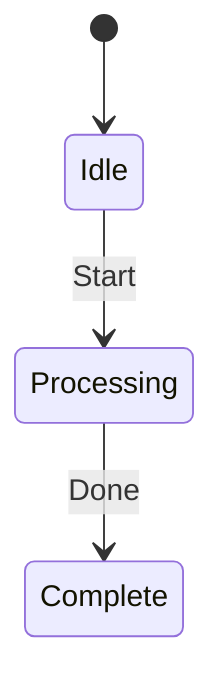
````

### Entity-Relationship-Diagramm

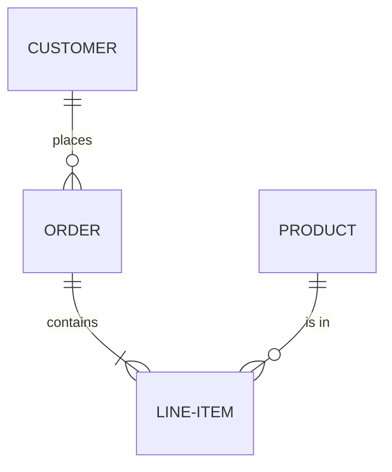

````markdown
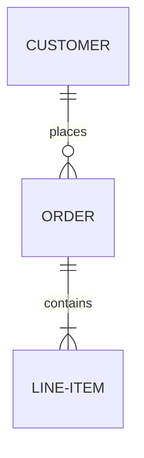
````

### Gantt-Diagramm

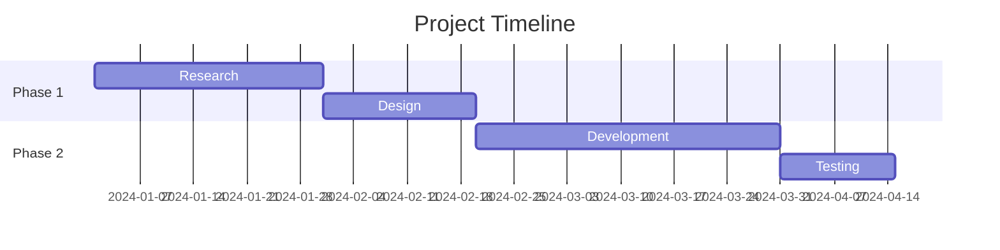

````markdown
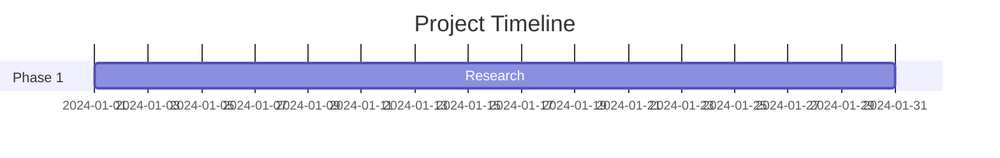
````

### Kreisdiagramm

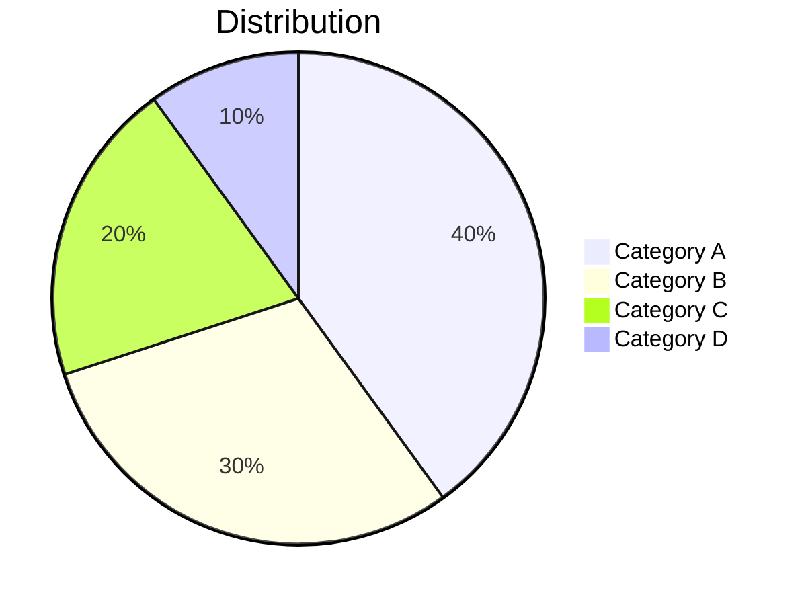

````markdown
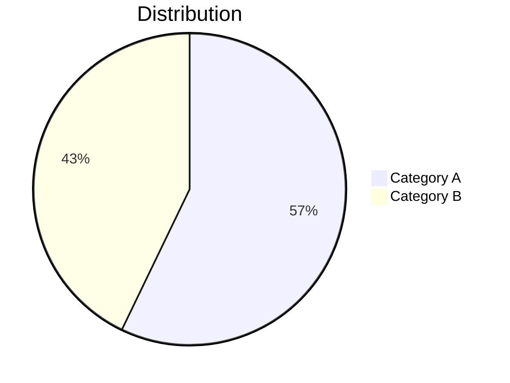
````

### Git-Graph

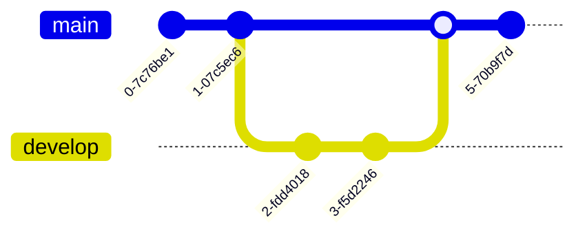

````markdown
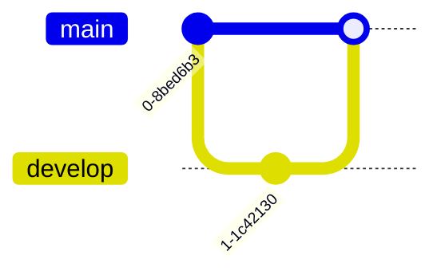
````

## Tipps

### Syntaxfehler

Wenn Ihr Diagramm einen Syntaxfehler hat:
- Im WYSIWYG-Modus: Der Code-Block zeigt den rohen Quellcode
- Im Quellmodus: Die Vorschau zeigt „Ungültige Mermaid-Syntax"

Lesen Sie die [Mermaid-Dokumentation](https://mermaid.js.org/intro/) für korrekte Syntax.

### Schwenken und Zoomen

Im WYSIWYG-Modus unterstützen gerenderte Diagramme interaktive Navigation:

| Aktion | Wie |
|--------|-----|
| **Schwenken** | Scrollen oder das Diagramm klicken und ziehen |
| **Zoomen** | `Cmd` (macOS) oder `Strg` (Windows/Linux) gedrückt halten und scrollen |
| **Zurücksetzen** | Auf die Zurücksetzen-Schaltfläche klicken, die beim Hovern erscheint (obere rechte Ecke) |

### Mermaid-Quellcode kopieren

Beim Bearbeiten eines Mermaid-Code-Blocks im WYSIWYG-Modus erscheint eine **Kopieren**-Schaltfläche in der Bearbeitungskopfzeile. Klicken Sie darauf, um den Mermaid-Quellcode in die Zwischenablage zu kopieren.

### Design-Integration

Mermaid-Diagramme passen sich automatisch an das aktuelle VMark-Design an (White, Paper, Mint, Sepia oder Night).

### Als PNG exportieren

Fahren Sie über ein gerendertes Mermaid-Diagramm im WYSIWYG-Modus, um eine **Export**-Schaltfläche zu enthüllen (oben rechts, links von der Zurücksetzen-Schaltfläche). Klicken Sie darauf, um ein Design zu wählen:

| Design | Hintergrund |
|--------|-------------|
| **Hell** | Weißer Hintergrund |
| **Dunkel** | Dunkler Hintergrund |

Das Diagramm wird als PNG mit 2-facher Auflösung über den System-Speicherdialog exportiert. Das exportierte Bild verwendet einen konkreten System-Schriftart-Stack, sodass Text unabhängig von den auf dem Rechner des Betrachters installierten Schriften korrekt gerendert wird.

### Als HTML/PDF exportieren

Beim Exportieren des vollständigen Dokuments nach HTML oder PDF werden Mermaid-Diagramme als SVG-Bilder gerendert für gestochen scharfe Anzeige in jeder Auflösung.

## KI-generierte Diagramme korrigieren

VMark verwendet **Mermaid v11**, das einen strengeren Parser (Langium) als ältere Versionen hat. KI-Tools (ChatGPT, Claude, Copilot usw.) generieren oft Syntax, die in älteren Mermaid-Versionen funktionierte, aber in v11 fehlschlägt. Hier sind die häufigsten Probleme und wie man sie behebt.

### 1. Nicht-quotierte Beschriftungen mit Sonderzeichen

**Das häufigste Problem.** Wenn eine Knotenbeschriftung Klammern, Apostrophe, Doppelpunkte oder Anführungszeichen enthält, muss sie in doppelte Anführungszeichen eingeschlossen werden.

````markdown
<!-- Schlägt fehl -->
```mermaid
flowchart TD
    A[User's Dashboard] --> B[Step (optional)]
    C[Status: Active] --> D[Say "Hello"]
```

<!-- Funktioniert -->
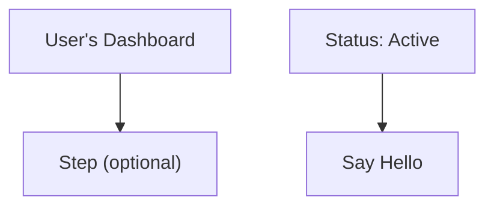
````

**Regel:** Wenn eine Beschriftung eines dieser Zeichen enthält — `' ( ) : " ; # &` — wickeln Sie die gesamte Beschriftung in doppelte Anführungszeichen: `["so wie hier"]`.

### 2. Abschließende Semikolons

KI-Modelle fügen manchmal Semikolons am Zeilenende hinzu. Mermaid v11 erlaubt diese nicht.

````markdown
<!-- Schlägt fehl -->
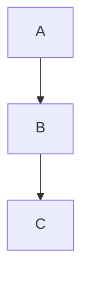

<!-- Funktioniert -->
```mermaid
flowchart TD
    A --> B
    B --> C
```
````

### 3. `graph` statt `flowchart` verwenden

Das Schlüsselwort `graph` ist veraltete Syntax. Einige neuere Funktionen funktionieren nur mit `flowchart`. Bevorzugen Sie `flowchart` für alle neuen Diagramme.

````markdown
<!-- Kann mit neuerer Syntax fehlschlagen -->
```mermaid
graph TD
    A --> B
```

<!-- Bevorzugt -->
```mermaid
flowchart TD
    A --> B
```
````

### 4. Subgraph-Titel mit Sonderzeichen

Subgraph-Titel folgen denselben Quotierungsregeln wie Knotenbeschriftungen.

````markdown
<!-- Schlägt fehl -->
```mermaid
flowchart TD
    subgraph Service Layer (Backend)
        A --> B
    end
```

<!-- Funktioniert -->
```mermaid
flowchart TD
    subgraph "Service Layer (Backend)"
        A --> B
    end
```
````

### 5. Schnellkorrektur-Checkliste

Wenn ein KI-generiertes Diagramm „Ungültige Syntax" zeigt:

1. **Alle Beschriftungen quotieren**, die Sonderzeichen enthalten: `["Beschriftung (mit Klammern)"]`
2. **Abschließende Semikolons entfernen** von jeder Zeile
3. **`graph` durch `flowchart` ersetzen**, wenn neuere Syntaxfunktionen verwendet werden
4. **Subgraph-Titel quotieren**, die Sonderzeichen enthalten
5. **Im [Mermaid Live Editor](https://mermaid.live/) testen**, um den genauen Fehler zu finden

::: tip
Wenn Sie KI bitten, Mermaid-Diagramme zu generieren, fügen Sie dies Ihrem Prompt hinzu: *„Verwende Mermaid v11-Syntax. Wickle Knotenbeschriftungen immer in doppelte Anführungszeichen ein, wenn sie Sonderzeichen enthalten. Verwende keine abschließenden Semikolons."*
:::

## Ihre KI auf gültiges Mermaid trainieren

Anstatt Diagramme jedes Mal manuell zu korrigieren, können Sie Tools installieren, die Ihren KI-Coding-Assistenten beibringen, von Anfang an korrekte Mermaid v11-Syntax zu generieren.

### Mermaid Skill (Syntaxreferenz)

Ein Skill gibt Ihrer KI Zugang zu aktueller Mermaid-Syntaxdokumentation für alle 23 Diagrammtypen, sodass sie korrekten Code generiert statt zu raten.

**Quelle:** [WH-2099/mermaid-skill](https://github.com/WH-2099/mermaid-skill)

#### Claude Code

```bash
# Skill klonen
git clone https://github.com/WH-2099/mermaid-skill.git /tmp/mermaid-skill

# Global installieren (in allen Projekten verfügbar)
mkdir -p ~/.claude/skills/mermaid
cp -r /tmp/mermaid-skill/.claude/skills/mermaid/* ~/.claude/skills/mermaid/

# Oder nur pro Projekt installieren
mkdir -p .claude/skills/mermaid
cp -r /tmp/mermaid-skill/.claude/skills/mermaid/* .claude/skills/mermaid/
```

Nach der Installation `/mermaid <Beschreibung>` in Claude Code verwenden, um Diagramme mit korrekter Syntax zu generieren.

#### Codex (OpenAI)

```bash
# Gleiche Dateien, anderer Speicherort
mkdir -p ~/.codex/skills/mermaid
cp -r /tmp/mermaid-skill/.claude/skills/mermaid/* ~/.codex/skills/mermaid/
```

#### Gemini CLI (Google)

Gemini CLI liest Skills aus `~/.gemini/` oder pro Projekt `.gemini/`. Kopieren Sie die Referenzdateien und fügen Sie eine Anweisung zu Ihrer `GEMINI.md` hinzu:

```bash
mkdir -p ~/.gemini/skills/mermaid
cp -r /tmp/mermaid-skill/.claude/skills/mermaid/references ~/.gemini/skills/mermaid/
```

Dann zu Ihrer `GEMINI.md` hinzufügen (global `~/.gemini/GEMINI.md` oder pro Projekt):

```markdown
## Mermaid Diagrams

When generating Mermaid diagrams, read the syntax reference in
~/.gemini/skills/mermaid/references/ for the diagram type you are
generating. Use Mermaid v11 syntax: always quote node labels containing
special characters, do not use trailing semicolons, prefer "flowchart"
over "graph".
```

### Mermaid Validator MCP-Server (Syntaxprüfung)

Ein MCP-Server ermöglicht es Ihrer KI, Diagramme zu **validieren**, bevor sie Ihnen präsentiert werden. Er erkennt Fehler mit denselben Parsern (Jison + Langium), die Mermaid v11 intern verwendet.

**Quelle:** [fast-mermaid-validator-mcp](https://github.com/ai-of-mine/fast-mermaid-validator-mcp)

#### Claude Code

```bash
# Ein Befehl — installiert global
claude mcp add -s user --transport stdio mermaid-validator \
  -- npx -y @ai-of-mine/fast-mermaid-validator-mcp --mcp-stdio
```

Dies registriert einen `mermaid-validator`-MCP-Server, der drei Tools bereitstellt:

| Tool | Zweck |
|------|-------|
| `validate_mermaid` | Syntax eines einzelnen Diagramms prüfen |
| `validate_file` | Diagramme innerhalb von Markdown-Dateien validieren |
| `get_examples` | Beispieldiagramme für alle 28 unterstützten Typen abrufen |

#### Codex (OpenAI)

```bash
codex mcp add --transport stdio mermaid-validator \
  -- npx -y @ai-of-mine/fast-mermaid-validator-mcp --mcp-stdio
```

#### Claude Desktop

Zu Ihrer `claude_desktop_config.json` hinzufügen (Einstellungen > Entwickler > Konfiguration bearbeiten):

```json
{
  "mcpServers": {
    "mermaid-validator": {
      "command": "npx",
      "args": ["-y", "@ai-of-mine/fast-mermaid-validator-mcp", "--mcp-stdio"]
    }
  }
}
```

#### Gemini CLI (Google)

Zu Ihrer `~/.gemini/settings.json` hinzufügen (oder pro Projekt `.gemini/settings.json`):

```json
{
  "mcpServers": {
    "mermaid-validator": {
      "command": "npx",
      "args": ["-y", "@ai-of-mine/fast-mermaid-validator-mcp", "--mcp-stdio"]
    }
  }
}
```

::: info Voraussetzungen
Beide Tools erfordern [Node.js](https://nodejs.org/) (v18 oder höher) auf Ihrem Rechner. Der MCP-Server wird beim ersten Einsatz automatisch über `npx` heruntergeladen.
:::

## Mermaid-Syntax erlernen

VMark rendert Standard-Mermaid-Syntax. Um die Diagrammerstellung zu meistern, lesen Sie die offizielle Mermaid-Dokumentation:

### Offizielle Dokumentation

| Diagrammtyp | Dokumentationslink |
|-------------|-------------------|
| Flussdiagramm | [Flussdiagramm-Syntax](https://mermaid.js.org/syntax/flowchart.html) |
| Sequenzdiagramm | [Sequenzdiagramm-Syntax](https://mermaid.js.org/syntax/sequenceDiagram.html) |
| Klassendiagramm | [Klassendiagramm-Syntax](https://mermaid.js.org/syntax/classDiagram.html) |
| Zustandsdiagramm | [Zustandsdiagramm-Syntax](https://mermaid.js.org/syntax/stateDiagram.html) |
| Entity-Relationship | [ER-Diagramm-Syntax](https://mermaid.js.org/syntax/entityRelationshipDiagram.html) |
| Gantt-Diagramm | [Gantt-Syntax](https://mermaid.js.org/syntax/gantt.html) |
| Kreisdiagramm | [Kreisdiagramm-Syntax](https://mermaid.js.org/syntax/pie.html) |
| Git-Graph | [Git-Graph-Syntax](https://mermaid.js.org/syntax/gitgraph.html) |

### Übungstools

- **[Mermaid Live Editor](https://mermaid.live/)** — Interaktive Spielwiese zum Testen und Voranzeigen von Diagrammen vor dem Einfügen in VMark
- **[Mermaid-Dokumentation](https://mermaid.js.org/)** — Vollständige Referenz mit Beispielen für alle Diagrammtypen

::: tip
Der Live Editor ist großartig zum Experimentieren mit komplexen Diagrammen. Sobald Ihr Diagramm richtig aussieht, kopieren Sie den Code in VMark.
:::
