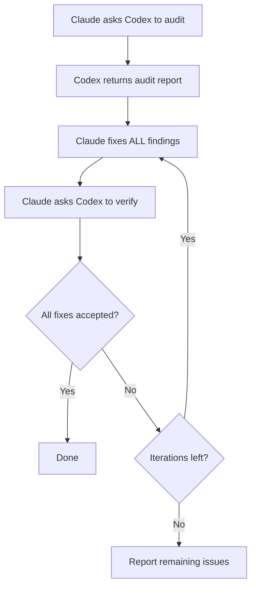

# Modellübergreifende Verifikation

VMark verwendet zwei KI-Modelle, die sich gegenseitig herausfordern: **Claude schreibt den Code, Codex prüft ihn**. Dieses adversarielle Setup findet Bugs, die ein einzelnes Modell übersehen würde.

## Warum zwei Modelle besser sind als eines

Jedes KI-Modell hat blinde Flecken. Es könnte bestimmte Bug-Kategorien konsequent übersehen, bestimmte Muster sichereren Alternativen vorziehen oder seine eigenen Annahmen nicht hinterfragen. Wenn dasselbe Modell Code schreibt und überprüft, überleben diese blinden Flecken beide Durchgänge.

Modellübergreifende Verifikation durchbricht dies:

1. **Claude** (Anthropic) schreibt die Implementierung — es versteht den vollen Kontext, befolgt Projektkonventionen und wendet TDD an.
2. **Codex** (OpenAI) prüft das Ergebnis unabhängig — es liest den Code mit frischen Augen, trainiert auf anderen Daten, mit anderen Fehlermustern.

Die Modelle sind grundlegend verschieden. Sie wurden von separaten Teams entwickelt, auf verschiedenen Datensätzen trainiert, mit unterschiedlichen Architekturen und Optimierungszielen. Wenn beide einig sind, dass der Code korrekt ist, ist Ihr Vertrauen viel höher als die „Sieht gut aus für mich"-Aussage eines einzelnen Modells.

Forschung unterstützt diesen Ansatz aus mehreren Blickwinkeln. Multi-Agent-Debatte — wo mehrere LLM-Instanzen die Antworten der anderen herausfordern — verbessert Faktizität und Reasoning-Genauigkeit erheblich[^1]. Rollenspiel-Prompting, bei dem Modellen spezifische Expertenrollen zugewiesen werden, übertrifft konsistent Standard-Zero-Shot-Prompting bei Reasoning-Benchmarks[^2]. Und neuere Arbeit zeigt, dass Frontier-LLMs erkennen können, wenn sie bewertet werden, und ihr Verhalten entsprechend anpassen[^3] — was bedeutet, dass ein Modell, das weiß, dass seine Ausgabe von einer anderen KI untersucht wird, wahrscheinlich sorgfältigere, weniger schmeichlerische Arbeit produziert[^4].

### Was modellübergreifende Verifikation erkennt

In der Praxis findet das zweite Modell Probleme wie:

- **Logikfehler**, die das erste Modell zuversichtlich eingeführt hat
- **Edge Cases**, die das erste Modell nicht berücksichtigt hat (null, leer, Unicode, gleichzeitiger Zugriff)
- **Toter Code**, der nach dem Refactoring zurückgelassen wurde
- **Sicherheitsmuster**, die das Training des ersten Modells nicht markiert hat (Pfadtraversierung, Injektion)
- **Konventionsverstöße**, die das schreibende Modell rationalisiert hat
- **Copy-Paste-Bugs**, bei denen das Modell Code mit subtilen Fehlern dupliziert hat

Dies ist dasselbe Prinzip wie menschliches Code-Review — ein zweites Augenpaar erkennt Dinge, die der Autor nicht sehen kann — außer dass beide „Reviewer" und „Autor" unermüdlich sind und ganze Codebasen in Sekunden verarbeiten können.

## So funktioniert es in VMark

### Das Codex Toolkit Plugin

VMark verwendet das `codex-toolkit@xiaolai` Claude Code-Plugin, das Codex als MCP-Server bündelt. Wenn das Plugin aktiviert ist, erhält Claude Code automatisch Zugriff auf ein `codex` MCP-Tool — einen Kanal, um Prompts an Codex zu senden und strukturierte Antworten zu empfangen. Codex läuft in einem **sandboxten, schreibgeschützten Kontext**: Es kann die Codebasis lesen, aber keine Dateien ändern. Alle Änderungen werden von Claude vorgenommen.

### Einrichtung

1. Codex CLI global installieren und authentifizieren:

```bash
npm install -g @openai/codex
codex login                   # Mit ChatGPT-Abonnement anmelden (empfohlen)
```

2. Das codex-toolkit-Plugin in Claude Code installieren und aktivieren:

```bash
claude plugin install codex-toolkit@xiaolai --scope project
```

3. Überprüfen, ob Codex verfügbar ist:

```bash
codex --version
```

Das war's. Das Plugin registriert den Codex MCP-Server automatisch — kein manueller `.mcp.json`-Eintrag erforderlich.

::: tip Abonnement vs. API
Verwenden Sie `codex login` (ChatGPT-Abonnement) anstelle von `OPENAI_API_KEY` für dramatisch niedrigere Kosten. Siehe [Abonnement vs. API-Preisgestaltung](/de/guide/users-as-developers/subscription-vs-api).
:::

::: tip PATH für macOS-GUI-Apps
macOS-GUI-Apps haben einen minimalen PATH. Wenn `codex --version` in Ihrem Terminal funktioniert, Claude Code es aber nicht findet, fügen Sie den Codex-Binärpfad zu Ihrem Shell-Profil (`~/.zshrc` oder `~/.bashrc`) hinzu.
:::

::: tip Projektkonfiguration
Führen Sie `/codex-toolkit:init` aus, um eine `.codex-toolkit.md`-Konfigurationsdatei mit projektspezifischen Standardwerten zu generieren (Audit-Fokus, Aufwandsniveau, Überspringmuster).
:::

## Slash-Befehle

Das `codex-toolkit`-Plugin bietet vorgefertigte Slash-Befehle, die Claude + Codex-Workflows orchestrieren. Sie müssen die Interaktion nicht manuell verwalten — rufen Sie einfach den Befehl auf und die Modelle koordinieren sich automatisch.

### `/codex-toolkit:audit` — Code-Audit

Der primäre Audit-Befehl. Unterstützt zwei Modi:

- **Mini (Standard)** — Schnelle 5-dimensionale Prüfung: Logik, Duplikation, toter Code, Refactoring-Schulden, Abkürzungen
- **Vollständig (`--full`)** — Gründliches 9-dimensionales Audit, das Sicherheit, Performance, Compliance, Abhängigkeiten, Dokumentation hinzufügt

| Dimension | Was geprüft wird |
|-----------|-----------------|
| 1. Redundanter Code | Toter Code, Duplikate, ungenutzte Imports |
| 2. Sicherheit | Injektion, Pfadtraversierung, XSS, hartcodierte Secrets |
| 3. Korrektheit | Logikfehler, Race Conditions, Null-Behandlung |
| 4. Compliance | Projektkonventionen, Zustand-Muster, CSS-Token |
| 5. Wartbarkeit | Komplexität, Dateigröße, Benennung, Import-Hygiene |
| 6. Performance | Unnötige Re-Renders, blockierende Operationen |
| 7. Tests | Coverage-Lücken, fehlende Edge-Case-Tests |
| 8. Abhängigkeiten | Bekannte CVEs, Konfigurationssicherheit |
| 9. Dokumentation | Fehlende Docs, veraltete Kommentare, Website-Sync |

Verwendung:

```
/codex-toolkit:audit                  # Mini-Audit auf nicht committeten Änderungen
/codex-toolkit:audit --full           # Vollständiges 9-dimensionales Audit
/codex-toolkit:audit commit -3        # Letzte 3 Commits auditieren
/codex-toolkit:audit src/stores/      # Ein bestimmtes Verzeichnis auditieren
```

Die Ausgabe ist ein strukturierter Bericht mit Schweregradeinschätzungen (Kritisch / Hoch / Mittel / Niedrig) und vorgeschlagenen Fixes für jeden Befund.

### `/codex-toolkit:verify` — Vorherige Fixes verifizieren

Nachdem Sie Audit-Befunde behoben haben, lassen Sie Codex bestätigen, dass die Fixes korrekt sind:

```
/codex-toolkit:verify                 # Fixes vom letzten Audit verifizieren
```

Codex liest jede Datei an den gemeldeten Stellen erneut und markiert jedes Problem als behoben, nicht behoben oder teilweise behoben. Es führt auch Stichprobenprüfungen auf neue Probleme durch, die durch die Fixes eingeführt wurden.

### `/codex-toolkit:audit-fix` — Die vollständige Schleife

Der mächtigste Befehl. Er verkettet Audit → Fix → Verify in einer Schleife:

```
/codex-toolkit:audit-fix              # Schleife auf nicht committeten Änderungen
/codex-toolkit:audit-fix commit -1    # Schleife auf letztem Commit
```

Was passiert:



Die Schleife endet, wenn Codex keine Befunde über alle Schweregrade berichtet, oder nach 3 Iterationen (wobei verbleibende Probleme an Sie gemeldet werden).

### `/codex-toolkit:implement` — Autonome Implementierung

Einen Plan an Codex zur vollständigen autonomen Implementierung senden:

```
/codex-toolkit:implement              # Aus einem Plan implementieren
```

### `/codex-toolkit:bug-analyze` — Ursachenanalyse

Ursachenanalyse für nutzerbeschriebene Bugs:

```
/codex-toolkit:bug-analyze            # Einen Bug analysieren
```

### `/codex-toolkit:review-plan` — Plan-Review

Einen Plan an Codex zur Architekturprüfung senden:

```
/codex-toolkit:review-plan            # Einen Plan auf Konsistenz und Risiken prüfen
```

### `/codex-toolkit:continue` — Eine Sitzung fortsetzen

Eine vorherige Codex-Sitzung fortsetzen, um Befunde zu iterieren:

```
/codex-toolkit:continue               # Dort weitermachen, wo Sie aufgehört haben
```

### `/fix-issue` — End-to-End Issue-Löser

Dieser projektspezifische Befehl führt die vollständige Pipeline für ein GitHub-Issue aus:

```
/fix-issue #123               # Ein einzelnes Issue beheben
/fix-issue #123 #456 #789     # Mehrere Issues parallel beheben
```

Die Pipeline:
1. **Abrufen** des Issues von GitHub
2. **Klassifizieren** (Bug, Feature oder Frage)
3. **Branch-Erstellung** mit einem beschreibenden Namen
4. **Fix** mit TDD (RED → GREEN → REFACTOR)
5. **Codex-Audit-Schleife** (bis zu 3 Runden von Audit → Fix → Verify)
6. **Gate** (`pnpm check:all` + `cargo check` bei Rust-Änderungen)
7. **PR-Erstellung** mit strukturierter Beschreibung

Das modellübergreifende Audit ist in Schritt 5 eingebaut — jeder Fix durchläuft adversarielle Prüfung, bevor der PR erstellt wird.

## Spezialisierte Agenten und Planung

Über Audit-Befehle hinaus umfasst VMarcks KI-Setup höherwertige Orchestrierung:

### `/feature-workflow` — Agentengesteuertes Entwicklung

Für komplexe Features setzt dieser Befehl ein Team spezialisierter Unteragenten ein:

| Agent | Rolle |
|-------|-------|
| **Planer** | Best Practices recherchieren, Edge Cases brainstormen, modulare Pläne erstellen |
| **Spec Guardian** | Plan gegen Projektregeln und Spezifikationen validieren |
| **Impact Analyst** | Minimale Änderungsmengen und Abhängigkeitskanten kartieren |
| **Implementierer** | TDD-gesteuertes Implementieren mit Vorab-Untersuchung |
| **Prüfer** | Diffs auf Korrektheit und Regelverstöße überprüfen |
| **Test-Runner** | Gates ausführen, E2E-Tests koordinieren |
| **Verifizierer** | Abschließende Vor-Release-Checkliste |
| **Release Steward** | Commit-Nachrichten und Release-Notes |

Verwendung:

```
/feature-workflow sidebar-redesign
```

### Planungs-Skill

Der Planungs-Skill erstellt strukturierte Implementierungspläne mit:

- Expliziten Arbeitselementen (WI-001, WI-002, ...)
- Akzeptanzkriterien für jedes Element
- Zuerst zu schreibenden Tests (TDD)
- Risikominderungen und Rollback-Strategien
- Migrationsplänen bei Datenänderungen

Pläne werden in `dev-docs/plans/` als Referenz während der Implementierung gespeichert.

## Ad-hoc-Codex-Konsultation

Über strukturierte Befehle hinaus können Sie Claude jederzeit bitten, Codex zu konsultieren:

```
Summarize your trouble, and ask Codex for help.
```

Claude formuliert eine Frage, sendet sie über MCP an Codex und integriert die Antwort. Dies ist nützlich, wenn Claude bei einem Problem steckt oder Sie eine zweite Meinung zu einem Ansatz möchten.

Sie können auch spezifisch sein:

```
Ask Codex whether this Zustand pattern could cause stale state.
```

```
Have Codex review the SQL in this migration for edge cases.
```

## Fallback: Wenn Codex nicht verfügbar ist

Alle Befehle werden graceful degradiert, wenn Codex MCP nicht verfügbar ist (nicht installiert, Netzwerkprobleme usw.):

1. Der Befehl pingt Codex zuerst (`Respond with 'ok'`)
2. Wenn keine Antwort: **manuelles Audit** startet automatisch
3. Claude liest jede Datei direkt und führt dieselbe dimensionale Analyse durch
4. Das Audit findet trotzdem statt — nur einzelmodellbasiert statt modellübergreifend

Sie müssen sich nie sorgen, dass Befehle fehlschlagen, weil Codex ausgefallen ist. Sie produzieren immer ein Ergebnis.

## Die Philosophie

Die Idee ist einfach: **Vertrauen, aber mit einem anderen Gehirn verifizieren.**

Menschliche Teams tun dies auf natürliche Weise. Ein Entwickler schreibt Code, ein Kollege überprüft ihn, und ein QA-Ingenieur testet ihn. Jede Person bringt unterschiedliche Erfahrung, unterschiedliche blinde Flecken und unterschiedliche mentale Modelle mit. VMark wendet dasselbe Prinzip auf KI-Tools an:

- **Verschiedene Trainingsdaten** → Verschiedene Wissenslücken
- **Verschiedene Architekturen** → Verschiedene Reasoning-Muster
- **Verschiedene Fehlermuster** → Bugs, die eines erkennt, die das andere übersieht

Die Kosten sind minimal (ein paar Sekunden API-Zeit pro Audit), aber die Qualitätsverbesserung ist erheblich. In VMarcks Erfahrung findet das zweite Modell typischerweise 2–5 zusätzliche Probleme pro Audit, die das erste Modell übersehen hat.

[^1]: Du, Y., Li, S., Torralba, A., Tenenbaum, J.B., & Mordatch, I. (2024). [Improving Factuality and Reasoning in Language Models through Multiagent Debate](https://arxiv.org/abs/2305.14325). *ICML 2024*. Mehrere LLM-Instanzen, die Antworten über mehrere Runden vorschlagen und debattieren, verbessern Faktizität und Reasoning erheblich, selbst wenn alle Modelle zunächst falsche Antworten produzieren.

[^2]: Kong, A., Zhao, S., Chen, H., Li, Q., Qin, Y., Sun, R., & Zhou, X. (2024). [Better Zero-Shot Reasoning with Role-Play Prompting](https://arxiv.org/abs/2308.07702). *NAACL 2024*. Die Zuweisung aufgabenspezifischer Expertenrollen an LLMs übertrifft konsistent Standard-Zero-Shot und Zero-Shot-Chain-of-Thought-Prompting über 12 Reasoning-Benchmarks hinweg.

[^3]: Needham, J., Edkins, G., Pimpale, G., Bartsch, H., & Hobbhahn, M. (2025). [Large Language Models Often Know When They Are Being Evaluated](https://arxiv.org/abs/2505.23836). Frontier-Modelle können Bewertungskontexte von realen Einsätzen unterscheiden (Gemini-2.5-Pro erreicht AUC 0,83), was Implikationen dafür hat, wie Modelle sich verhalten, wenn sie wissen, dass eine andere KI ihre Ausgabe überprüfen wird.

[^4]: Sharma, M., Tong, M., Korbak, T., et al. (2024). [Towards Understanding Sycophancy in Language Models](https://arxiv.org/abs/2310.13548). *ICLR 2024*. LLMs, die mit menschlichem Feedback trainiert wurden, neigen dazu, den bestehenden Überzeugungen der Nutzer zuzustimmen, anstatt wahrheitsgemäße Antworten zu liefern. Wenn der Bewerter eine andere KI anstatt ein Mensch ist, wird dieser schmeichlerische Druck beseitigt, was zu ehrlicherer und rigoroserer Ausgabe führt.
