# Diagramas Mermaid

VMark soporta diagramas [Mermaid](https://mermaid.js.org/) para crear diagramas de flujo, diagramas de secuencia y otras visualizaciones directamente en tus documentos Markdown.


## Insertar un Diagrama

### Usando Atajo de Teclado

Escribe un bloque de código delimitado con el identificador de lenguaje `mermaid`:

````markdown
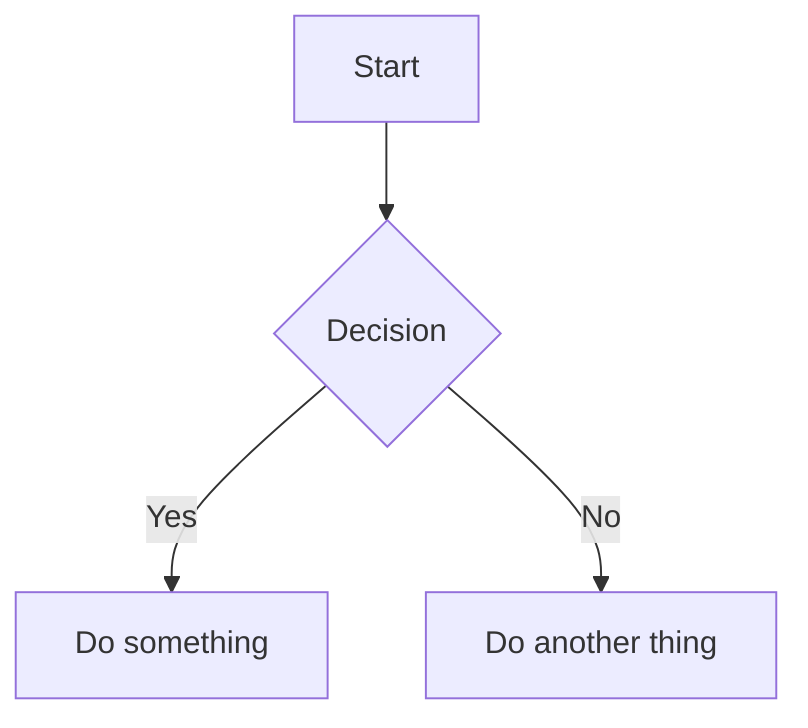
````

### Usando el Comando de Barra

1. Escribe `/` para abrir el menú de comandos
2. Selecciona **Diagrama Mermaid**
3. Se inserta un diagrama de plantilla para que lo edites

## Modos de Edición

### Modo Texto Enriquecido (WYSIWYG)

En el modo WYSIWYG, los diagramas Mermaid se renderizan en línea mientras escribes. Haz clic en un diagrama para editar su código fuente.

### Modo Fuente con Vista Previa en Vivo

En el modo Fuente, aparece un panel de vista previa flotante cuando el cursor está dentro de un bloque de código mermaid:


| Función | Descripción |
|---------|-------------|
| **Vista Previa en Vivo** | Ve el diagrama renderizado mientras escribes (debounce de 200ms) |
| **Arrastrar para Mover** | Arrastra el encabezado para reposicionar la vista previa |
| **Redimensionar** | Arrastra cualquier borde o esquina para redimensionar |
| **Zoom** | Usa los botones `−` y `+` (10% a 300%) |

El panel de vista previa recuerda su posición si lo mueves, lo que facilita organizar tu espacio de trabajo.

## Tipos de Diagramas Admitidos

VMark admite todos los tipos de diagramas Mermaid:

### Diagrama de Flujo

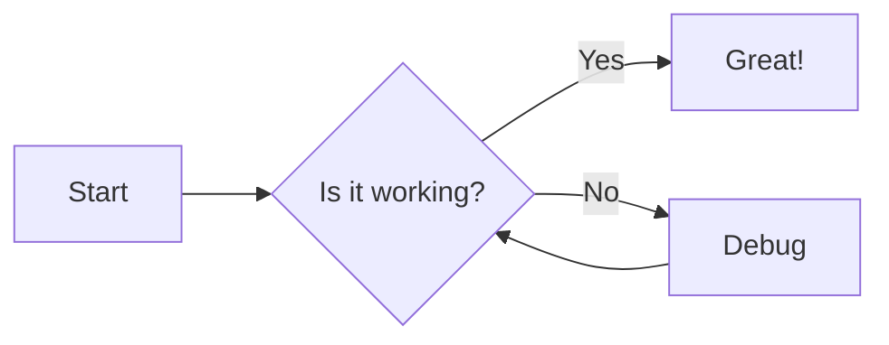

````markdown

````

### Diagrama de Secuencia

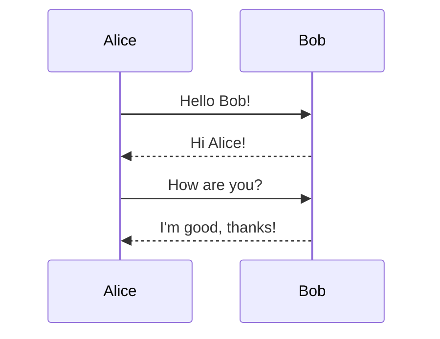

````markdown
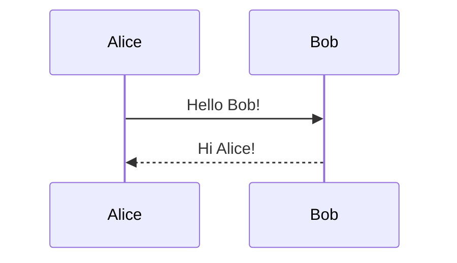
````

### Diagrama de Clases

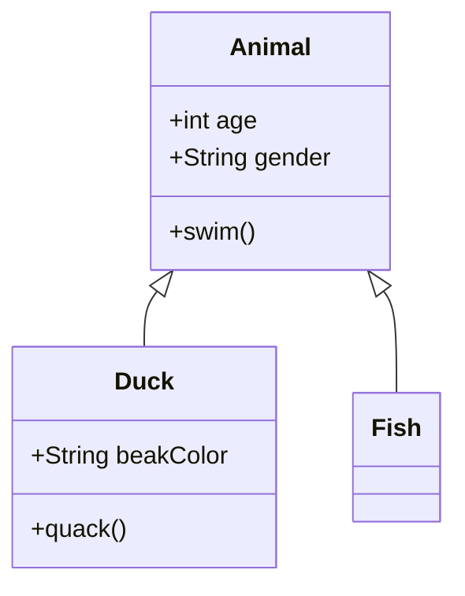

````markdown
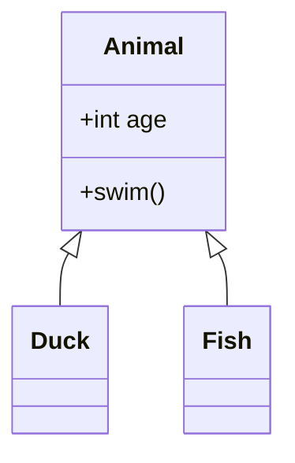
````

### Diagrama de Estado

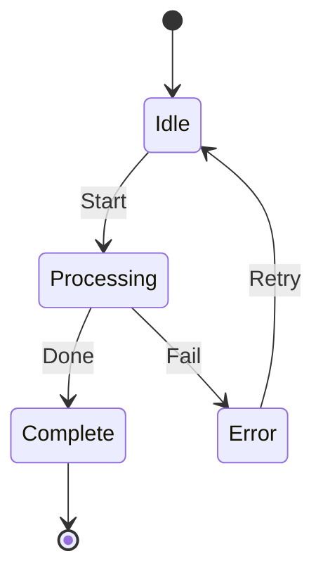

````markdown
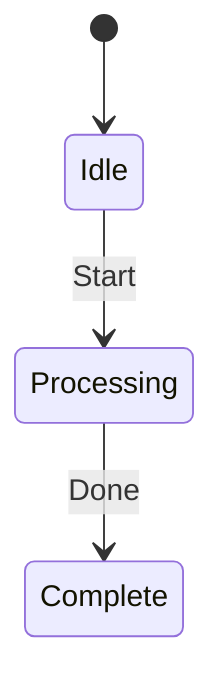
````

### Diagrama de Entidad-Relación

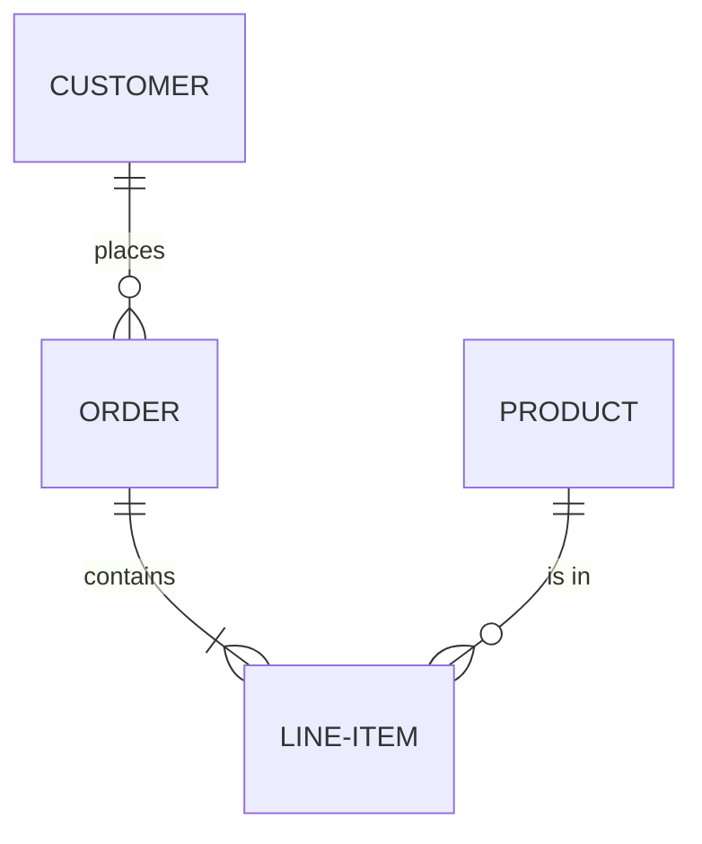

````markdown
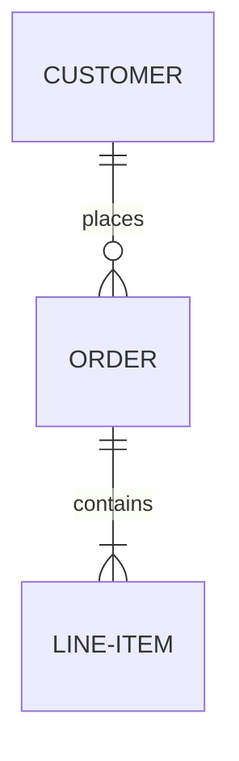
````

### Diagrama de Gantt

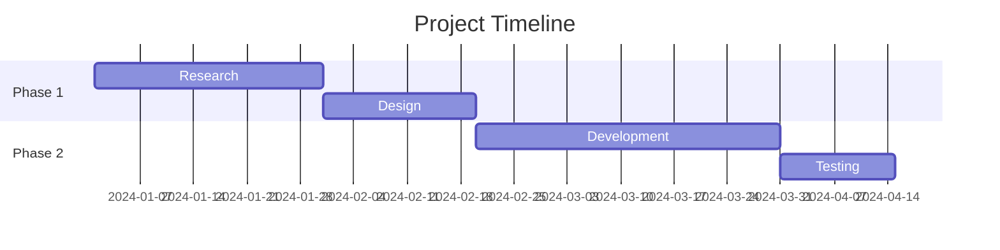

````markdown
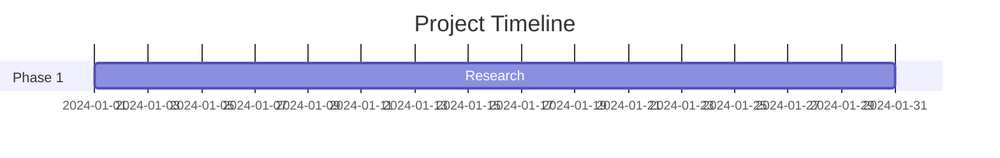
````

### Gráfico Circular

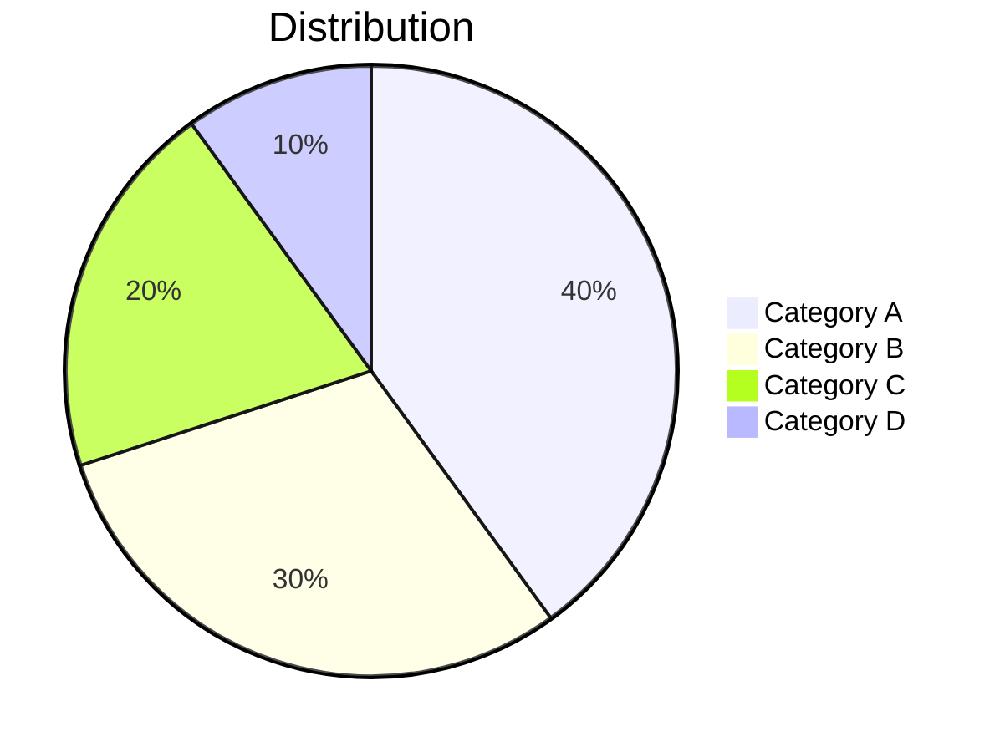

````markdown
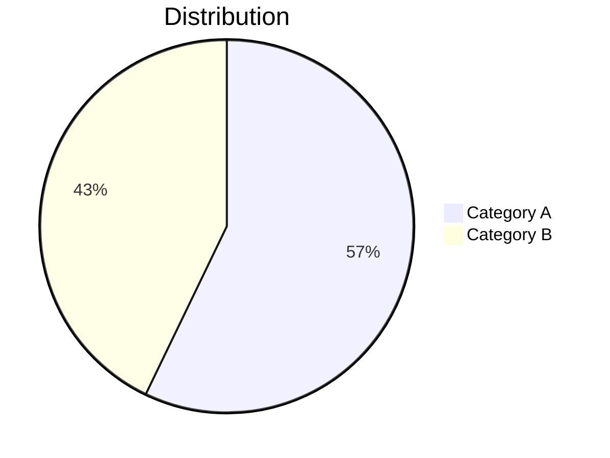
````

### Grafo de Git

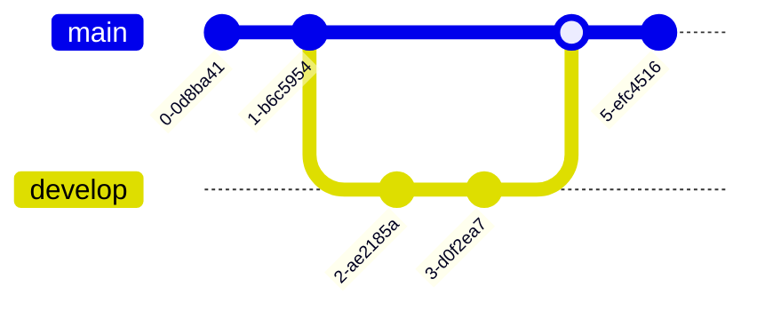

````markdown
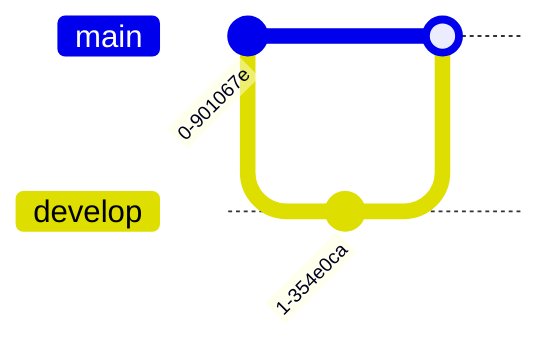
````

## Consejos

### Errores de Sintaxis

Si tu diagrama tiene un error de sintaxis:
- En el modo WYSIWYG: el bloque de código muestra el código fuente sin procesar
- En el modo Fuente: la vista previa muestra "Sintaxis mermaid no válida"

Consulta la [documentación de Mermaid](https://mermaid.js.org/intro/) para la sintaxis correcta.

### Panorámica y Zoom

En el modo WYSIWYG, los diagramas renderizados admiten navegación interactiva:

| Acción | Cómo |
|--------|------|
| **Panorámica** | Desplaza o haz clic y arrastra el diagrama |
| **Zoom** | Mantén `Cmd` (macOS) o `Ctrl` (Windows/Linux) y desplaza |
| **Restablecer** | Haz clic en el botón de restablecimiento que aparece al pasar el ratón (esquina superior derecha) |

### Copiar Código Fuente de Mermaid

Al editar un bloque de código mermaid en el modo WYSIWYG, aparece un botón de **copiar** en el encabezado de edición. Haz clic en él para copiar el código fuente de mermaid al portapapeles.

### Integración de Temas

Los diagramas Mermaid se adaptan automáticamente al tema actual de VMark (White, Paper, Mint, Sepia o Night).

### Exportar como PNG

Pasa el ratón sobre un diagrama mermaid renderizado en el modo WYSIWYG para mostrar un botón de **exportar** (arriba a la derecha, a la izquierda del botón de restablecimiento). Haz clic en él para elegir un tema:

| Tema | Fondo |
|------|-------|
| **Claro** | Fondo blanco |
| **Oscuro** | Fondo oscuro |

El diagrama se exporta como PNG de resolución 2x a través del cuadro de diálogo de guardado del sistema. La imagen exportada usa una pila de fuentes del sistema concreta, por lo que el texto se renderiza correctamente independientemente de las fuentes instaladas en la máquina del espectador.

### Exportar como HTML/PDF

Al exportar el documento completo a HTML o PDF, los diagramas Mermaid se renderizan como imágenes SVG para una visualización nítida a cualquier resolución.

## Corregir Diagramas Generados por IA

VMark usa **Mermaid v11**, que tiene un analizador más estricto (Langium) que las versiones anteriores. Las herramientas de IA (ChatGPT, Claude, Copilot, etc.) a menudo generan sintaxis que funcionaba en versiones anteriores de Mermaid pero falla en v11. Aquí están los problemas más comunes y cómo solucionarlos.

### 1. Etiquetas Sin Comillas con Caracteres Especiales

**El problema más frecuente.** Si una etiqueta de nodo contiene paréntesis, apóstrofos, dos puntos o comillas, debe estar entre comillas dobles.

````markdown
<!-- Falla -->
```mermaid
flowchart TD
    A[User's Dashboard] --> B[Step (optional)]
    C[Status: Active] --> D[Say "Hello"]
```

<!-- Funciona -->
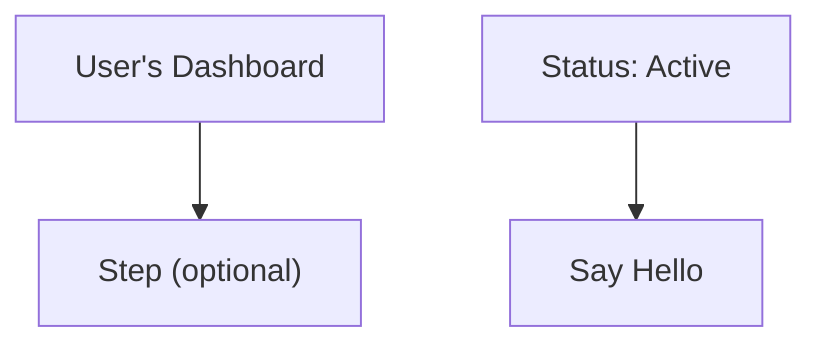
````

**Regla:** Si una etiqueta contiene alguno de estos caracteres — `' ( ) : " ; # &` — envuelve toda la etiqueta entre comillas dobles: `["así"]`.

### 2. Punto y Coma al Final de Línea

Los modelos de IA a veces añaden punto y coma al final de las líneas. Mermaid v11 no los permite.

````markdown
<!-- Falla -->
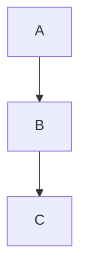

<!-- Funciona -->
```mermaid
flowchart TD
    A --> B
    B --> C
```
````

### 3. Usar `graph` en Lugar de `flowchart`

La palabra clave `graph` es sintaxis heredada. Algunas características más nuevas solo funcionan con `flowchart`. Prefiere `flowchart` para todos los diagramas nuevos.

````markdown
<!-- Puede fallar con la sintaxis más nueva -->
```mermaid
graph TD
    A --> B
```

<!-- Preferido -->
```mermaid
flowchart TD
    A --> B
```
````

### 4. Títulos de Subgráfos con Caracteres Especiales

Los títulos de subgráfos siguen las mismas reglas de comillas que las etiquetas de nodos.

````markdown
<!-- Falla -->
```mermaid
flowchart TD
    subgraph Service Layer (Backend)
        A --> B
    end
```

<!-- Funciona -->
```mermaid
flowchart TD
    subgraph "Service Layer (Backend)"
        A --> B
    end
```
````

### 5. Lista de Verificación Rápida

Cuando un diagrama generado por IA muestra "Sintaxis no válida":

1. **Pon entre comillas todas las etiquetas** que contengan caracteres especiales: `["Etiqueta (con paréntesis)"]`
2. **Elimina los puntos y coma al final** de cada línea
3. **Reemplaza `graph` con `flowchart`** si usas características de sintaxis más nuevas
4. **Pon entre comillas los títulos de subgráfos** que contengan caracteres especiales
5. **Prueba en el [Editor en Vivo de Mermaid](https://mermaid.live/)** para identificar el error exacto

::: tip
Al pedir a la IA que genere diagramas Mermaid, añade esto a tu prompt: *"Usa la sintaxis de Mermaid v11. Siempre envuelve las etiquetas de los nodos entre comillas dobles si contienen caracteres especiales. No uses punto y coma al final de las líneas."*
:::

## Enseña a tu IA a Escribir Mermaid Válido

En lugar de corregir diagramas a mano cada vez, puedes instalar herramientas que enseñen a tu asistente de programación con IA a generar sintaxis correcta de Mermaid v11 desde el principio.

### Skill de Mermaid (Referencia de Sintaxis)

Un skill le da a tu IA acceso a documentación actualizada de sintaxis Mermaid para los 23 tipos de diagramas, para que genere código correcto en lugar de adivinar.

**Fuente:** [WH-2099/mermaid-skill](https://github.com/WH-2099/mermaid-skill)

#### Claude Code

```bash
# Clonar el skill
git clone https://github.com/WH-2099/mermaid-skill.git /tmp/mermaid-skill

# Instalar globalmente (disponible en todos los proyectos)
mkdir -p ~/.claude/skills/mermaid
cp -r /tmp/mermaid-skill/.claude/skills/mermaid/* ~/.claude/skills/mermaid/

# O instalar solo por proyecto
mkdir -p .claude/skills/mermaid
cp -r /tmp/mermaid-skill/.claude/skills/mermaid/* .claude/skills/mermaid/
```

Una vez instalado, usa `/mermaid <descripción>` en Claude Code para generar diagramas con la sintaxis correcta.

#### Codex (OpenAI)

```bash
# Los mismos archivos, ubicación diferente
mkdir -p ~/.codex/skills/mermaid
cp -r /tmp/mermaid-skill/.claude/skills/mermaid/* ~/.codex/skills/mermaid/
```

#### Gemini CLI (Google)

Gemini CLI lee los skills desde `~/.gemini/` o el `.gemini/` del proyecto. Copia los archivos de referencia y añade una instrucción a tu `GEMINI.md`:

```bash
mkdir -p ~/.gemini/skills/mermaid
cp -r /tmp/mermaid-skill/.claude/skills/mermaid/references ~/.gemini/skills/mermaid/
```

Luego añade a tu `GEMINI.md` (global `~/.gemini/GEMINI.md` o por proyecto):

```markdown
## Mermaid Diagrams

When generating Mermaid diagrams, read the syntax reference in
~/.gemini/skills/mermaid/references/ for the diagram type you are
generating. Use Mermaid v11 syntax: always quote node labels containing
special characters, do not use trailing semicolons, prefer "flowchart"
over "graph".
```

### Servidor MCP de Validación de Mermaid (Comprobación de Sintaxis) {#mermaid-validator-mcp-server-syntax-checking}

Un servidor MCP permite a tu IA **validar** los diagramas antes de presentártelos. Detecta errores usando los mismos analizadores (Jison + Langium) que Mermaid v11 usa internamente.

**Fuente:** [fast-mermaid-validator-mcp](https://github.com/ai-of-mine/fast-mermaid-validator-mcp)

#### Claude Code

```bash
# Un comando — instala globalmente
claude mcp add -s user --transport stdio mermaid-validator \
  -- npx -y @ai-of-mine/fast-mermaid-validator-mcp --mcp-stdio
```

Esto registra un servidor MCP `mermaid-validator` que proporciona tres herramientas:

| Herramienta | Propósito |
|-------------|-----------|
| `validate_mermaid` | Comprueba la sintaxis de un diagrama individual |
| `validate_file` | Valida los diagramas dentro de archivos Markdown |
| `get_examples` | Obtiene diagramas de muestra para los 28 tipos admitidos |

#### Codex (OpenAI)

```bash
codex mcp add --transport stdio mermaid-validator \
  -- npx -y @ai-of-mine/fast-mermaid-validator-mcp --mcp-stdio
```

#### Claude Desktop

Añade a tu `claude_desktop_config.json` (Configuración > Desarrollador > Editar Configuración):

```json
{
  "mcpServers": {
    "mermaid-validator": {
      "command": "npx",
      "args": ["-y", "@ai-of-mine/fast-mermaid-validator-mcp", "--mcp-stdio"]
    }
  }
}
```

#### Gemini CLI (Google)

Añade a tu `~/.gemini/settings.json` (o el `.gemini/settings.json` del proyecto):

```json
{
  "mcpServers": {
    "mermaid-validator": {
      "command": "npx",
      "args": ["-y", "@ai-of-mine/fast-mermaid-validator-mcp", "--mcp-stdio"]
    }
  }
}
```

::: info Requisitos Previos
Ambas herramientas requieren [Node.js](https://nodejs.org/) (v18 o posterior) instalado en tu máquina. El servidor MCP se descarga automáticamente mediante `npx` en el primer uso.
:::

## Aprender la Sintaxis de Mermaid

VMark renderiza la sintaxis estándar de Mermaid. Para dominar la creación de diagramas, consulta la documentación oficial de Mermaid:

### Documentación Oficial

| Tipo de Diagrama | Enlace de Documentación |
|------------------|------------------------|
| Diagrama de Flujo | [Sintaxis de Diagrama de Flujo](https://mermaid.js.org/syntax/flowchart.html) |
| Diagrama de Secuencia | [Sintaxis de Diagrama de Secuencia](https://mermaid.js.org/syntax/sequenceDiagram.html) |
| Diagrama de Clases | [Sintaxis de Diagrama de Clases](https://mermaid.js.org/syntax/classDiagram.html) |
| Diagrama de Estado | [Sintaxis de Diagrama de Estado](https://mermaid.js.org/syntax/stateDiagram.html) |
| Entidad-Relación | [Sintaxis de Diagrama ER](https://mermaid.js.org/syntax/entityRelationshipDiagram.html) |
| Diagrama de Gantt | [Sintaxis de Gantt](https://mermaid.js.org/syntax/gantt.html) |
| Gráfico Circular | [Sintaxis de Gráfico Circular](https://mermaid.js.org/syntax/pie.html) |
| Grafo de Git | [Sintaxis de Grafo de Git](https://mermaid.js.org/syntax/gitgraph.html) |

### Herramientas de Práctica

- **[Editor en Vivo de Mermaid](https://mermaid.live/)** — Playground interactivo para probar y previsualizar diagramas antes de pegarlos en VMark
- **[Documentación de Mermaid](https://mermaid.js.org/)** — Referencia completa con ejemplos para todos los tipos de diagramas

::: tip
El Editor en Vivo es ideal para experimentar con diagramas complejos. Una vez que tu diagrama se vea bien, copia el código en VMark.
:::
