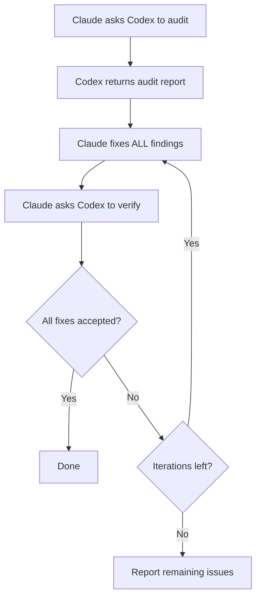

# Verificación Cruzada de Modelos

VMark usa dos modelos de IA que se desafían mutuamente: **Claude escribe el código, Codex lo audita**. Esta configuración adversarial detecta errores que un único modelo pasaría por alto.

## Por Qué Dos Modelos Son Mejor que Uno

Cada modelo de IA tiene puntos ciegos. Puede pasar por alto consistentemente una categoría de errores, favorecer ciertos patrones sobre alternativas más seguras, o no cuestionar sus propias suposiciones. Cuando el mismo modelo escribe y revisa código, esos puntos ciegos sobreviven ambos pases.

La verificación cruzada de modelos rompe esto:

1. **Claude** (Anthropic) escribe la implementación — entiende el contexto completo, sigue las convenciones del proyecto y aplica TDD.
2. **Codex** (OpenAI) audita el resultado de forma independiente — lee el código con ojos frescos, entrenado con datos diferentes, con diferentes modos de fallo.

Los modelos son genuinamente diferentes. Fueron construidos por equipos separados, entrenados con diferentes conjuntos de datos, con diferentes arquitecturas y objetivos de optimización. Cuando ambos están de acuerdo en que el código es correcto, tu confianza es mucho mayor que con el "parece bien" de un único modelo.

La investigación respalda este enfoque desde múltiples ángulos. El debate multiagente — donde múltiples instancias de LLM se desafían mutuamente — mejora significativamente la exactitud y el razonamiento[^1]. Los prompts de rol, donde a los modelos se les asignan roles de expertos específicos, superan consistentemente al prompting estándar sin ejemplos en benchmarks de razonamiento[^2]. Y trabajo reciente muestra que los LLMs de frontera pueden detectar cuando están siendo evaluados y ajustar su comportamiento en consecuencia[^3] — lo que significa que un modelo que sabe que su salida será escrutada por otra IA es probable que produzca trabajo más cuidadoso y menos servil[^4].

### Lo que Detecta la Verificación Cruzada

En la práctica, el segundo modelo encuentra problemas como:

- **Errores lógicos** que el primer modelo introdujo con confianza
- **Casos límite** que el primer modelo no consideró (null, vacío, Unicode, acceso concurrente)
- **Código muerto** dejado atrás tras la refactorización
- **Patrones de seguridad** que el entrenamiento de un modelo no marcó (traversal de rutas, inyección)
- **Violaciones de convenciones** que el modelo que escribió el código racionalizó
- **Errores de copiar y pegar** donde el modelo duplicó código con errores sutiles

Este es el mismo principio detrás de la revisión de código humana — un segundo par de ojos detecta cosas que el autor no puede ver — excepto que tanto el "revisor" como el "autor" son incansables y pueden procesar codebases completos en segundos.

## Cómo Funciona en VMark

### El Plugin Codex Toolkit

VMark usa el plugin de Claude Code `codex-toolkit@xiaolai`, que incluye Codex como servidor MCP. Cuando el plugin está habilitado, Claude Code obtiene acceso automáticamente a una herramienta MCP `codex` — un canal para enviar prompts a Codex y recibir respuestas estructuradas. Codex se ejecuta en un **contexto aislado y de solo lectura**: puede leer el código base pero no puede modificar archivos. Todos los cambios los hace Claude.

### Configuración

1. Instala Codex CLI globalmente y autentícate:

```bash
npm install -g @openai/codex
codex login                   # Iniciar sesión con suscripción ChatGPT (recomendado)
```

2. Añade el marketplace de plugins xiaolai (solo la primera vez):

```bash
claude plugin marketplace add xiaolai/claude-plugin-marketplace
```

3. Instala y habilita el plugin codex-toolkit en Claude Code:

```bash
claude plugin install codex-toolkit@xiaolai --scope project
```

4. Verifica que Codex está disponible:

```bash
codex --version
```

Eso es todo. El plugin registra el servidor MCP de Codex automáticamente — no se necesita ninguna entrada manual en `.mcp.json`.

::: tip Suscripción vs API
Usa `codex login` (suscripción ChatGPT) en lugar de `OPENAI_API_KEY` para costes dramáticamente más bajos. Ver [Suscripción vs Precios de API](/es/guide/users-as-developers/subscription-vs-api).
:::

::: tip PATH para Aplicaciones GUI de macOS
Las aplicaciones GUI de macOS tienen un PATH mínimo. Si `codex --version` funciona en tu terminal pero Claude Code no puede encontrarlo, añade la ubicación del binario de Codex a tu perfil de shell (`~/.zshrc` o `~/.bashrc`).
:::

::: tip Configuración del Proyecto
Ejecuta `/codex-toolkit:init` para generar un archivo de configuración `.codex-toolkit.md` con valores predeterminados específicos del proyecto (enfoque de auditoría, nivel de esfuerzo, patrones a omitir).
:::

## Slash Commands

El plugin `codex-toolkit` proporciona slash commands predefinidos que orquestan los flujos de trabajo de Claude + Codex. No necesitas gestionar la interacción manualmente — solo invoca el comando y los modelos se coordinan automáticamente.

### `/codex-toolkit:audit` — Auditoría de Código

El comando de auditoría principal. Admite dos modos:

- **Mini (predeterminado)** — Verificación rápida en 5 dimensiones: lógica, duplicación, código muerto, deuda de refactorización, atajos
- **Completo (`--full`)** — Auditoría exhaustiva en 9 dimensiones que añade seguridad, rendimiento, cumplimiento, dependencias, documentación

| Dimensión | Qué Verifica |
|-----------|---------------|
| 1. Código Redundante | Código muerto, duplicados, importaciones no usadas |
| 2. Seguridad | Inyección, traversal de rutas, XSS, secretos codificados |
| 3. Corrección | Errores lógicos, condiciones de carrera, manejo de null |
| 4. Cumplimiento | Convenciones del proyecto, patrones de Zustand, tokens CSS |
| 5. Mantenibilidad | Complejidad, tamaño de archivo, nomenclatura, higiene de importaciones |
| 6. Rendimiento | Re-renderizados innecesarios, operaciones bloqueantes |
| 7. Pruebas | Brechas de cobertura, pruebas de casos límite faltantes |
| 8. Dependencias | CVEs conocidos, seguridad de configuración |
| 9. Documentación | Documentación faltante, comentarios desactualizados, sincronización del sitio web |

Uso:

```
/codex-toolkit:audit                  # Auditoría mini en cambios sin commit
/codex-toolkit:audit --full           # Auditoría completa en 9 dimensiones
/codex-toolkit:audit commit -3        # Auditar los últimos 3 commits
/codex-toolkit:audit src/stores/      # Auditar un directorio específico
```

La salida es un informe estructurado con clasificaciones de severidad (Crítico / Alto / Medio / Bajo) y correcciones sugeridas para cada hallazgo.

### `/codex-toolkit:verify` — Verificar Correcciones Anteriores

Después de corregir los hallazgos de la auditoría, haz que Codex confirme que las correcciones son correctas:

```
/codex-toolkit:verify                 # Verificar correcciones de la última auditoría
```

Codex vuelve a leer cada archivo en las ubicaciones reportadas y marca cada problema como corregido, no corregido o parcialmente corregido. También verifica si hay nuevos problemas introducidos por las correcciones.

### `/codex-toolkit:audit-fix` — El Bucle Completo

El comando más potente. Encadena auditoría → corrección → verificación en un bucle:

```
/codex-toolkit:audit-fix              # Bucle en cambios sin commit
/codex-toolkit:audit-fix commit -1    # Bucle en el último commit
```

Esto es lo que sucede:



El bucle termina cuando Codex reporta cero hallazgos en todas las severidades, o después de 3 iteraciones (momento en el que los problemas restantes se te reportan a ti).

### `/codex-toolkit:implement` — Implementación Autónoma

Envía un plan a Codex para una implementación autónoma completa:

```
/codex-toolkit:implement              # Implementar a partir de un plan
```

### `/codex-toolkit:bug-analyze` — Análisis de Causa Raíz

Análisis de causa raíz para errores descritos por el usuario:

```
/codex-toolkit:bug-analyze            # Analizar un error
```

### `/codex-toolkit:review-plan` — Revisión de Plan

Envía un plan a Codex para una revisión arquitectónica:

```
/codex-toolkit:review-plan            # Revisar un plan en busca de coherencia y riesgos
```

### `/codex-toolkit:continue` — Continuar una Sesión

Continúa una sesión anterior de Codex para iterar sobre los hallazgos:

```
/codex-toolkit:continue               # Continuar donde lo dejaste
```

### `/fix-issue` — Resolvedor de Issues de Extremo a Extremo

Este comando específico del proyecto ejecuta la canalización completa para un issue de GitHub:

```
/fix-issue #123               # Corregir un único issue
/fix-issue #123 #456 #789     # Corregir múltiples issues en paralelo
```

La canalización:
1. **Obtener** el issue de GitHub
2. **Clasificar** (error, función o pregunta)
3. **Crear rama** con un nombre descriptivo
4. **Corregir** con TDD (ROJO → VERDE → REFACTORIZAR)
5. **Bucle de auditoría de Codex** (hasta 3 rondas de auditoría → corrección → verificación)
6. **Compuerta** (`pnpm check:all` + `cargo check` si se cambió Rust)
7. **Crear PR** con descripción estructurada

La auditoría cruzada de modelos está integrada en el paso 5 — cada corrección pasa por una revisión adversarial antes de que se cree el PR.

## Agentes Especializados y Planificación

Más allá de los comandos de auditoría, la configuración de IA de VMark incluye orquestación de nivel superior:

### `/feature-workflow` — Desarrollo Dirigido por Agentes

Para funciones complejas, este comando despliega un equipo de subagentes especializados:

| Agente | Rol |
|-------|------|
| **Planificador** | Investigar mejores prácticas, proponer casos límite, producir planes modulares |
| **Guardián de Especificaciones** | Validar el plan contra las reglas y especificaciones del proyecto |
| **Analista de Impacto** | Mapear conjuntos de cambios mínimos y aristas de dependencia |
| **Implementador** | Implementación dirigida por TDD con investigación previa |
| **Auditor** | Revisar diffs en busca de corrección y violaciones de reglas |
| **Ejecutor de Pruebas** | Ejecutar compuertas, coordinar pruebas E2E |
| **Verificador** | Lista de verificación final antes del lanzamiento |
| **Gestor de Lanzamiento** | Mensajes de commit y notas de lanzamiento |

Uso:

```
/feature-workflow sidebar-redesign
```

### Habilidad de Planificación

La habilidad de planificación crea planes de implementación estructurados con:

- Elementos de trabajo explícitos (WI-001, WI-002, ...)
- Criterios de aceptación para cada elemento
- Pruebas a escribir primero (TDD)
- Mitigaciones de riesgos y estrategias de retroceso
- Planes de migración cuando se involucran cambios de datos

Los planes se guardan en `dev-docs/plans/` como referencia durante la implementación.

## Consulta Ad-hoc con Codex

Más allá de los comandos estructurados, puedes pedirle a Claude que consulte a Codex en cualquier momento:

```
Summarize your trouble, and ask Codex for help.
```

Claude formula una pregunta, la envía a Codex a través de MCP e incorpora la respuesta. Esto es útil cuando Claude está atascado en un problema o quieres una segunda opinión sobre un enfoque.

También puedes ser específico:

```
Ask Codex whether this Zustand pattern could cause stale state.
```

```
Have Codex review the SQL in this migration for edge cases.
```

## Alternativa: Cuando Codex No Está Disponible

Todos los comandos se degradan con elegancia si Codex MCP no está disponible (no instalado, problemas de red, etc.):

1. El comando hace ping a Codex primero (`Respond with 'ok'`)
2. Si no hay respuesta: la **auditoría manual** se activa automáticamente
3. Claude lee cada archivo directamente y realiza el mismo análisis dimensional
4. La auditoría sigue sucediendo — solo es de un modelo en lugar de cruzada

Nunca necesitas preocuparte por que los comandos fallen porque Codex está caído. Siempre producen un resultado.

## La Filosofía

La idea es simple: **confiar, pero verificar — con un cerebro diferente.**

Los equipos humanos hacen esto de forma natural. Un desarrollador escribe código, un colega lo revisa y un ingeniero de QA lo prueba. Cada persona aporta experiencia diferente, puntos ciegos diferentes y modelos mentales diferentes. VMark aplica el mismo principio a las herramientas de IA:

- **Datos de entrenamiento diferentes** → Diferentes lagunas de conocimiento
- **Arquitecturas diferentes** → Diferentes patrones de razonamiento
- **Modos de fallo diferentes** → Errores detectados por uno que el otro pasa por alto

El coste es mínimo (unos pocos segundos de tiempo de API por auditoría), pero la mejora de calidad es sustancial. En la experiencia de VMark, el segundo modelo típicamente encuentra 2–5 problemas adicionales por auditoría que el primer modelo pasó por alto.

[^1]: Du, Y., Li, S., Torralba, A., Tenenbaum, J.B., & Mordatch, I. (2024). [Improving Factuality and Reasoning in Language Models through Multiagent Debate](https://arxiv.org/abs/2305.14325). *ICML 2024*. Múltiples instancias de LLM que proponen y debaten respuestas a lo largo de varias rondas mejoran significativamente la exactitud y el razonamiento, incluso cuando todos los modelos producen inicialmente respuestas incorrectas.

[^2]: Kong, A., Zhao, S., Chen, H., Li, Q., Qin, Y., Sun, R., & Zhou, X. (2024). [Better Zero-Shot Reasoning with Role-Play Prompting](https://arxiv.org/abs/2308.07702). *NAACL 2024*. Asignar roles de expertos específicos de tarea a los LLMs supera consistentemente al prompting estándar sin ejemplos y al prompting de cadena de pensamiento sin ejemplos en 12 benchmarks de razonamiento.

[^3]: Needham, J., Edkins, G., Pimpale, G., Bartsch, H., & Hobbhahn, M. (2025). [Large Language Models Often Know When They Are Being Evaluated](https://arxiv.org/abs/2505.23836). Los modelos de frontera pueden distinguir los contextos de evaluación del despliegue en el mundo real (Gemini-2.5-Pro alcanza AUC 0,83), con implicaciones para cómo se comportan los modelos cuando saben que otra IA revisará su salida.

[^4]: Sharma, M., Tong, M., Korbak, T., et al. (2024). [Towards Understanding Sycophancy in Language Models](https://arxiv.org/abs/2310.13548). *ICLR 2024*. Los LLMs entrenados con retroalimentación humana tienden a estar de acuerdo con las creencias existentes de los usuarios en lugar de proporcionar respuestas verídicas. Cuando el evaluador es otra IA en lugar de un humano, esta presión servil se elimina, lo que lleva a una salida más honesta y rigurosa.
