# Diagrammes Mermaid

VMark prend en charge les diagrammes [Mermaid](https://mermaid.js.org/) pour créer des organigrammes, des diagrammes de séquence et d'autres visualisations directement dans vos documents Markdown.


## Insérer un diagramme

### Utiliser un raccourci clavier

Tapez un bloc de code délimité avec l'identifiant de langage `mermaid` :

````markdown
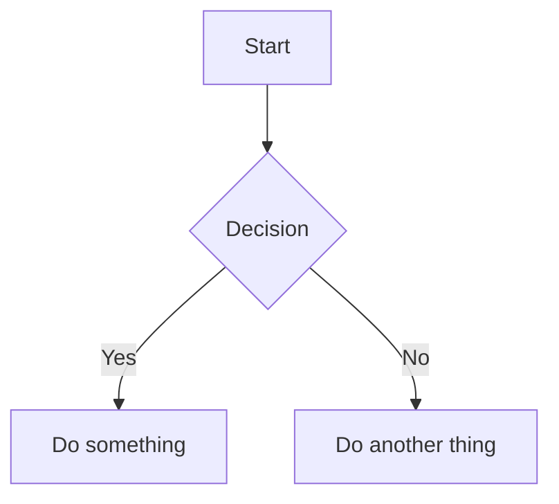
````

### Utiliser la commande slash

1. Tapez `/` pour ouvrir le menu de commandes
2. Sélectionnez **Diagramme Mermaid**
3. Un diagramme modèle est inséré pour que vous le modifiiez

## Modes d'édition

### Mode Texte enrichi (WYSIWYG)

En mode WYSIWYG, les diagrammes Mermaid sont rendus en ligne au fil de la saisie. Cliquez sur un diagramme pour modifier son code source.

### Mode Source avec prévisualisation en direct

En mode Source, un panneau de prévisualisation flottant apparaît lorsque votre curseur est à l'intérieur d'un bloc de code mermaid :


| Fonctionnalité | Description |
|---------------|-------------|
| **Prévisualisation en direct** | Voir le diagramme rendu au fil de la saisie (rebond de 200ms) |
| **Glisser pour déplacer** | Glissez l'en-tête pour repositionner la prévisualisation |
| **Redimensionner** | Glissez n'importe quel bord ou coin pour redimensionner |
| **Zoom** | Utilisez les boutons `−` et `+` (10% à 300%) |

Le panneau de prévisualisation mémorise sa position si vous le déplacez, facilitant l'organisation de votre espace de travail.

## Types de diagrammes pris en charge

VMark prend en charge tous les types de diagrammes Mermaid :

### Organigramme

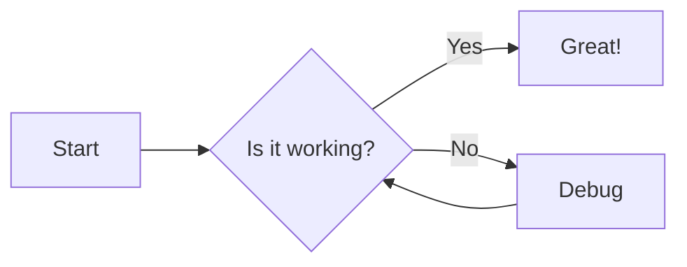

````markdown

````

### Diagramme de séquence

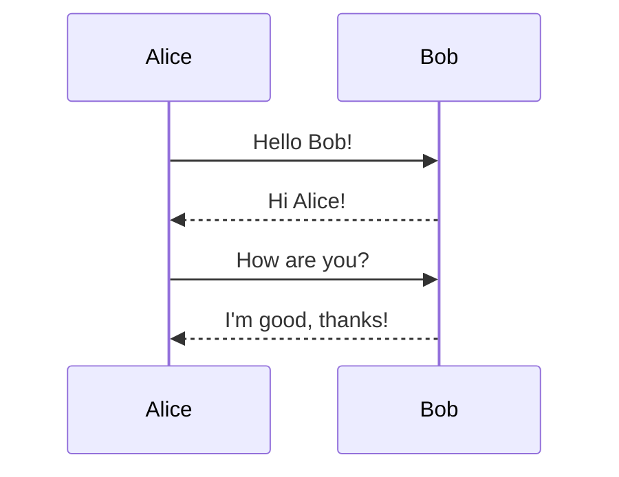

````markdown
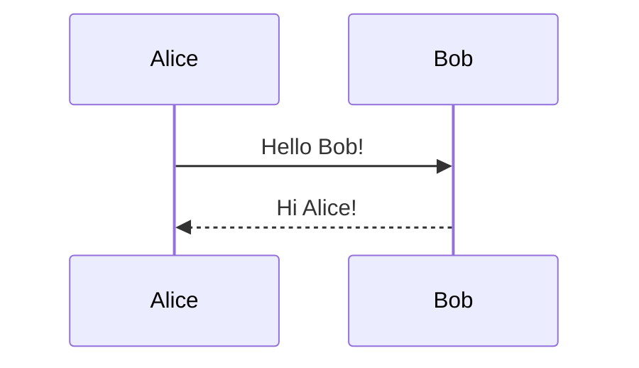
````

### Diagramme de classes

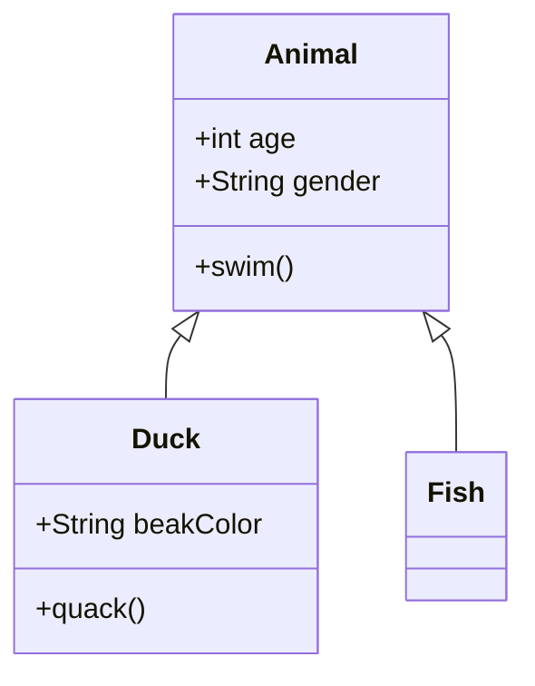

````markdown
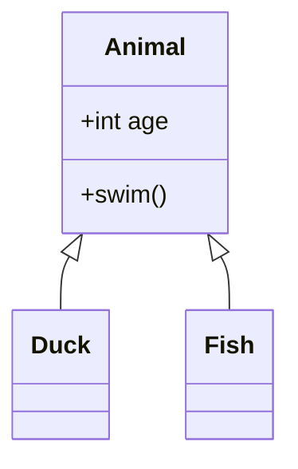
````

### Diagramme d'états

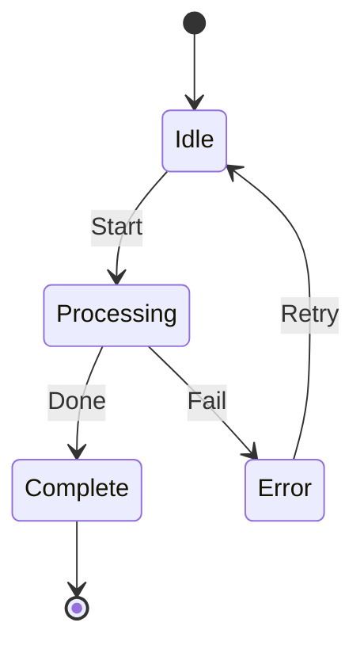

````markdown
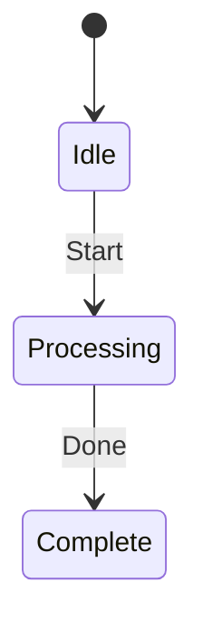
````

### Diagramme entité-relation

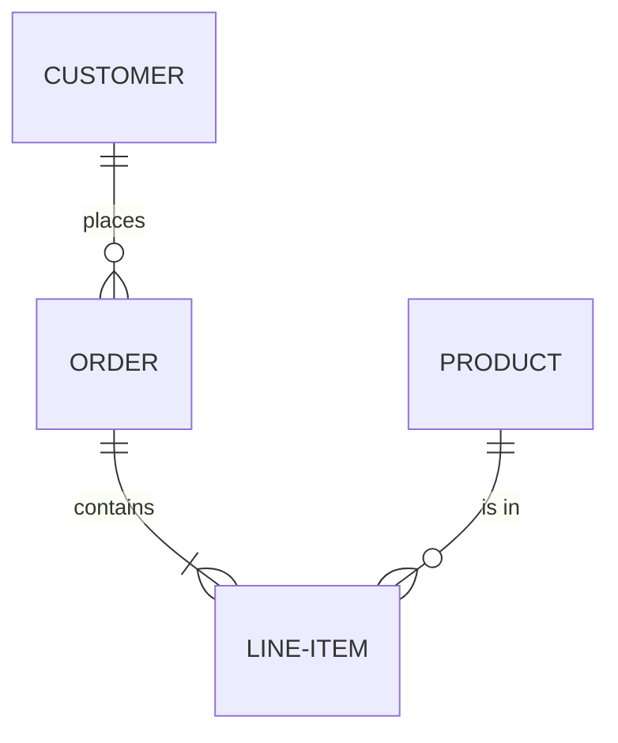

````markdown
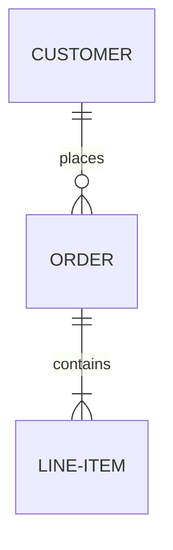
````

### Diagramme de Gantt

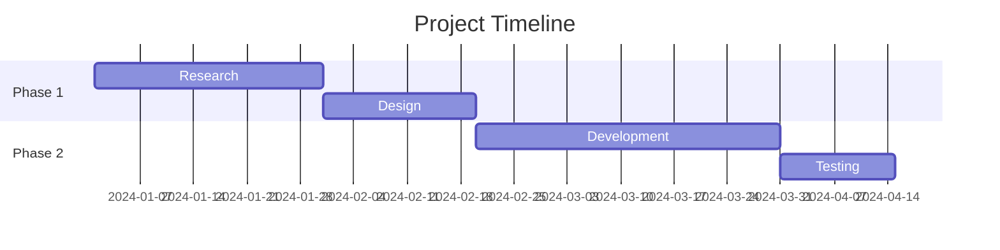

````markdown
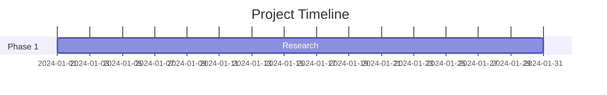
````

### Graphique en secteurs

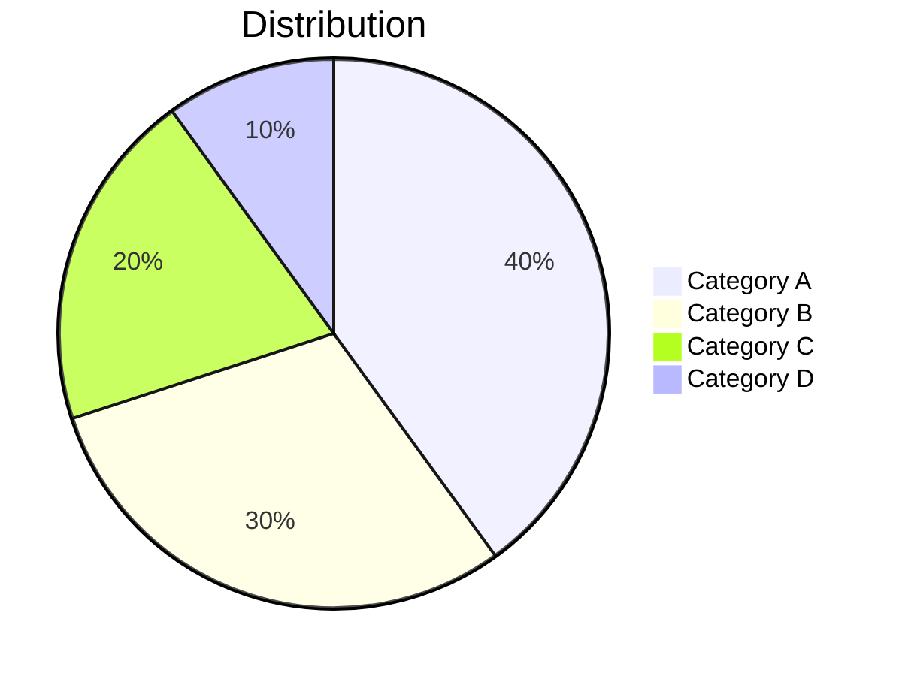

````markdown
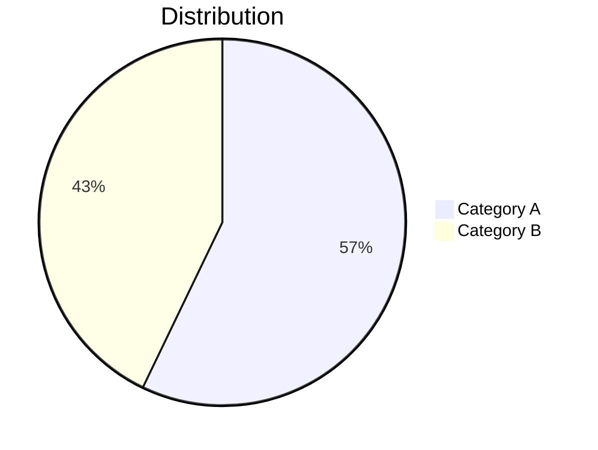
````

### Graphe Git

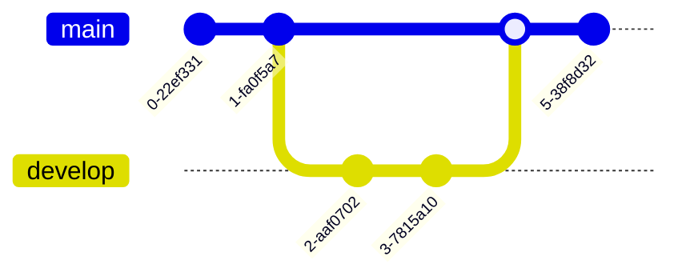

````markdown
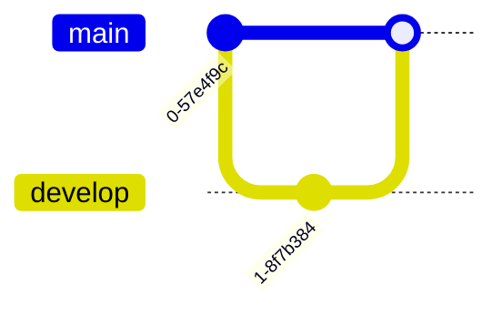
````

## Conseils

### Erreurs de syntaxe

Si votre diagramme a une erreur de syntaxe :
- En mode WYSIWYG : le bloc de code affiche le source brut
- En mode Source : la prévisualisation affiche « Syntaxe mermaid invalide »

Consultez la [documentation Mermaid](https://mermaid.js.org/intro/) pour la syntaxe correcte.

### Panoramique et zoom

En mode WYSIWYG, les diagrammes rendus prennent en charge la navigation interactive :

| Action | Comment |
|--------|---------|
| **Panoramique** | Défilez ou cliquez et glissez le diagramme |
| **Zoom** | Maintenez `Cmd` (macOS) ou `Ctrl` (Windows/Linux) et défilez |
| **Réinitialiser** | Cliquez sur le bouton de réinitialisation qui apparaît au survol (coin supérieur droit) |

### Copier le source Mermaid

Lors de la modification d'un bloc de code mermaid en mode WYSIWYG, un bouton de **copie** apparaît dans l'en-tête d'édition. Cliquez dessus pour copier le code source mermaid dans le presse-papiers.

### Intégration du thème

Les diagrammes Mermaid s'adaptent automatiquement au thème actuel de VMark (White, Paper, Mint, Sepia ou Night).

### Exporter en PNG

Survolez un diagramme mermaid rendu en mode WYSIWYG pour révéler un bouton d'**exportation** (en haut à droite, à gauche du bouton de réinitialisation). Cliquez dessus pour choisir un thème :

| Thème | Arrière-plan |
|-------|-------------|
| **Clair** | Fond blanc |
| **Sombre** | Fond sombre |

Le diagramme est exporté en PNG 2x via la boîte de dialogue d'enregistrement du système. L'image exportée utilise une pile de polices système concrète, de sorte que le texte s'affiche correctement quelle que soit les polices installées sur la machine du visualisateur.

### Exporter en HTML/PDF

Lors de l'exportation du document complet en HTML ou PDF, les diagrammes Mermaid sont rendus en images SVG pour un affichage net à n'importe quelle résolution.

## Corriger les diagrammes générés par IA

VMark utilise **Mermaid v11**, qui a un parseur plus strict (Langium) que les versions plus anciennes. Les outils IA (ChatGPT, Claude, Copilot, etc.) génèrent souvent une syntaxe qui fonctionnait dans les anciennes versions de Mermaid mais échoue en v11. Voici les problèmes les plus courants et comment les corriger.

### 1. Labels non cités avec des caractères spéciaux

**Le problème le plus fréquent.** Si un label de nœud contient des parenthèses, des apostrophes, des deux-points ou des guillemets, il doit être entouré de guillemets doubles.

````markdown
<!-- Échoue -->
```mermaid
flowchart TD
    A[User's Dashboard] --> B[Step (optional)]
    C[Status: Active] --> D[Say "Hello"]
```

<!-- Fonctionne -->
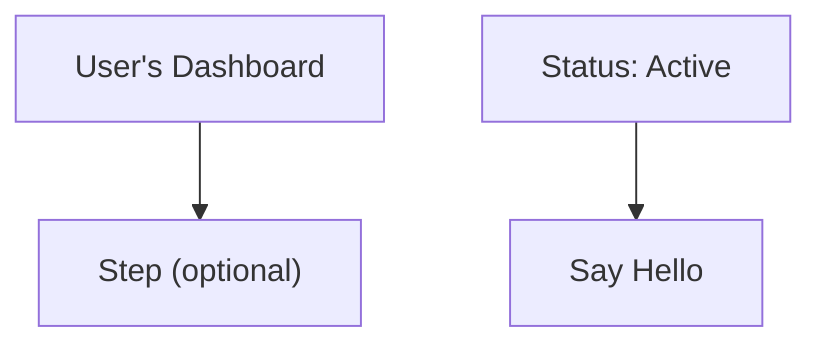
````

**Règle :** Si un label contient l'un de ces caractères — `' ( ) : " ; # &` — entourez l'intégralité du label de guillemets doubles : `["comme ça"]`.

### 2. Points-virgules de fin de ligne

Les modèles IA ajoutent parfois des points-virgules en fin de ligne. Mermaid v11 ne les autorise pas.

````markdown
<!-- Échoue -->
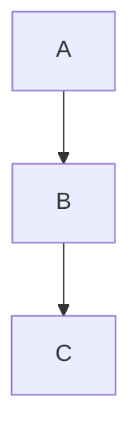

<!-- Fonctionne -->
```mermaid
flowchart TD
    A --> B
    B --> C
```
````

### 3. Utiliser `graph` au lieu de `flowchart`

Le mot-clé `graph` est une syntaxe héritée. Certaines fonctionnalités plus récentes ne fonctionnent qu'avec `flowchart`. Préférez `flowchart` pour tous les nouveaux diagrammes.

````markdown
<!-- Peut échouer avec la syntaxe plus récente -->
```mermaid
graph TD
    A --> B
```

<!-- Préféré -->
```mermaid
flowchart TD
    A --> B
```
````

### 4. Titres de sous-graphes avec des caractères spéciaux

Les titres de sous-graphes suivent les mêmes règles de citation que les labels de nœuds.

````markdown
<!-- Échoue -->
```mermaid
flowchart TD
    subgraph Service Layer (Backend)
        A --> B
    end
```

<!-- Fonctionne -->
```mermaid
flowchart TD
    subgraph "Service Layer (Backend)"
        A --> B
    end
```
````

### 5. Liste de vérification rapide

Lorsqu'un diagramme généré par IA affiche « Syntaxe invalide » :

1. **Citez tous les labels** contenant des caractères spéciaux : `["Label (avec parenthèses)"]`
2. **Supprimez les points-virgules de fin de ligne** de chaque ligne
3. **Remplacez `graph` par `flowchart`** si vous utilisez des fonctionnalités de syntaxe plus récentes
4. **Citez les titres de sous-graphes** contenant des caractères spéciaux
5. **Testez dans l'[Éditeur en direct Mermaid](https://mermaid.live/)** pour localiser l'erreur exacte

::: tip
Lorsque vous demandez à l'IA de générer des diagrammes Mermaid, ajoutez ceci à votre prompt : *« Utilisez la syntaxe Mermaid v11. Entourez toujours les labels de nœuds de guillemets doubles s'ils contiennent des caractères spéciaux. N'utilisez pas de points-virgules de fin de ligne. »*
:::

## Apprendre à votre IA à écrire du Mermaid valide

Au lieu de corriger les diagrammes à la main à chaque fois, vous pouvez installer des outils qui apprennent à votre assistant de codage IA à générer la syntaxe Mermaid v11 correcte dès le départ.

### Compétence Mermaid (référence de syntaxe)

Une compétence donne à votre IA accès à la documentation à jour de la syntaxe Mermaid pour les 23 types de diagrammes, afin qu'elle génère du code correct au lieu de deviner.

**Source :** [WH-2099/mermaid-skill](https://github.com/WH-2099/mermaid-skill)

#### Claude Code

```bash
# Cloner la compétence
git clone https://github.com/WH-2099/mermaid-skill.git /tmp/mermaid-skill

# Installer globalement (disponible dans tous les projets)
mkdir -p ~/.claude/skills/mermaid
cp -r /tmp/mermaid-skill/.claude/skills/mermaid/* ~/.claude/skills/mermaid/

# Ou installer uniquement par projet
mkdir -p .claude/skills/mermaid
cp -r /tmp/mermaid-skill/.claude/skills/mermaid/* .claude/skills/mermaid/
```

Une fois installé, utilisez `/mermaid <description>` dans Claude Code pour générer des diagrammes avec la syntaxe correcte.

#### Codex (OpenAI)

```bash
# Mêmes fichiers, emplacement différent
mkdir -p ~/.codex/skills/mermaid
cp -r /tmp/mermaid-skill/.claude/skills/mermaid/* ~/.codex/skills/mermaid/
```

#### Gemini CLI (Google)

Gemini CLI lit les compétences depuis `~/.gemini/` ou le `.gemini/` du projet. Copiez les fichiers de référence et ajoutez une instruction à votre `GEMINI.md` :

```bash
mkdir -p ~/.gemini/skills/mermaid
cp -r /tmp/mermaid-skill/.claude/skills/mermaid/references ~/.gemini/skills/mermaid/
```

Puis ajoutez à votre `GEMINI.md` (global `~/.gemini/GEMINI.md` ou par projet) :

```markdown
## Mermaid Diagrams

When generating Mermaid diagrams, read the syntax reference in
~/.gemini/skills/mermaid/references/ for the diagram type you are
generating. Use Mermaid v11 syntax: always quote node labels containing
special characters, do not use trailing semicolons, prefer "flowchart"
over "graph".
```

### Serveur MCP mermaid-validator (vérification de la syntaxe)

Un serveur MCP permet à votre IA de **valider** les diagrammes avant de vous les présenter. Il détecte les erreurs en utilisant les mêmes parseurs (Jison + Langium) que ceux utilisés en interne par Mermaid v11.

**Source :** [fast-mermaid-validator-mcp](https://github.com/ai-of-mine/fast-mermaid-validator-mcp)

#### Claude Code

```bash
# Une commande — installe globalement
claude mcp add -s user --transport stdio mermaid-validator \
  -- npx -y @ai-of-mine/fast-mermaid-validator-mcp --mcp-stdio
```

Cela enregistre un serveur MCP `mermaid-validator` qui fournit trois outils :

| Outil | Objectif |
|-------|---------|
| `validate_mermaid` | Vérifier la syntaxe d'un seul diagramme |
| `validate_file` | Valider les diagrammes à l'intérieur des fichiers Markdown |
| `get_examples` | Obtenir des exemples de diagrammes pour les 28 types pris en charge |

#### Codex (OpenAI)

```bash
codex mcp add --transport stdio mermaid-validator \
  -- npx -y @ai-of-mine/fast-mermaid-validator-mcp --mcp-stdio
```

#### Claude Desktop

Ajoutez à votre `claude_desktop_config.json` (Paramètres > Développeur > Modifier la configuration) :

```json
{
  "mcpServers": {
    "mermaid-validator": {
      "command": "npx",
      "args": ["-y", "@ai-of-mine/fast-mermaid-validator-mcp", "--mcp-stdio"]
    }
  }
}
```

#### Gemini CLI (Google)

Ajoutez à votre `~/.gemini/settings.json` (ou au `.gemini/settings.json` du projet) :

```json
{
  "mcpServers": {
    "mermaid-validator": {
      "command": "npx",
      "args": ["-y", "@ai-of-mine/fast-mermaid-validator-mcp", "--mcp-stdio"]
    }
  }
}
```

::: info Prérequis
Les deux outils nécessitent [Node.js](https://nodejs.org/) (v18 ou version ultérieure) installé sur votre machine. Le serveur MCP se télécharge automatiquement via `npx` lors de la première utilisation.
:::

## Apprendre la syntaxe Mermaid

VMark affiche la syntaxe Mermaid standard. Pour maîtriser la création de diagrammes, référez-vous à la documentation officielle Mermaid :

### Documentation officielle

| Type de diagramme | Lien de documentation |
|------------------|----------------------|
| Organigramme | [Syntaxe d'organigramme](https://mermaid.js.org/syntax/flowchart.html) |
| Diagramme de séquence | [Syntaxe de diagramme de séquence](https://mermaid.js.org/syntax/sequenceDiagram.html) |
| Diagramme de classes | [Syntaxe de diagramme de classes](https://mermaid.js.org/syntax/classDiagram.html) |
| Diagramme d'états | [Syntaxe de diagramme d'états](https://mermaid.js.org/syntax/stateDiagram.html) |
| Entité-relation | [Syntaxe de diagramme ER](https://mermaid.js.org/syntax/entityRelationshipDiagram.html) |
| Diagramme de Gantt | [Syntaxe de Gantt](https://mermaid.js.org/syntax/gantt.html) |
| Graphique en secteurs | [Syntaxe de graphique en secteurs](https://mermaid.js.org/syntax/pie.html) |
| Graphe Git | [Syntaxe de graphe Git](https://mermaid.js.org/syntax/gitgraph.html) |

### Outils pratiques

- **[Éditeur en direct Mermaid](https://mermaid.live/)** — Terrain de jeu interactif pour tester et prévisualiser les diagrammes avant de les coller dans VMark
- **[Documentation Mermaid](https://mermaid.js.org/)** — Référence complète avec exemples pour tous les types de diagrammes

::: tip
L'éditeur en direct est idéal pour expérimenter avec des diagrammes complexes. Une fois que votre diagramme est correct, copiez le code dans VMark.
:::
