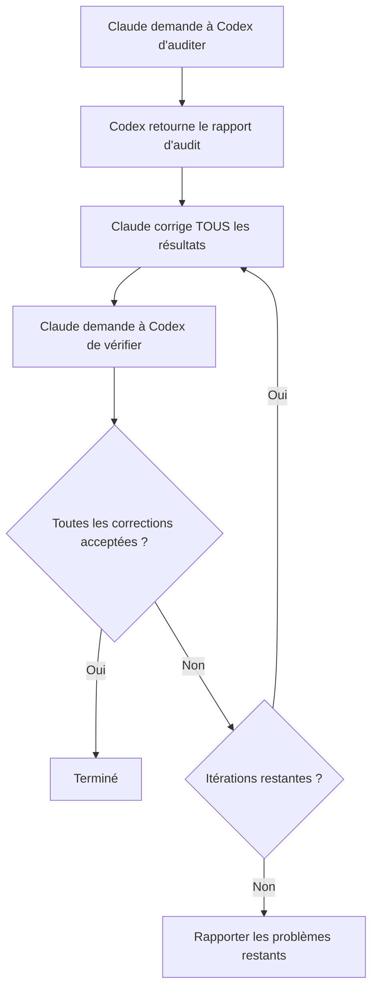

# Vérification croisée entre modèles

VMark utilise deux modèles IA qui se challengent mutuellement : **Claude écrit le code, Codex l'audite**. Cette configuration adversariale détecte des bugs qu'un seul modèle manquerait.

## Pourquoi deux modèles valent mieux qu'un

Chaque modèle IA a des angles morts. Il peut manquer systématiquement une catégorie de bugs, favoriser certains patterns au détriment d'alternatives plus sûres, ou ne pas questionner ses propres hypothèses. Quand le même modèle écrit et examine le code, ces angles morts survivent aux deux passages.

La vérification croisée rompt ce cycle :

1. **Claude** (Anthropic) écrit l'implémentation — il comprend le contexte complet, suit les conventions du projet et applique TDD.
2. **Codex** (OpenAI) audite le résultat de manière indépendante — il lit le code avec un regard neuf, entraîné sur des données différentes, avec des modes d'échec différents.

Les modèles sont vraiment différents. Ils ont été construits par des équipes séparées, entraînés sur des jeux de données différents, avec des architectures et des objectifs d'optimisation différents. Quand tous deux s'accordent sur le fait que le code est correct, votre confiance est bien plus grande que le « ça semble bon » d'un seul modèle.

La recherche soutient cette approche sous plusieurs angles. Le débat multi-agents — où plusieurs instances LLM se challengent mutuellement — améliore significativement la factualité et la précision du raisonnement[^1]. Le prompting par jeu de rôle, où les modèles se voient assigner des rôles d'experts spécifiques, surpasse systématiquement le prompting zero-shot standard sur les benchmarks de raisonnement[^2]. Et des travaux récents montrent que les LLMs frontière peuvent détecter quand ils sont évalués et ajuster leur comportement en conséquence[^3] — ce qui signifie qu'un modèle qui sait que son output sera scruté par une autre IA est susceptible de produire un travail plus soigné et moins complaisant[^4].

### Ce que la vérification croisée détecte

En pratique, le second modèle trouve des problèmes comme :

- **Erreurs de logique** que le premier modèle a introduites avec confiance
- **Cas limites** que le premier modèle n'a pas considérés (null, vide, Unicode, accès concurrent)
- **Code mort** laissé après un refactoring
- **Patterns de sécurité** que l'entraînement d'un modèle n'a pas signalés (path traversal, injection)
- **Violations de conventions** que le modèle d'écriture a rationalisées
- **Bugs de copier-coller** où le modèle a dupliqué du code avec des erreurs subtiles

C'est le même principe que la revue de code humaine — une deuxième paire d'yeux attrape des choses que l'auteur ne peut pas voir — sauf que « relecteur » et « auteur » sont tous les deux infatigables et peuvent traiter des bases de code entières en quelques secondes.

## Comment ça fonctionne dans VMark

### Le plugin Codex Toolkit

VMark utilise le plugin Claude Code `codex-toolkit@xiaolai`, qui intègre Codex comme serveur MCP. Quand le plugin est activé, Claude Code accède automatiquement à un outil MCP `codex` — un canal pour envoyer des prompts à Codex et recevoir des réponses structurées. Codex s'exécute dans un **contexte sandboxé, en lecture seule** : il peut lire la base de code mais ne peut pas modifier les fichiers. Tous les changements sont effectués par Claude.

### Configuration

1. Installez Codex CLI globalement et authentifiez-vous :

```bash
npm install -g @openai/codex
codex login                   # Connexion avec abonnement ChatGPT (recommandé)
```

2. Ajoutez le marketplace de plugins xiaolai (première fois uniquement) :

```bash
claude plugin marketplace add xiaolai/claude-plugin-marketplace
```

3. Installez et activez le plugin codex-toolkit dans Claude Code :

```bash
claude plugin install codex-toolkit@xiaolai --scope project
```

4. Vérifiez que Codex est disponible :

```bash
codex --version
```

C'est tout. Le plugin enregistre automatiquement le serveur MCP Codex — aucune entrée `.mcp.json` manuelle n'est nécessaire.

::: tip Abonnement vs API
Utilisez `codex login` (abonnement ChatGPT) plutôt que `OPENAI_API_KEY` pour des coûts dramatiquement plus bas. Voir [Abonnement vs facturation API](/fr/guide/users-as-developers/subscription-vs-api).
:::

::: tip PATH pour les applications macOS GUI
Les applications macOS GUI ont un PATH minimal. Si `codex --version` fonctionne dans votre terminal mais que Claude Code ne peut pas le trouver, ajoutez l'emplacement du binaire Codex à votre profil shell (`~/.zshrc` ou `~/.bashrc`).
:::

::: tip Configuration du projet
Exécutez `/codex-toolkit:init` pour générer un fichier de configuration `.codex-toolkit.md` avec les valeurs par défaut spécifiques au projet (focus de l'audit, niveau d'effort, patterns à ignorer).
:::

## Commandes slash

Le plugin `codex-toolkit` fournit des commandes slash pré-construites qui orchestrent les flux de travail Claude + Codex. Vous n'avez pas besoin de gérer l'interaction manuellement — invoquez simplement la commande et les modèles se coordonnent automatiquement.

### `/codex-toolkit:audit` — Audit de code

La commande d'audit principale. Prend en charge deux modes :

- **Mini (par défaut)** — Vérification rapide en 5 dimensions : logique, duplication, code mort, dette de refactoring, raccourcis
- **Complet (`--full`)** — Audit approfondi en 9 dimensions ajoutant sécurité, performance, conformité, dépendances, documentation

| Dimension | Ce qu'elle vérifie |
|-----------|-------------------|
| 1. Code redondant | Code mort, doublons, imports inutilisés |
| 2. Sécurité | Injection, path traversal, XSS, secrets codés en dur |
| 3. Exactitude | Erreurs de logique, conditions de course, gestion des nulls |
| 4. Conformité | Conventions du projet, patterns Zustand, tokens CSS |
| 5. Maintenabilité | Complexité, taille des fichiers, nommage, hygiène des imports |
| 6. Performance | Re-renders inutiles, opérations bloquantes |
| 7. Tests | Lacunes de couverture, tests de cas limites manquants |
| 8. Dépendances | CVEs connus, sécurité de la configuration |
| 9. Documentation | Docs manquantes, commentaires obsolètes, synchronisation du site web |

Utilisation :

```
/codex-toolkit:audit                  # Audit mini sur les changements non committés
/codex-toolkit:audit --full           # Audit complet en 9 dimensions
/codex-toolkit:audit commit -3        # Audit des 3 derniers commits
/codex-toolkit:audit src/stores/      # Audit d'un répertoire spécifique
```

L'output est un rapport structuré avec des niveaux de sévérité (Critique / Élevé / Moyen / Faible) et des corrections suggérées pour chaque résultat.

### `/codex-toolkit:verify` — Vérifier les corrections précédentes

Après avoir corrigé les résultats d'un audit, demandez à Codex de confirmer que les corrections sont correctes :

```
/codex-toolkit:verify                 # Vérifier les corrections du dernier audit
```

Codex relit chaque fichier aux emplacements signalés et marque chaque problème comme corrigé, non corrigé ou partiellement corrigé. Il vérifie aussi spot par spot les nouveaux problèmes introduits par les corrections.

### `/codex-toolkit:audit-fix` — La boucle complète

La commande la plus puissante. Elle enchaîne audit → correction → vérification en boucle :

```
/codex-toolkit:audit-fix              # Boucle sur les changements non committés
/codex-toolkit:audit-fix commit -1    # Boucle sur le dernier commit
```

Voici ce qui se passe :



La boucle se termine quand Codex ne signale aucun résultat sur toutes les sévérités, ou après 3 itérations (auquel cas les problèmes restants vous sont rapportés).

### `/codex-toolkit:implement` — Implémentation autonome

Envoyez un plan à Codex pour une implémentation autonome complète :

```
/codex-toolkit:implement              # Implémenter à partir d'un plan
```

### `/codex-toolkit:bug-analyze` — Analyse des causes racines

Analyse des causes racines pour les bugs décrits par l'utilisateur :

```
/codex-toolkit:bug-analyze            # Analyser un bug
```

### `/codex-toolkit:review-plan` — Revue de plan

Envoyez un plan à Codex pour une revue architecturale :

```
/codex-toolkit:review-plan            # Examiner un plan pour la cohérence et les risques
```

### `/codex-toolkit:continue` — Continuer une session

Continuer une session Codex précédente pour itérer sur les résultats :

```
/codex-toolkit:continue               # Continuer là où vous vous êtes arrêté
```

### `/fix-issue` — Résolveur d'issue de bout en bout

Cette commande spécifique au projet exécute le pipeline complet pour une issue GitHub :

```
/fix-issue #123               # Corriger une seule issue
/fix-issue #123 #456 #789     # Corriger plusieurs issues en parallèle
```

Le pipeline :
1. **Récupérer** l'issue depuis GitHub
2. **Classifier** (bug, fonctionnalité ou question)
3. **Créer une branche** avec un nom descriptif
4. **Corriger** avec TDD (RED → GREEN → REFACTOR)
5. **Boucle d'audit Codex** (jusqu'à 3 rounds d'audit → correction → vérification)
6. **Contrôle qualité** (`pnpm check:all` + `cargo check` si Rust a changé)
7. **Créer une PR** avec une description structurée

L'audit croisé est intégré à l'étape 5 — chaque correction passe par une revue adversariale avant la création de la PR.

## Agents spécialisés et planification

Au-delà des commandes d'audit, la configuration IA de VMark inclut une orchestration de plus haut niveau :

### `/feature-workflow` — Développement piloté par agents

Pour les fonctionnalités complexes, cette commande déploie une équipe de sous-agents spécialisés :

| Agent | Rôle |
|-------|------|
| **Planner** | Rechercher les meilleures pratiques, réfléchir aux cas limites, produire des plans modulaires |
| **Spec Guardian** | Valider le plan par rapport aux règles et spécifications du projet |
| **Impact Analyst** | Cartographier les ensembles de changements minimaux et les arêtes de dépendance |
| **Implementer** | Implémentation pilotée par TDD avec investigation préliminaire |
| **Auditor** | Examiner les diffs pour la correction et les violations de règles |
| **Test Runner** | Exécuter les contrôles qualité, coordonner les tests E2E |
| **Verifier** | Liste de contrôle finale avant la sortie |
| **Release Steward** | Messages de commit et notes de sortie |

Utilisation :

```
/feature-workflow sidebar-redesign
```

### Compétence de planification

La compétence de planification crée des plans d'implémentation structurés avec :

- Des éléments de travail explicites (WI-001, WI-002, ...)
- Des critères d'acceptation pour chaque élément
- Des tests à écrire en premier (TDD)
- Des atténuations de risques et des stratégies de retour en arrière
- Des plans de migration quand des changements de données sont impliqués

Les plans sont sauvegardés dans `dev-docs/plans/` pour référence pendant l'implémentation.

## Consultation Codex ad hoc

Au-delà des commandes structurées, vous pouvez demander à Claude de consulter Codex à tout moment :

```
Summarize your trouble, and ask Codex for help.
```

Claude formule une question, l'envoie à Codex via MCP et intègre la réponse. C'est utile quand Claude est bloqué sur un problème ou que vous voulez un second avis sur une approche.

Vous pouvez aussi être spécifique :

```
Ask Codex whether this Zustand pattern could cause stale state.
```

```
Have Codex review the SQL in this migration for edge cases.
```

## Alternative : quand Codex n'est pas disponible

Toutes les commandes se dégradent gracieusement si le MCP Codex n'est pas disponible (non installé, problèmes réseau, etc.) :

1. La commande pinge d'abord Codex (`Respond with 'ok'`)
2. Si pas de réponse : un **audit manuel** démarre automatiquement
3. Claude lit directement chaque fichier et effectue la même analyse dimensionnelle
4. L'audit se produit quand même — il est juste mono-modèle plutôt que croisé

Vous n'avez jamais à vous inquiéter que des commandes échouent parce que Codex est en panne. Elles produisent toujours un résultat.

## La philosophie

L'idée est simple : **faire confiance, mais vérifier — avec un cerveau différent.**

Les équipes humaines font ça naturellement. Un développeur écrit du code, un collègue l'examine et un ingénieur QA le teste. Chaque personne apporte une expérience différente, des angles morts différents et des modèles mentaux différents. VMark applique le même principe aux outils IA :

- **Données d'entraînement différentes** → Lacunes de connaissances différentes
- **Architectures différentes** → Patterns de raisonnement différents
- **Modes d'échec différents** → Bugs détectés par l'un que l'autre rate

Le coût est minimal (quelques secondes de temps API par audit), mais l'amélioration de qualité est substantielle. Dans l'expérience de VMark, le second modèle trouve typiquement 2–5 problèmes supplémentaires par audit que le premier modèle a manqués.

[^1]: Du, Y., Li, S., Torralba, A., Tenenbaum, J.B., & Mordatch, I. (2024). [Improving Factuality and Reasoning in Language Models through Multiagent Debate](https://arxiv.org/abs/2305.14325). *ICML 2024*. Plusieurs instances LLM proposant et débattant des réponses sur plusieurs rounds améliorent significativement la factualité et le raisonnement, même quand tous les modèles produisent initialement des réponses incorrectes.

[^2]: Kong, A., Zhao, S., Chen, H., Li, Q., Qin, Y., Sun, R., & Zhou, X. (2024). [Better Zero-Shot Reasoning with Role-Play Prompting](https://arxiv.org/abs/2308.07702). *NAACL 2024*. Assigner des rôles d'experts spécifiques aux LLMs surpasse systématiquement le prompting zero-shot et zero-shot chain-of-thought standard sur 12 benchmarks de raisonnement.

[^3]: Needham, J., Edkins, G., Pimpale, G., Bartsch, H., & Hobbhahn, M. (2025). [Large Language Models Often Know When They Are Being Evaluated](https://arxiv.org/abs/2505.23836). Les modèles frontière peuvent distinguer les contextes d'évaluation du déploiement en conditions réelles (Gemini-2.5-Pro atteint AUC 0,83), soulevant des implications sur la façon dont les modèles se comportent quand ils savent qu'une autre IA examinera leur output.

[^4]: Sharma, M., Tong, M., Korbak, T., et al. (2024). [Towards Understanding Sycophancy in Language Models](https://arxiv.org/abs/2310.13548). *ICLR 2024*. Les LLMs entraînés avec un retour humain ont tendance à être d'accord avec les croyances existantes des utilisateurs plutôt que de fournir des réponses véridiques. Quand l'évaluateur est une autre IA plutôt qu'un humain, cette pression complaisante est supprimée, menant à un output plus honnête et rigoureux.
