# Diagrammi Mermaid

VMark supporta i diagrammi [Mermaid](https://mermaid.js.org/) per creare diagrammi di flusso, diagrammi di sequenza e altre visualizzazioni direttamente nei tuoi documenti Markdown.


## Inserimento di un Diagramma

### Usando la Scorciatoia da Tastiera

Digita un blocco di codice delimitato con l'identificatore di linguaggio `mermaid`:

````markdown
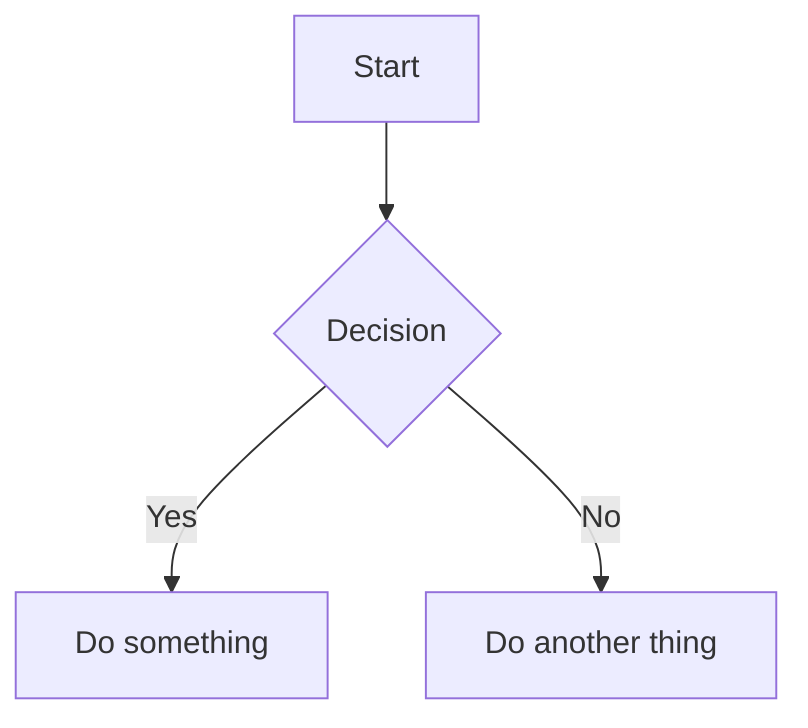
````

### Usando il Comando Slash

1. Digita `/` per aprire il menu dei comandi
2. Seleziona **Diagramma Mermaid**
3. Viene inserito un diagramma template da modificare

## Modalità di Modifica

### Modalità Rich Text (WYSIWYG)

In modalità WYSIWYG, i diagrammi Mermaid vengono renderizzati inline mentre digiti. Fai clic su un diagramma per modificarne il codice sorgente.

### Modalità Sorgente con Anteprima Live

In modalità Sorgente, un pannello di anteprima fluttuante appare quando il cursore è all'interno di un blocco di codice mermaid:


| Funzione | Descrizione |
|----------|-------------|
| **Anteprima Live** | Visualizza il diagramma renderizzato mentre digiti (debounce di 200ms) |
| **Trascina per Spostare** | Trascina l'intestazione per riposizionare l'anteprima |
| **Ridimensiona** | Trascina qualsiasi bordo o angolo per ridimensionare |
| **Zoom** | Usa i pulsanti `−` e `+` (dal 10% al 300%) |

Il pannello di anteprima ricorda la sua posizione se lo sposti, rendendo facile organizzare il tuo workspace.

## Tipi di Diagrammi Supportati

VMark supporta tutti i tipi di diagrammi Mermaid:

### Diagramma di Flusso

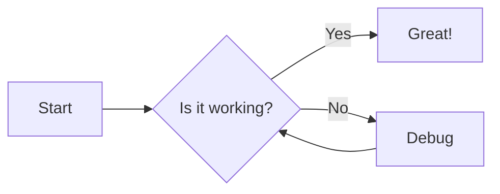

````markdown

````

### Diagramma di Sequenza

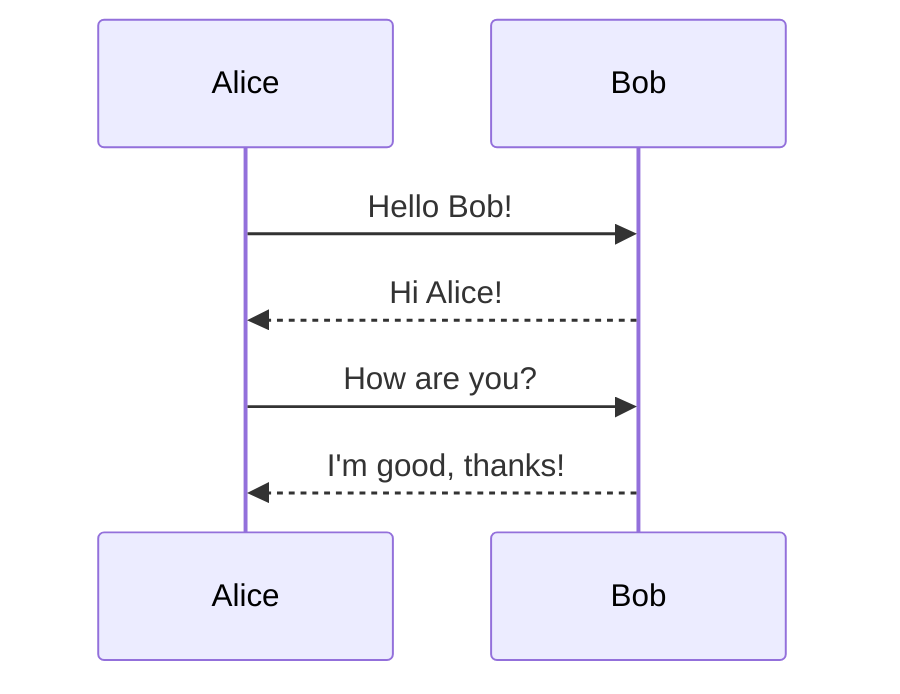

````markdown
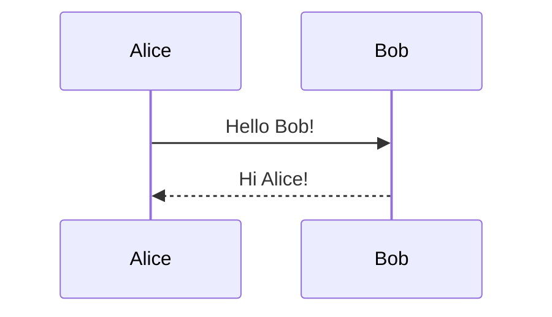
````

### Diagramma delle Classi

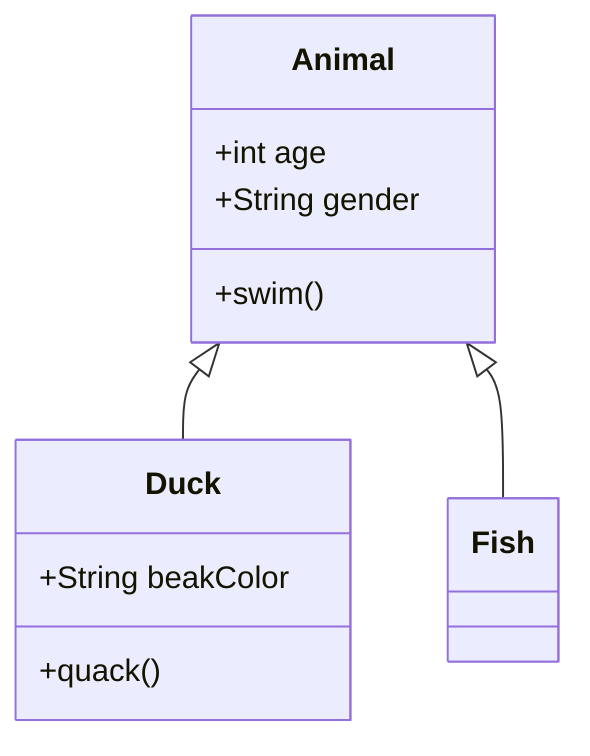

````markdown
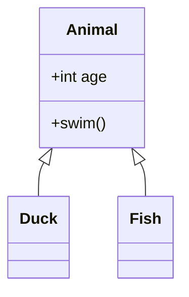
````

### Diagramma degli Stati

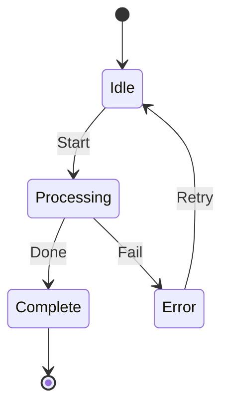

````markdown
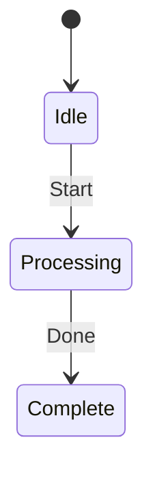
````

### Diagramma Entità-Relazione

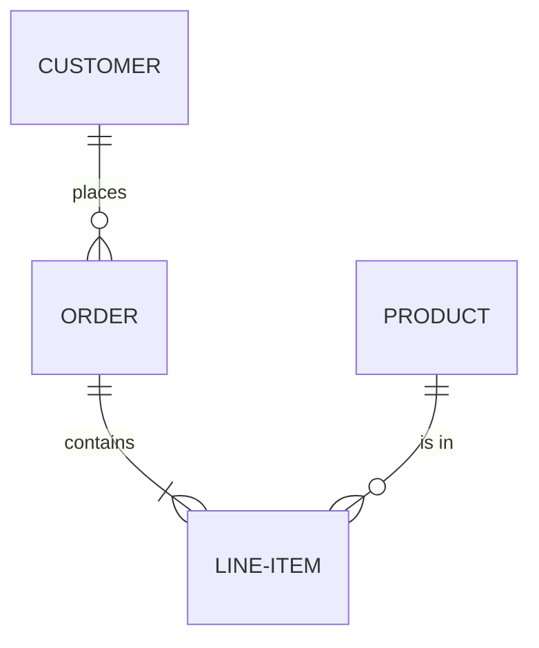

````markdown
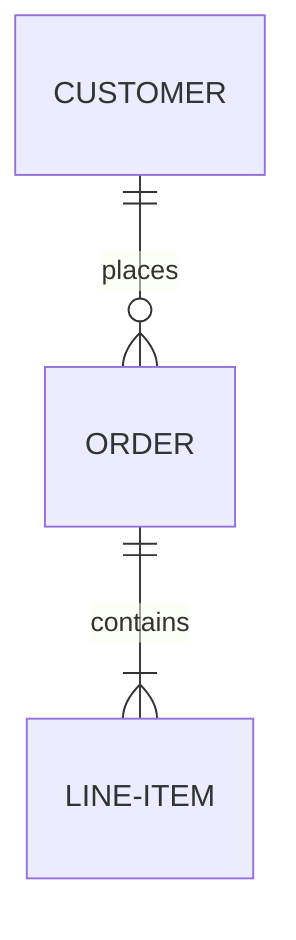
````

### Diagramma di Gantt

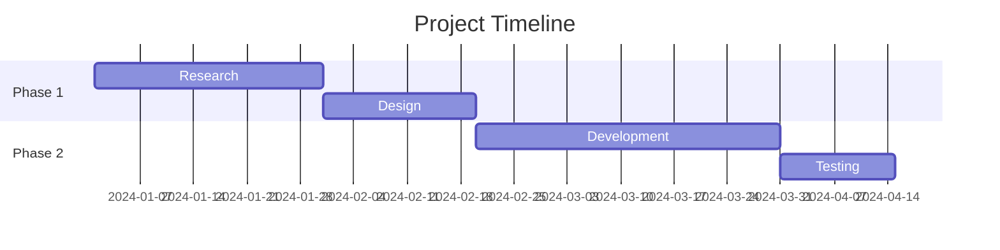

````markdown
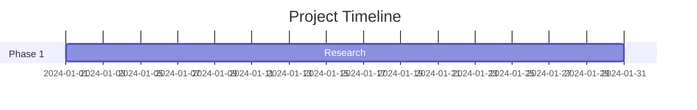
````

### Grafico a Torta

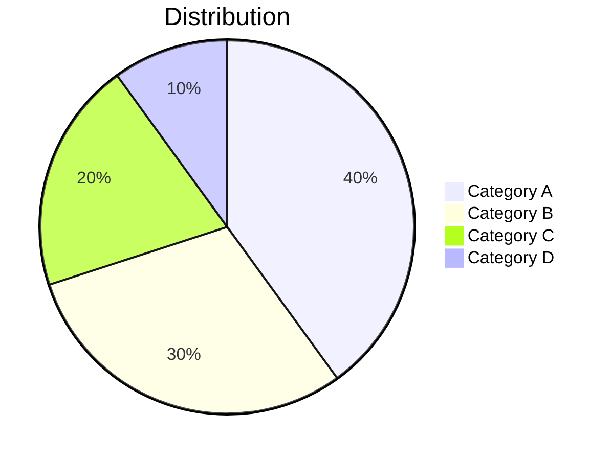

````markdown
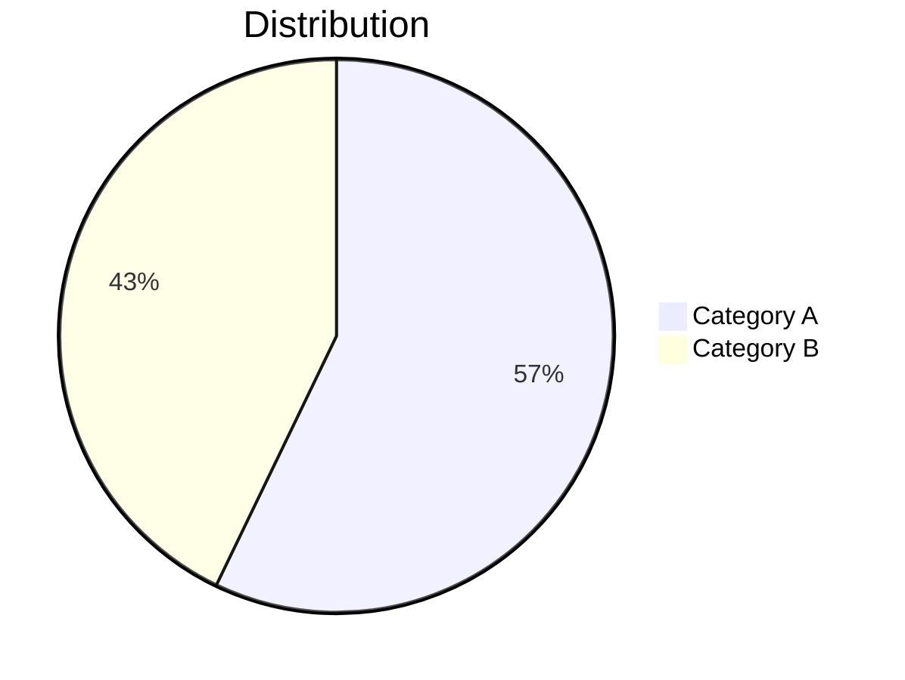
````

### Grafico Git

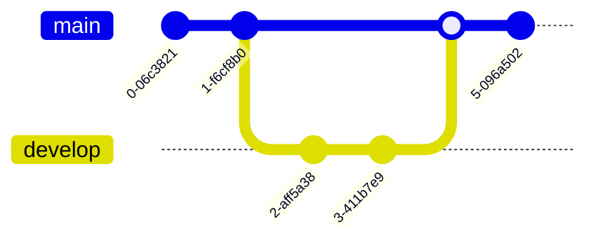

````markdown
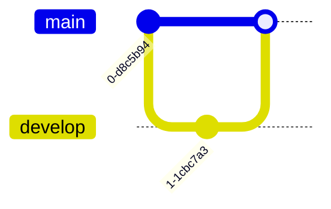
````

## Suggerimenti

### Errori di Sintassi

Se il tuo diagramma ha un errore di sintassi:
- In modalità WYSIWYG: il blocco di codice mostra il sorgente grezzo
- In modalità Sorgente: l'anteprima mostra "Sintassi mermaid non valida"

Consulta la [documentazione Mermaid](https://mermaid.js.org/intro/) per la sintassi corretta.

### Pan e Zoom

In modalità WYSIWYG, i diagrammi renderizzati supportano la navigazione interattiva:

| Azione | Come |
|--------|------|
| **Pan** | Scorri o fai clic e trascina il diagramma |
| **Zoom** | Tieni premuto `Cmd` (macOS) o `Ctrl` (Windows/Linux) e scorri |
| **Reset** | Fai clic sul pulsante reset che appare al passaggio (angolo in alto a destra) |

### Copia Sorgente Mermaid

Quando si modifica un blocco di codice mermaid in modalità WYSIWYG, appare un pulsante **copia** nell'intestazione di modifica. Fai clic per copiare il codice sorgente mermaid negli appunti.

### Integrazione del Tema

I diagrammi Mermaid si adattano automaticamente al tema corrente di VMark (modalità chiara o scura).

### Esporta come PNG

Passa il mouse su un diagramma mermaid renderizzato in modalità WYSIWYG per rivelare un pulsante **esporta** (in alto a destra, a sinistra del pulsante reset). Fai clic per scegliere un tema:

| Tema | Sfondo |
|------|--------|
| **Chiaro** | Sfondo bianco |
| **Scuro** | Sfondo scuro |

Il diagramma viene esportato come PNG a risoluzione 2x tramite la finestra di salvataggio del sistema. L'immagine esportata usa uno stack di font di sistema concreto, quindi il testo viene renderizzato correttamente indipendentemente dai font installati sulla macchina del visualizzatore.

### Esporta come HTML/PDF

Quando si esporta l'intero documento in HTML o PDF, i diagrammi Mermaid vengono renderizzati come immagini SVG per una visualizzazione nitida a qualsiasi risoluzione.

## Correzione dei Diagrammi Generati dall'IA

VMark usa **Mermaid v11**, che ha un parser più rigoroso (Langium) rispetto alle versioni precedenti. Gli strumenti IA (ChatGPT, Claude, Copilot, ecc.) spesso generano sintassi che funzionava nelle versioni precedenti di Mermaid ma che non funziona in v11. Ecco i problemi più comuni e come risolverli.

### 1. Etichette Senza Virgolette con Caratteri Speciali

**Il problema più frequente.** Se un'etichetta di nodo contiene parentesi, apostrofi, due punti o virgolette, deve essere racchiusa tra virgolette doppie.

````markdown
<!-- Non funziona -->
```mermaid
flowchart TD
    A[User's Dashboard] --> B[Step (optional)]
    C[Status: Active] --> D[Say "Hello"]
```

<!-- Funziona -->
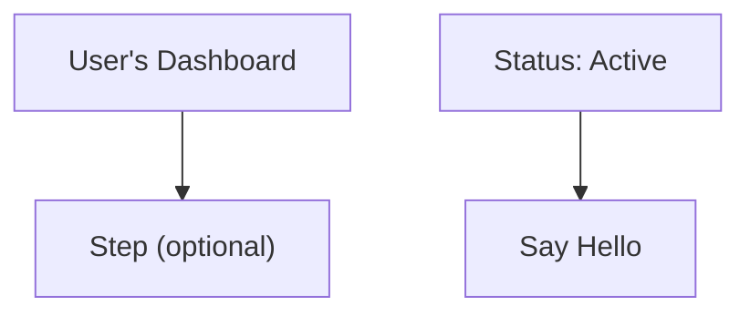
````

**Regola:** Se un'etichetta contiene uno di questi caratteri — `' ( ) : " ; # &` — racchiudi l'intera etichetta tra virgolette doppie: `["come questo"]`.

### 2. Punto e Virgola Finale

I modelli IA a volte aggiungono punto e virgola alla fine delle righe. Mermaid v11 non li consente.

````markdown
<!-- Non funziona -->
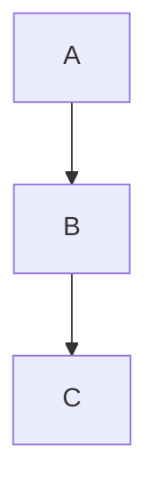

<!-- Funziona -->
```mermaid
flowchart TD
    A --> B
    B --> C
```
````

### 3. Uso di `graph` invece di `flowchart`

La parola chiave `graph` è sintassi legacy. Alcune funzionalità più recenti funzionano solo con `flowchart`. Preferisci `flowchart` per tutti i nuovi diagrammi.

````markdown
<!-- Potrebbe non funzionare con la sintassi più recente -->
```mermaid
graph TD
    A --> B
```

<!-- Preferito -->
```mermaid
flowchart TD
    A --> B
```
````

### 4. Titoli di Sottografi con Caratteri Speciali

I titoli dei sottografi seguono le stesse regole di virgolettatura delle etichette dei nodi.

````markdown
<!-- Non funziona -->
```mermaid
flowchart TD
    subgraph Service Layer (Backend)
        A --> B
    end
```

<!-- Funziona -->
```mermaid
flowchart TD
    subgraph "Service Layer (Backend)"
        A --> B
    end
```
````

### 5. Lista di Controllo per la Correzione Rapida

Quando un diagramma generato dall'IA mostra "Sintassi non valida":

1. **Metti tra virgolette tutte le etichette** che contengono caratteri speciali: `["Etichetta (con parentesi)"]`
2. **Rimuovi i punto e virgola finali** da ogni riga
3. **Sostituisci `graph` con `flowchart`** se usi funzionalità di sintassi più recenti
4. **Metti tra virgolette i titoli dei sottografi** che contengono caratteri speciali
5. **Testa nell'[Editor Live Mermaid](https://mermaid.live/)** per individuare l'errore esatto

::: tip
Quando chiedi all'IA di generare diagrammi Mermaid, aggiungi questo al tuo prompt: *"Usa la sintassi Mermaid v11. Racchiudi sempre le etichette dei nodi tra virgolette doppie se contengono caratteri speciali. Non usare punto e virgola finali."*
:::

## Insegna alla Tua IA a Scrivere Mermaid Valido

Invece di correggere i diagrammi a mano ogni volta, puoi installare strumenti che insegnano al tuo assistente IA di codifica a generare la sintassi Mermaid v11 corretta fin dall'inizio.

### Skill Mermaid (Riferimento Sintassi)

Una skill fornisce al tuo IA accesso alla documentazione aggiornata della sintassi Mermaid per tutti i 23 tipi di diagrammi, in modo che generi codice corretto invece di indovinare.

**Sorgente:** [WH-2099/mermaid-skill](https://github.com/WH-2099/mermaid-skill)

#### Claude Code

```bash
# Clona la skill
git clone https://github.com/WH-2099/mermaid-skill.git /tmp/mermaid-skill

# Installa globalmente (disponibile in tutti i progetti)
mkdir -p ~/.claude/skills/mermaid
cp -r /tmp/mermaid-skill/.claude/skills/mermaid/* ~/.claude/skills/mermaid/

# Oppure installa solo per progetto
mkdir -p .claude/skills/mermaid
cp -r /tmp/mermaid-skill/.claude/skills/mermaid/* .claude/skills/mermaid/
```

Una volta installato, usa `/mermaid <descrizione>` in Claude Code per generare diagrammi con sintassi corretta.

#### Codex (OpenAI)

```bash
# Stessi file, posizione diversa
mkdir -p ~/.codex/skills/mermaid
cp -r /tmp/mermaid-skill/.claude/skills/mermaid/* ~/.codex/skills/mermaid/
```

#### Gemini CLI (Google)

Gemini CLI legge le skill da `~/.gemini/` o dal progetto `.gemini/`. Copia i file di riferimento e aggiungi un'istruzione al tuo `GEMINI.md`:

```bash
mkdir -p ~/.gemini/skills/mermaid
cp -r /tmp/mermaid-skill/.claude/skills/mermaid/references ~/.gemini/skills/mermaid/
```

Poi aggiungi al tuo `GEMINI.md` (globale `~/.gemini/GEMINI.md` o per progetto):

```markdown
## Mermaid Diagrams

When generating Mermaid diagrams, read the syntax reference in
~/.gemini/skills/mermaid/references/ for the diagram type you are
generating. Use Mermaid v11 syntax: always quote node labels containing
special characters, do not use trailing semicolons, prefer "flowchart"
over "graph".
```

### Server MCP Mermaid Validator (Verifica della Sintassi) {#mermaid-validator-mcp-server-syntax-checking}

Un server MCP permette al tuo IA di **validare** i diagrammi prima di presentarli. Rileva gli errori usando gli stessi parser (Jison + Langium) che Mermaid v11 usa internamente.

**Sorgente:** [fast-mermaid-validator-mcp](https://github.com/ai-of-mine/fast-mermaid-validator-mcp)

#### Claude Code

```bash
# Un solo comando — installa globalmente
claude mcp add -s user --transport stdio mermaid-validator \
  -- npx -y @ai-of-mine/fast-mermaid-validator-mcp --mcp-stdio
```

Questo registra un server MCP `mermaid-validator` che fornisce tre strumenti:

| Strumento | Scopo |
|-----------|-------|
| `validate_mermaid` | Controlla la sintassi di un singolo diagramma |
| `validate_file` | Valida i diagrammi all'interno dei file Markdown |
| `get_examples` | Ottieni diagrammi di esempio per tutti i 28 tipi supportati |

#### Codex (OpenAI)

```bash
codex mcp add --transport stdio mermaid-validator \
  -- npx -y @ai-of-mine/fast-mermaid-validator-mcp --mcp-stdio
```

#### Claude Desktop

Aggiungi al tuo `claude_desktop_config.json` (Impostazioni > Sviluppatore > Modifica Config):

```json
{
  "mcpServers": {
    "mermaid-validator": {
      "command": "npx",
      "args": ["-y", "@ai-of-mine/fast-mermaid-validator-mcp", "--mcp-stdio"]
    }
  }
}
```

#### Gemini CLI (Google)

Aggiungi al tuo `~/.gemini/settings.json` (o al progetto `.gemini/settings.json`):

```json
{
  "mcpServers": {
    "mermaid-validator": {
      "command": "npx",
      "args": ["-y", "@ai-of-mine/fast-mermaid-validator-mcp", "--mcp-stdio"]
    }
  }
}
```

::: info Prerequisiti
Entrambi gli strumenti richiedono [Node.js](https://nodejs.org/) (v18 o successivo) installato sulla tua macchina. Il server MCP si scarica automaticamente tramite `npx` al primo utilizzo.
:::

## Imparare la Sintassi Mermaid

VMark renderizza la sintassi Mermaid standard. Per padroneggiare la creazione di diagrammi, consulta la documentazione ufficiale di Mermaid:

### Documentazione Ufficiale

| Tipo di Diagramma | Link alla Documentazione |
|-------------------|-------------------------|
| Diagramma di Flusso | [Sintassi Flowchart](https://mermaid.js.org/syntax/flowchart.html) |
| Diagramma di Sequenza | [Sintassi Sequence Diagram](https://mermaid.js.org/syntax/sequenceDiagram.html) |
| Diagramma delle Classi | [Sintassi Class Diagram](https://mermaid.js.org/syntax/classDiagram.html) |
| Diagramma degli Stati | [Sintassi State Diagram](https://mermaid.js.org/syntax/stateDiagram.html) |
| Entità-Relazione | [Sintassi ER Diagram](https://mermaid.js.org/syntax/entityRelationshipDiagram.html) |
| Diagramma di Gantt | [Sintassi Gantt](https://mermaid.js.org/syntax/gantt.html) |
| Grafico a Torta | [Sintassi Pie Chart](https://mermaid.js.org/syntax/pie.html) |
| Grafico Git | [Sintassi Git Graph](https://mermaid.js.org/syntax/gitgraph.html) |

### Strumenti di Pratica

- **[Mermaid Live Editor](https://mermaid.live/)** — Playground interattivo per testare e visualizzare in anteprima i diagrammi prima di incollarli in VMark
- **[Documentazione Mermaid](https://mermaid.js.org/)** — Riferimento completo con esempi per tutti i tipi di diagrammi

::: tip
L'Editor Live è ottimo per sperimentare con diagrammi complessi. Una volta che il tuo diagramma sembra giusto, copia il codice in VMark.
:::
