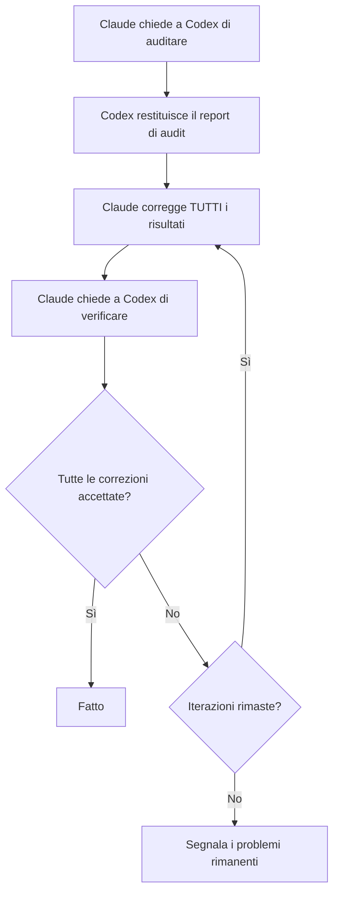

# Verifica Cross-Model

VMark usa due modelli AI che si sfidano a vicenda: **Claude scrive il codice, Codex lo audita**. Questa configurazione avversariale cattura bug che un singolo modello mancherebbe.

## Perché Due Modelli Sono Meglio di Uno

Ogni modello AI ha punti ciechi. Potrebbe perdere sistematicamente una categoria di bug, favorire certi pattern rispetto ad alternative più sicure o non mettere in discussione le proprie assunzioni. Quando lo stesso modello scrive e revisiona il codice, quei punti ciechi sopravvivono a entrambi i passaggi.

La verifica cross-model rompe questo schema:

1. **Claude** (Anthropic) scrive l'implementazione — capisce il contesto completo, segue le convenzioni del progetto e applica il TDD.
2. **Codex** (OpenAI) audita il risultato indipendentemente — legge il codice con occhi freschi, addestrato su dati diversi, con diversi modi di fallire.

I modelli sono genuinamente diversi. Sono stati costruiti da team separati, addestrati su dataset diversi, con architetture e obiettivi di ottimizzazione differenti. Quando entrambi concordano che il codice è corretto, la tua fiducia è molto più alta rispetto al "sembra buono" di un singolo modello.

La ricerca supporta questo approccio da più angolazioni. Il dibattito multi-agente — dove più istanze LLM si sfidano a vicenda nelle risposte — migliora significativamente la fattualità e la precisione del ragionamento[^1]. Il prompting con giochi di ruolo, dove i modelli vengono assegnati a ruoli di esperti specifici, supera costantemente il prompting zero-shot standard sui benchmark di ragionamento[^2]. E la ricerca recente mostra che gli LLM frontier possono rilevare quando vengono valutati e adeguare il loro comportamento di conseguenza[^3] — il che significa che un modello che sa che il suo output sarà esaminato da un altro AI è probabile che produca un lavoro più attento e meno sycofantico[^4].

### Cosa Cattura il Cross-Model

In pratica, il secondo modello trova problemi come:

- **Errori logici** che il primo modello ha introdotto con sicurezza
- **Casi limite** che il primo modello non ha considerato (null, vuoto, Unicode, accesso concorrente)
- **Codice morto** lasciato dopo il refactoring
- **Pattern di sicurezza** che l'addestramento di un modello non ha segnalato (path traversal, injection)
- **Violazioni delle convenzioni** che il modello di scrittura ha razionalizzato
- **Bug da copia-incolla** dove il modello ha duplicato il codice con errori sottili

Questo è lo stesso principio alla base della revisione del codice umano — un secondo paio di occhi cattura cose che l'autore non riesce a vedere — eccetto che sia il "revisore" che l'"autore" sono instancabili e possono elaborare interi codebase in secondi.

## Come Funziona in VMark

### Il Plugin Codex Toolkit

VMark usa il plugin Claude Code `codex-toolkit@xiaolai`, che include Codex come server MCP. Quando il plugin è abilitato, Claude Code ottiene automaticamente accesso a uno strumento MCP `codex` — un canale per inviare prompt a Codex e ricevere risposte strutturate. Codex gira in un **contesto sandboxed, di sola lettura**: può leggere il codebase ma non può modificare i file. Tutte le modifiche sono fatte da Claude.

### Configurazione

1. Installa Codex CLI globalmente e autentica:

```bash
npm install -g @openai/codex
codex login                   # Accedi con abbonamento ChatGPT (raccomandato)
```

2. Aggiungi il marketplace di plugin xiaolai (solo la prima volta):

```bash
claude plugin marketplace add xiaolai/claude-plugin-marketplace
```

3. Installa e abilita il plugin codex-toolkit in Claude Code:

```bash
claude plugin install codex-toolkit@xiaolai --scope project
```

4. Verifica che Codex sia disponibile:

```bash
codex --version
```

Ecco fatto. Il plugin registra automaticamente il server MCP di Codex — non è necessaria alcuna voce manuale in `.mcp.json`.

::: tip Abbonamento vs API
Usa `codex login` (abbonamento ChatGPT) invece di `OPENAI_API_KEY` per costi drammaticamente inferiori. Vedi [Abbonamento vs Prezzi API](/it/guide/users-as-developers/subscription-vs-api).
:::

::: tip PATH per le App GUI macOS
Le app GUI macOS hanno un PATH minimo. Se `codex --version` funziona nel tuo terminale ma Claude Code non riesce a trovarlo, aggiungi la posizione del binario Codex al tuo profilo shell (`~/.zshrc` o `~/.bashrc`).
:::

::: tip Configurazione del Progetto
Esegui `/codex-toolkit:init` per generare un file di configurazione `.codex-toolkit.md` con impostazioni predefinite specifiche del progetto (focus di audit, livello di sforzo, pattern da saltare).
:::

## Comandi Slash

Il plugin `codex-toolkit` fornisce comandi slash pre-costruiti che orchestrano i flussi di lavoro Claude + Codex. Non devi gestire l'interazione manualmente — invoca semplicemente il comando e i modelli si coordinano automaticamente.

### `/codex-toolkit:audit` — Audit del Codice

Il comando di audit principale. Supporta due modalità:

- **Mini (default)** — Controllo rapido a 5 dimensioni: logica, duplicazione, codice morto, debito di refactoring, scorciatoie
- **Full (`--full`)** — Audit approfondito a 9 dimensioni che aggiunge sicurezza, prestazioni, conformità, dipendenze, documentazione

| Dimensione | Cosa Controlla |
|-----------|---------------|
| 1. Codice Ridondante | Codice morto, duplicati, import inutilizzati |
| 2. Sicurezza | Injection, path traversal, XSS, segreti hardcoded |
| 3. Correttezza | Errori logici, race condition, gestione null |
| 4. Conformità | Convenzioni del progetto, pattern Zustand, token CSS |
| 5. Manutenibilità | Complessità, dimensioni dei file, naming, igiene degli import |
| 6. Prestazioni | Re-render inutili, operazioni bloccanti |
| 7. Testing | Lacune di copertura, test mancanti per casi limite |
| 8. Dipendenze | CVE noti, sicurezza della configurazione |
| 9. Documentazione | Documentazione mancante, commenti obsoleti, sincronizzazione del sito web |

Utilizzo:

```
/codex-toolkit:audit                  # Audit mini sulle modifiche non committate
/codex-toolkit:audit --full           # Audit completo a 9 dimensioni
/codex-toolkit:audit commit -3        # Audit degli ultimi 3 commit
/codex-toolkit:audit src/stores/      # Audit di una directory specifica
```

L'output è un report strutturato con valutazioni di gravità (Critico / Alto / Medio / Basso) e correzioni suggerite per ogni risultato.

### `/codex-toolkit:verify` — Verifica delle Correzioni Precedenti

Dopo aver corretto i risultati dell'audit, fai confermare a Codex che le correzioni siano corrette:

```
/codex-toolkit:verify                 # Verifica le correzioni dall'ultimo audit
```

Codex rilegge ogni file nelle posizioni segnalate e marca ogni problema come corretto, non corretto o parzialmente corretto. Esegue anche controlli spot per individuare nuovi problemi introdotti dalle correzioni.

### `/codex-toolkit:audit-fix` — Il Ciclo Completo

Il comando più potente. Concatena audit → correggi → verifica in un ciclo:

```
/codex-toolkit:audit-fix              # Ciclo sulle modifiche non committate
/codex-toolkit:audit-fix commit -1    # Ciclo sull'ultimo commit
```

Ecco cosa succede:



Il ciclo si interrompe quando Codex segnala zero risultati su tutte le gravità, o dopo 3 iterazioni (a quel punto i problemi rimanenti vengono segnalati a te).

### `/codex-toolkit:implement` — Implementazione Autonoma

Invia un piano a Codex per l'implementazione autonoma completa:

```
/codex-toolkit:implement              # Implementa da un piano
```

### `/codex-toolkit:bug-analyze` — Analisi della Causa Radice

Analisi della causa radice per bug descritti dagli utenti:

```
/codex-toolkit:bug-analyze            # Analizza un bug
```

### `/codex-toolkit:review-plan` — Revisione del Piano

Invia un piano a Codex per la revisione architetturale:

```
/codex-toolkit:review-plan            # Revisiona un piano per coerenza e rischio
```

### `/codex-toolkit:continue` — Continua una Sessione

Continua una sessione Codex precedente per iterare sui risultati:

```
/codex-toolkit:continue               # Continua da dove hai lasciato
```

### `/fix-issue` — Risolutore End-to-End di Issue

Questo comando specifico del progetto esegue l'intera pipeline per una issue GitHub:

```
/fix-issue #123               # Correggi una singola issue
/fix-issue #123 #456 #789     # Correggi più issue in parallelo
```

La pipeline:
1. **Fetch** della issue da GitHub
2. **Classificazione** (bug, funzionalità o domanda)
3. Creazione del **branch** con un nome descrittivo
4. **Correzione** con TDD (RED → GREEN → REFACTOR)
5. **Ciclo di audit Codex** (fino a 3 round di audit → correggi → verifica)
6. **Gate** (`pnpm check:all` + `cargo check` se il codice Rust è cambiato)
7. Creazione della **PR** con descrizione strutturata

L'audit cross-model è integrato nel passaggio 5 — ogni correzione passa attraverso la revisione avversariale prima che la PR venga creata.

## Agenti Specializzati e Pianificazione

Oltre ai comandi di audit, la configurazione AI di VMark include un'orchestrazione di livello superiore:

### `/feature-workflow` — Sviluppo Guidato da Agenti

Per funzionalità complesse, questo comando distribuisce un team di subagenti specializzati:

| Agente | Ruolo |
|--------|-------|
| **Pianificatore** | Ricerca le best practice, fa brainstorming sui casi limite, produce piani modulari |
| **Guardiano delle Specifiche** | Valida il piano rispetto alle regole del progetto e alle specifiche |
| **Analista d'Impatto** | Mappa i set di modifiche minime e i bordi delle dipendenze |
| **Implementatore** | Implementazione guidata da TDD con indagine preflight |
| **Auditor** | Revisiona i diff per correttezza e violazioni delle regole |
| **Test Runner** | Esegue i gate, coordina i test E2E |
| **Verificatore** | Checklist finale pre-rilascio |
| **Steward del Rilascio** | Messaggi di commit e note di rilascio |

Utilizzo:

```
/feature-workflow sidebar-redesign
```

### Skill di Pianificazione

La skill di pianificazione crea piani di implementazione strutturati con:

- Elementi di lavoro espliciti (WI-001, WI-002, ...)
- Criteri di accettazione per ogni elemento
- Test da scrivere prima (TDD)
- Mitigazioni dei rischi e strategie di rollback
- Piani di migrazione quando sono coinvolti cambiamenti ai dati

I piani vengono salvati in `dev-docs/plans/` come riferimento durante l'implementazione.

## Consultazione Ad-hoc di Codex

Oltre ai comandi strutturati, puoi chiedere a Claude di consultare Codex in qualsiasi momento:

```
Riassumi il problema e chiedi aiuto a Codex.
```

Claude formula una domanda, la invia a Codex tramite MCP e incorpora la risposta. Questo è utile quando Claude è bloccato su un problema o vuoi un secondo parere su un approccio.

Puoi anche essere specifico:

```
Chiedi a Codex se questo pattern Zustand potrebbe causare stato obsoleto.
```

```
Fai revisionare a Codex l'SQL in questa migrazione per i casi limite.
```

## Fallback: Quando Codex Non È Disponibile

Tutti i comandi si degradano elegantemente se l'MCP di Codex non è disponibile (non installato, problemi di rete, ecc.):

1. Il comando esegue prima un ping a Codex (`Respond with 'ok'`)
2. Se non c'è risposta: si attiva automaticamente l'**audit manuale**
3. Claude legge ogni file direttamente ed esegue la stessa analisi dimensionale
4. L'audit avviene comunque — è solo single-model invece di cross-model

Non devi mai preoccuparti che i comandi falliscano perché Codex è giù. Producono sempre un risultato.

## La Filosofia

L'idea è semplice: **fidati, ma verifica — con un cervello diverso.**

I team umani lo fanno naturalmente. Uno sviluppatore scrive il codice, un collega lo rivede e un ingegnere QA lo testa. Ognuno porta esperienza diversa, punti ciechi diversi e modelli mentali diversi. VMark applica lo stesso principio agli strumenti AI:

- **Dati di addestramento diversi** → Lacune di conoscenza diverse
- **Architetture diverse** → Pattern di ragionamento diversi
- **Modi di fallire diversi** → Bug catturati da uno che l'altro manca

Il costo è minimo (qualche secondo di tempo API per audit), ma il miglioramento della qualità è sostanziale. Nell'esperienza di VMark, il secondo modello trova tipicamente 2–5 problemi aggiuntivi per audit che il primo modello ha mancato.

[^1]: Du, Y., Li, S., Torralba, A., Tenenbaum, J.B., & Mordatch, I. (2024). [Improving Factuality and Reasoning in Language Models through Multiagent Debate](https://arxiv.org/abs/2305.14325). *ICML 2024*. Più istanze LLM che propongono e si sfidano a vicenda nelle risposte in diversi round migliorano significativamente la fattualità e il ragionamento, anche quando tutti i modelli producono inizialmente risposte errate.

[^2]: Kong, A., Zhao, S., Chen, H., Li, Q., Qin, Y., Sun, R., & Zhou, X. (2024). [Better Zero-Shot Reasoning with Role-Play Prompting](https://arxiv.org/abs/2308.07702). *NAACL 2024*. Assegnare ruoli di esperti specifici agli LLM supera costantemente il prompting zero-shot standard e zero-shot chain-of-thought su 12 benchmark di ragionamento.

[^3]: Needham, J., Edkins, G., Pimpale, G., Bartsch, H., & Hobbhahn, M. (2025). [Large Language Models Often Know When They Are Being Evaluated](https://arxiv.org/abs/2505.23836). I modelli frontier riescono a distinguere i contesti di valutazione dalla distribuzione nel mondo reale (Gemini-2.5-Pro raggiunge AUC 0,83), sollevando implicazioni su come i modelli si comportano quando sanno che un altro AI rivedrà il loro output.

[^4]: Sharma, M., Tong, M., Korbak, T., et al. (2024). [Towards Understanding Sycophancy in Language Models](https://arxiv.org/abs/2310.13548). *ICLR 2024*. Gli LLM addestrati con feedback umano tendono ad accordarsi con le credenze esistenti degli utenti piuttosto che fornire risposte veritiere. Quando il valutatore è un altro AI piuttosto che un umano, questa pressione sycofantica viene rimossa, portando a un output più onesto e rigoroso.
