# Mermaid ダイアグラム

VMark は Markdown ドキュメントに直接フローチャート、シーケンスダイアグラム、その他のビジュアライゼーションを作成するための[Mermaid](https://mermaid.js.org/)ダイアグラムをサポートしています。


## ダイアグラムの挿入

### キーボードショートカットの使用

`mermaid`言語識別子でフェンスされたコードブロックを入力します:

````markdown
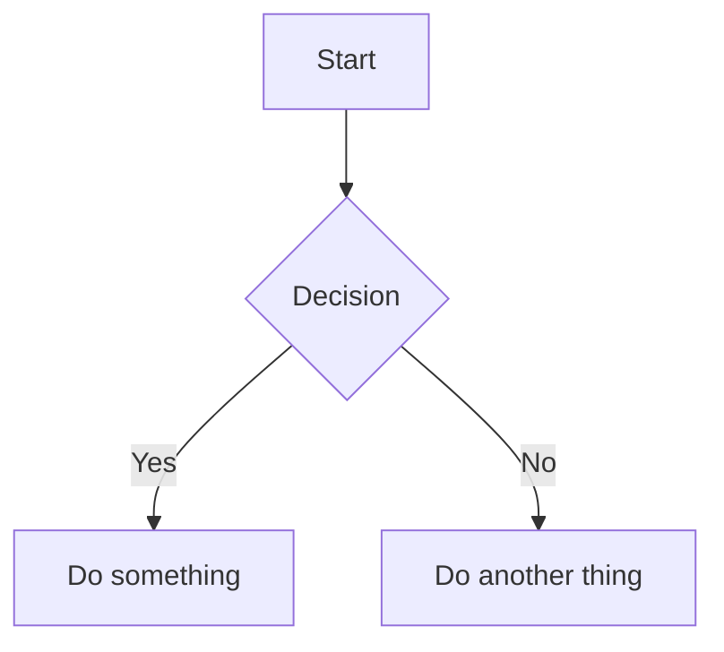
````

### スラッシュコマンドの使用

1. `/`を入力してコマンドメニューを開く
2. **Mermaid ダイアグラム**を選択
3. テンプレートダイアグラムが挿入されるので編集する

## 編集モード

### リッチテキストモード（WYSIWYG）

WYSIWYG モードでは、Mermaid ダイアグラムは入力中にインラインでレンダリングされます。ダイアグラムをクリックしてソースコードを編集します。

### ライブプレビュー付きソースモード

ソースモードでは、mermaid コードブロック内にカーソルがある場合にフローティングプレビューパネルが表示されます:


| 機能 | 説明 |
|-----|-----|
| **ライブプレビュー** | 入力中にレンダリングされたダイアグラムを表示（200ms のデバウンス） |
| **ドラッグして移動** | ヘッダーをドラッグしてプレビューの位置を変更 |
| **リサイズ** | 任意の端またはコーナーをドラッグしてリサイズ |
| **ズーム** | `−`と`+`ボタンを使用（10% から 300%） |

プレビューパネルは移動した場合の位置を記憶するため、ワークスペースを簡単に配置できます。

## サポートされているダイアグラムタイプ

VMark はすべての Mermaid ダイアグラムタイプをサポートしています:

### フローチャート

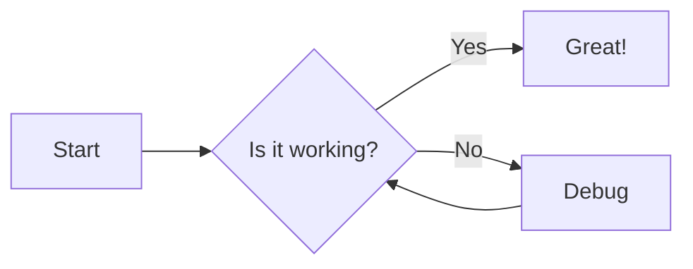

````markdown

````

### シーケンスダイアグラム

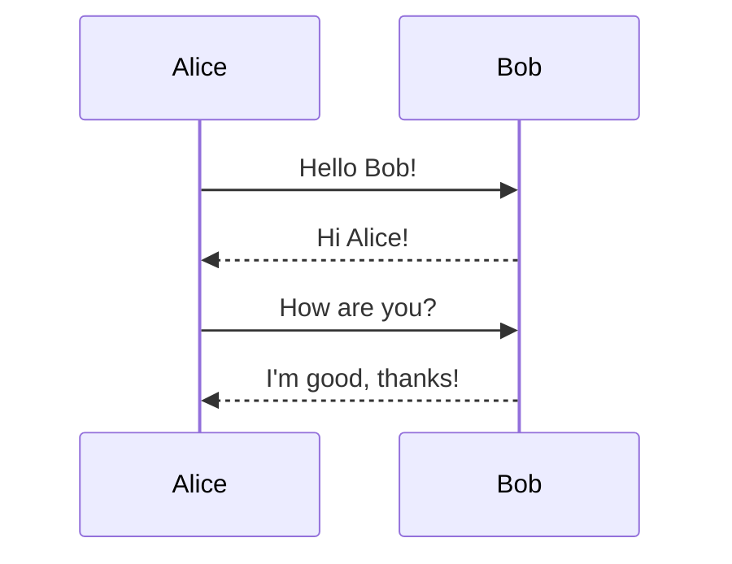

````markdown
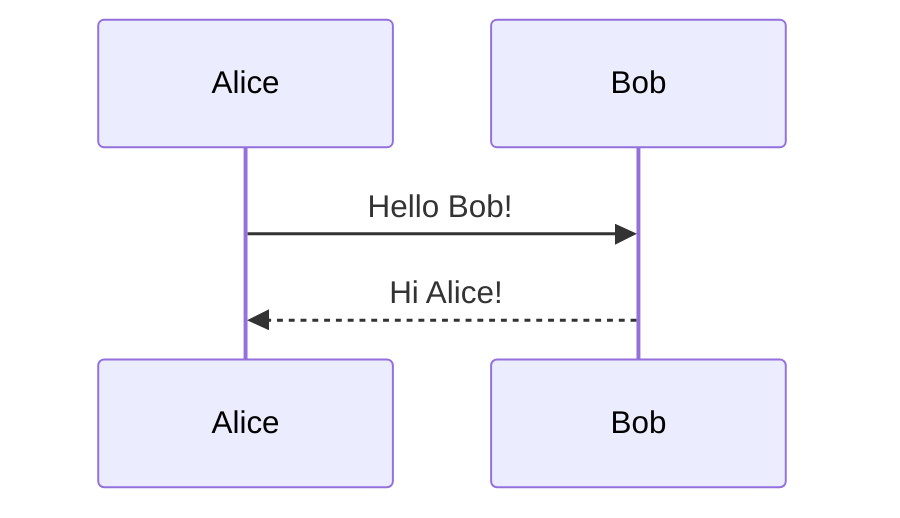
````

### クラスダイアグラム

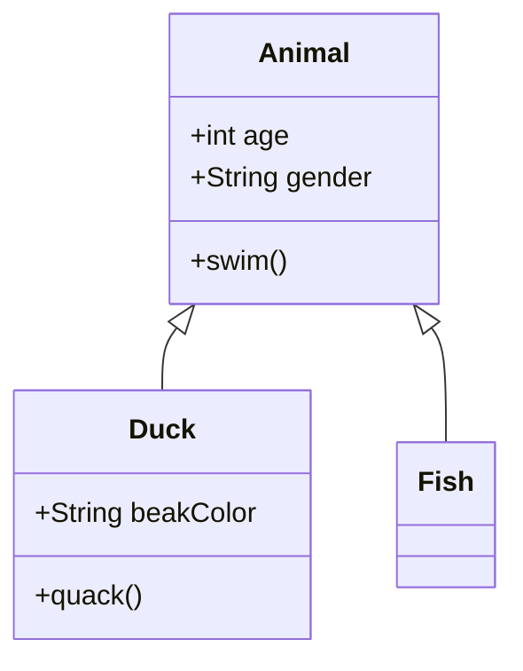

````markdown
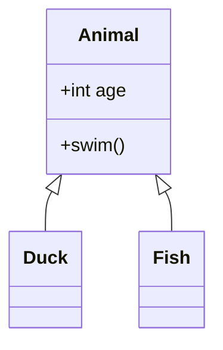
````

### 状態ダイアグラム

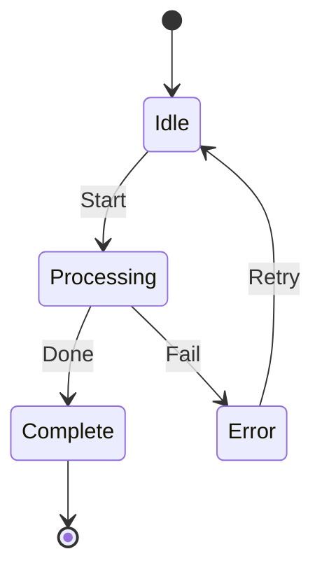

````markdown
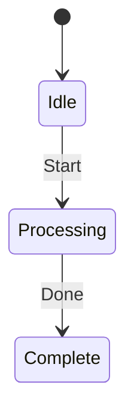
````

### ER 図

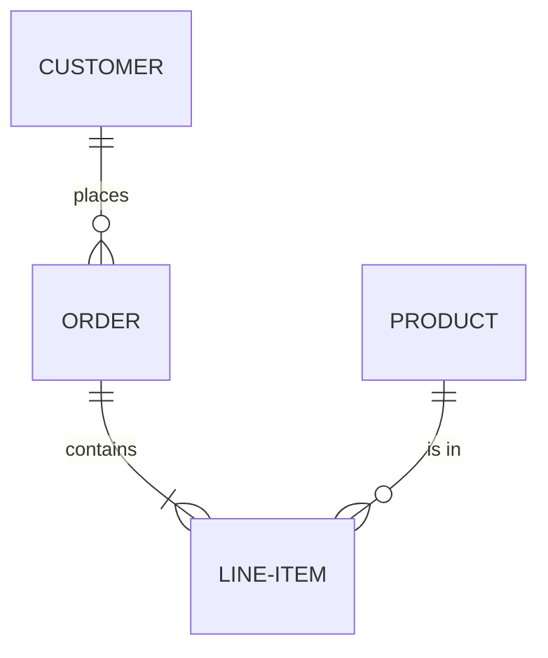

````markdown
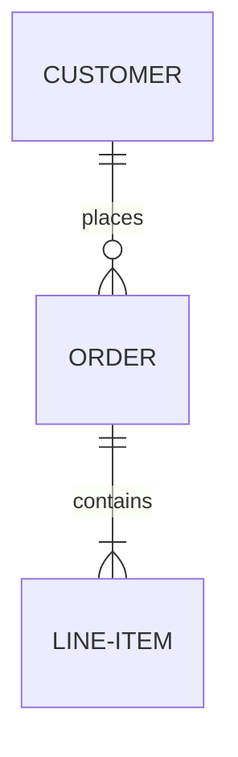
````

### ガントチャート

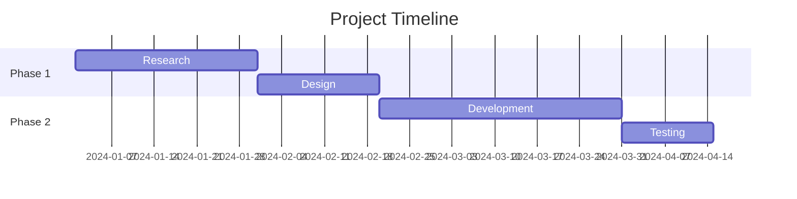

````markdown
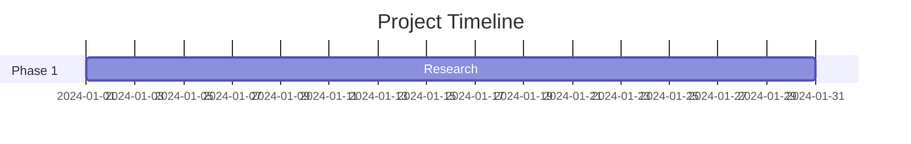
````

### 円グラフ

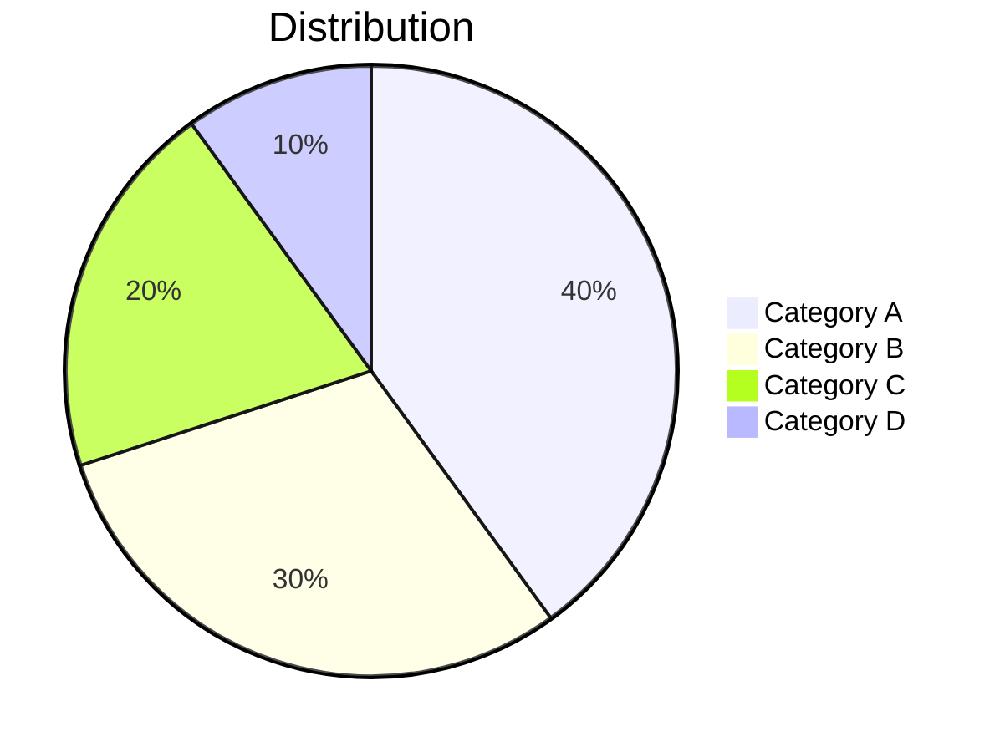

````markdown
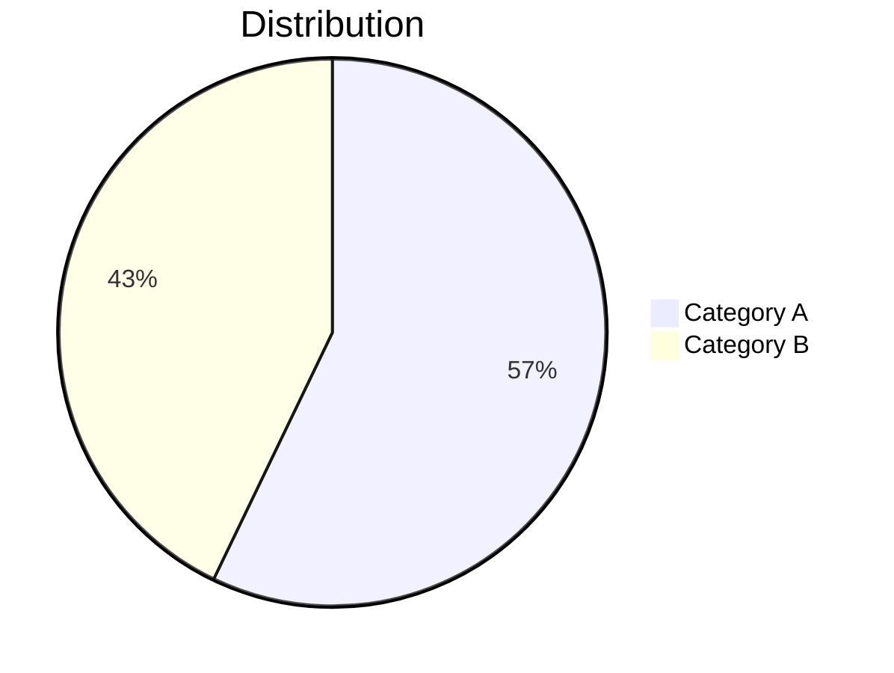
````

### Git グラフ

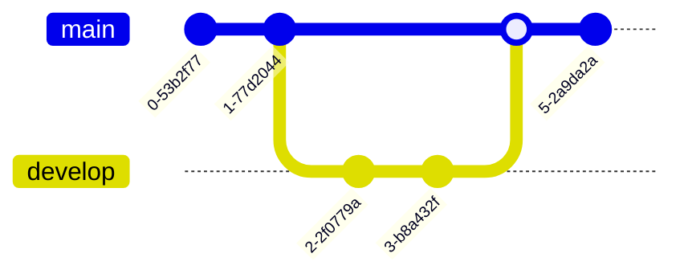

````markdown
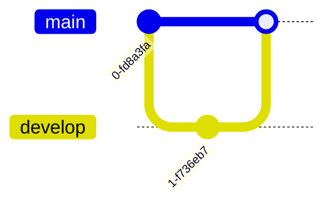
````

## ヒント

### 構文エラー

ダイアグラムに構文エラーがある場合:
- WYSIWYG モード: コードブロックに RAW ソースが表示されます
- ソースモード: プレビューに「無効な mermaid 構文」が表示されます

正しい構文については[Mermaid ドキュメント](https://mermaid.js.org/intro/)を確認してください。

### パンとズーム

WYSIWYG モードでは、レンダリングされたダイアグラムはインタラクティブなナビゲーションをサポートします:

| アクション | 手順 |
|---------|-----|
| **パン** | ダイアグラムをスクロールまたはクリックしてドラッグ |
| **ズーム** | `Cmd`（macOS）または`Ctrl`（Windows/Linux）を押しながらスクロール |
| **リセット** | ホバー時に表示されるリセットボタンをクリック（右上隅） |

### Mermaid ソースのコピー

WYSIWYG モードで mermaid コードブロックを編集する際、編集ヘッダーに**コピー**ボタンが表示されます。クリックして mermaid ソースコードをクリップボードにコピーします。

### テーマ統合

Mermaid ダイアグラムは VMark の現在のテーマ（ライトまたはダークモード）に自動的に適応します。

### PNG としてエクスポート

WYSIWYG モードでレンダリングされた mermaid ダイアグラムにホバーすると、**エクスポート**ボタンが表示されます（右上、リセットボタンの左）。クリックしてテーマを選択します:

| テーマ | 背景 |
|-------|-----|
| **ライト** | 白い背景 |
| **ダーク** | ダークな背景 |

ダイアグラムはシステムの保存ダイアログを通じて 2x 解像度の PNG としてエクスポートされます。エクスポートされた画像は具体的なシステムフォントスタックを使用するため、閲覧者のマシンにインストールされているフォントに関わらずテキストが正しくレンダリングされます。

### HTML または PDF へのエクスポート

ドキュメント全体を HTML または PDF にエクスポートする場合、Mermaid ダイアグラムは SVG 画像としてレンダリングされ、任意の解像度でシャープに表示されます。

## AI 生成ダイアグラムの修正

VMark は**Mermaid v11**を使用しており、古いバージョンより厳格なパーサー（Langium）を持っています。AI ツール（ChatGPT、Claude、Copilot など）は古い Mermaid バージョンでは動作したが v11 で失敗する構文を生成することがよくあります。以下は最も一般的な問題とその修正方法です。

### 1. 特殊文字を含むラベルのクォートなし

**最も頻繁な問題です。** ノードラベルに括弧、アポストロフィ、コロン、または引用符が含まれている場合、ダブル引用符で囲む必要があります。

````markdown
<!-- 失敗 -->
```mermaid
flowchart TD
    A[User's Dashboard] --> B[Step (optional)]
    C[Status: Active] --> D[Say "Hello"]
```

<!-- 動作する -->
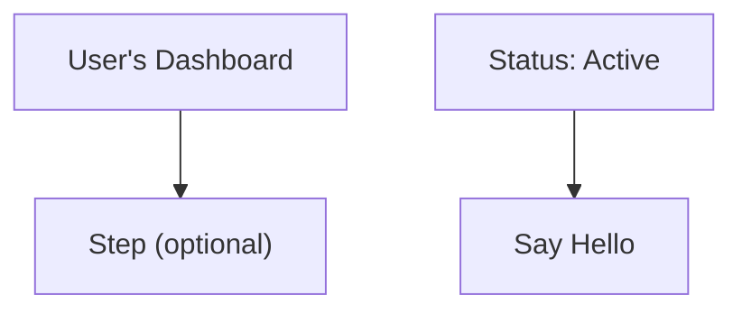
````

**ルール:** ラベルにこれらの文字が含まれる場合 — `' ( ) : " ; # &` — ラベル全体をダブル引用符で囲みます: `["like this"]`。

### 2. 末尾のセミコロン

AI モデルは行末にセミコロンを追加することがあります。Mermaid v11 ではこれは許可されていません。

````markdown
<!-- 失敗 -->
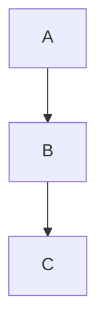

<!-- 動作する -->
```mermaid
flowchart TD
    A --> B
    B --> C
```
````

### 3. `flowchart`の代わりに`graph`を使用

`graph`キーワードはレガシー構文です。一部の新しい機能は`flowchart`でのみ動作します。すべての新しいダイアグラムには`flowchart`を優先してください。

````markdown
<!-- 新しい構文では失敗する場合がある -->
```mermaid
graph TD
    A --> B
```

<!-- 推奨 -->
```mermaid
flowchart TD
    A --> B
```
````

### 4. 特殊文字を含むサブグラフのタイトル

サブグラフのタイトルはノードラベルと同じクォートルールに従います。

````markdown
<!-- 失敗 -->
```mermaid
flowchart TD
    subgraph Service Layer (Backend)
        A --> B
    end
```

<!-- 動作する -->
```mermaid
flowchart TD
    subgraph "Service Layer (Backend)"
        A --> B
    end
```
````

### 5. クイック修正チェックリスト

AI 生成のダイアグラムに「無効な構文」と表示される場合:

1. 特殊文字を含む**すべてのラベルをクォート**: `["Label (with parens)"]`
2. すべての行から**末尾のセミコロンを削除**
3. 新しい構文機能を使用している場合は**`graph`を`flowchart`に置き換え**
4. 特殊文字を含む**サブグラフのタイトルをクォート**
5. **[Mermaid Live Editor](https://mermaid.live/)**でテストして正確なエラーを特定

::: tip
AI に Mermaid ダイアグラムを生成するよう依頼する場合、プロンプトに次を追加してください: *「Mermaid v11 の構文を使用してください。特殊文字を含むノードラベルは必ずダブル引用符で囲んでください。末尾のセミコロンは使用しないでください。」*
:::

## AI が有効な Mermaid を書けるようにする

毎回手動でダイアグラムを修正する代わりに、AI コーディングアシスタントが最初から正しい Mermaid v11 構文を生成するように教えるツールをインストールできます。

### Mermaid スキル（構文リファレンス）

スキルは AI に 23 種類すべてのダイアグラムタイプの最新の Mermaid 構文ドキュメントへのアクセスを提供するため、推測するのではなく正しいコードを生成します。

**ソース:** [WH-2099/mermaid-skill](https://github.com/WH-2099/mermaid-skill)

#### Claude Code

```bash
# スキルをクローン
git clone https://github.com/WH-2099/mermaid-skill.git /tmp/mermaid-skill

# グローバルにインストール（すべてのプロジェクトで利用可能）
mkdir -p ~/.claude/skills/mermaid
cp -r /tmp/mermaid-skill/.claude/skills/mermaid/* ~/.claude/skills/mermaid/

# またはプロジェクト単位でインストール
mkdir -p .claude/skills/mermaid
cp -r /tmp/mermaid-skill/.claude/skills/mermaid/* .claude/skills/mermaid/
```

インストール後、Claude Code で`/mermaid <説明>`を使用して正しい構文のダイアグラムを生成します。

#### Codex（OpenAI）

```bash
# 同じファイル、別の場所
mkdir -p ~/.codex/skills/mermaid
cp -r /tmp/mermaid-skill/.claude/skills/mermaid/* ~/.codex/skills/mermaid/
```

#### Gemini CLI（Google）

Gemini CLI は`~/.gemini/`またはプロジェクト単位の`.gemini/`からスキルを読み込みます。参照ファイルをコピーし、`GEMINI.md`に指示を追加します:

```bash
mkdir -p ~/.gemini/skills/mermaid
cp -r /tmp/mermaid-skill/.claude/skills/mermaid/references ~/.gemini/skills/mermaid/
```

次に`GEMINI.md`（グローバルの`~/.gemini/GEMINI.md`またはプロジェクト単位）に追加します:

```markdown
## Mermaid Diagrams

When generating Mermaid diagrams, read the syntax reference in
~/.gemini/skills/mermaid/references/ for the diagram type you are
generating. Use Mermaid v11 syntax: always quote node labels containing
special characters, do not use trailing semicolons, prefer "flowchart"
over "graph".
```

### Mermaid Validator MCP サーバー（構文チェック） {#mermaid-validator-mcp-server-syntax-checking}

MCP サーバーは AI がダイアグラムをあなたに提示する前に**検証**できるようにします。Mermaid v11 が内部で使用するのと同じパーサー（Jison + Langium）を使用してエラーをキャッチします。

**ソース:** [fast-mermaid-validator-mcp](https://github.com/ai-of-mine/fast-mermaid-validator-mcp)

#### Claude Code

```bash
# ワンコマンド — グローバルにインストール
claude mcp add -s user --transport stdio mermaid-validator \
  -- npx -y @ai-of-mine/fast-mermaid-validator-mcp --mcp-stdio
```

これにより 3 つのツールを提供する`mermaid-validator` MCP サーバーが登録されます:

| ツール | 目的 |
|------|-----|
| `validate_mermaid` | 単一のダイアグラムの構文をチェック |
| `validate_file` | Markdown ファイル内のダイアグラムを検証 |
| `get_examples` | サポートされている 28 種類すべてのサンプルダイアグラムを取得 |

#### Codex（OpenAI）

```bash
codex mcp add --transport stdio mermaid-validator \
  -- npx -y @ai-of-mine/fast-mermaid-validator-mcp --mcp-stdio
```

#### Claude Desktop

`claude_desktop_config.json`（設定 > 開発者 > 設定を編集）に追加します:

```json
{
  "mcpServers": {
    "mermaid-validator": {
      "command": "npx",
      "args": ["-y", "@ai-of-mine/fast-mermaid-validator-mcp", "--mcp-stdio"]
    }
  }
}
```

#### Gemini CLI（Google）

`~/.gemini/settings.json`（またはプロジェクト単位の`.gemini/settings.json`）に追加します:

```json
{
  "mcpServers": {
    "mermaid-validator": {
      "command": "npx",
      "args": ["-y", "@ai-of-mine/fast-mermaid-validator-mcp", "--mcp-stdio"]
    }
  }
}
```

::: info 前提条件
両方のツールには[Node.js](https://nodejs.org/)（v18 以降）がマシンにインストールされている必要があります。MCP サーバーは初回使用時に`npx`で自動的にダウンロードされます。
:::

## Mermaid 構文の学習

VMark は標準的な Mermaid 構文をレンダリングします。ダイアグラム作成をマスターするには、公式の Mermaid ドキュメントを参照してください:

### 公式ドキュメント

| ダイアグラムタイプ | ドキュメントリンク |
|--------------|--------------|
| フローチャート | [Flowchart Syntax](https://mermaid.js.org/syntax/flowchart.html) |
| シーケンスダイアグラム | [Sequence Diagram Syntax](https://mermaid.js.org/syntax/sequenceDiagram.html) |
| クラスダイアグラム | [Class Diagram Syntax](https://mermaid.js.org/syntax/classDiagram.html) |
| 状態ダイアグラム | [State Diagram Syntax](https://mermaid.js.org/syntax/stateDiagram.html) |
| ER 図 | [ER Diagram Syntax](https://mermaid.js.org/syntax/entityRelationshipDiagram.html) |
| ガントチャート | [Gantt Syntax](https://mermaid.js.org/syntax/gantt.html) |
| 円グラフ | [Pie Chart Syntax](https://mermaid.js.org/syntax/pie.html) |
| Git グラフ | [Git Graph Syntax](https://mermaid.js.org/syntax/gitgraph.html) |

### 練習ツール

- **[Mermaid Live Editor](https://mermaid.live/)** — VMark に貼り付ける前にダイアグラムをテストしてプレビューするインタラクティブな環境
- **[Mermaid ドキュメント](https://mermaid.js.org/)** — すべてのダイアグラムタイプの例を含む完全なリファレンス

::: tip
Live Editor は複雑なダイアグラムの実験に最適です。ダイアグラムが正しく表示されたら、コードを VMark にコピーします。
:::
