# Mermaid 다이어그램

VMark는 마크다운 문서에서 직접 순서도, 시퀀스 다이어그램 및 기타 시각화를 만들기 위해 [Mermaid](https://mermaid.js.org/) 다이어그램을 지원합니다.


## 다이어그램 삽입

### 키보드 단축키 사용

`mermaid` 언어 식별자와 함께 펜스드 코드 블록을 입력합니다:

````markdown
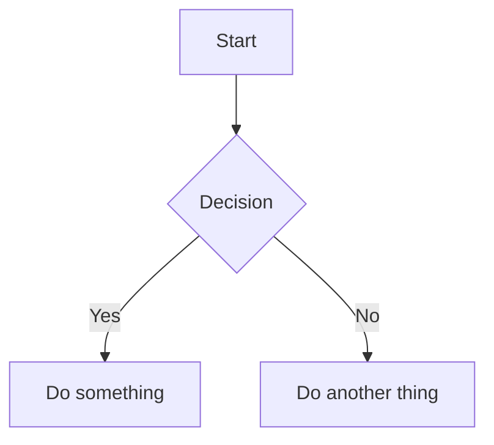
````

### 슬래시 명령 사용

1. `/`를 입력하여 명령 메뉴를 엽니다
2. **Mermaid 다이어그램** 선택
3. 편집할 템플릿 다이어그램이 삽입됩니다

## 편집 모드

### 리치 텍스트 모드 (WYSIWYG)

WYSIWYG 모드에서 Mermaid 다이어그램은 입력하는 동안 인라인으로 렌더링됩니다. 다이어그램을 클릭하면 소스 코드를 편집할 수 있습니다.

### 실시간 미리보기가 있는 소스 모드

소스 모드에서 커서가 mermaid 코드 블록 안에 있으면 플로팅 미리보기 패널이 나타납니다:


| 기능 | 설명 |
|------|------|
| **실시간 미리보기** | 입력하면서 렌더링된 다이어그램 확인 (200ms 디바운스) |
| **이동하려면 드래그** | 헤더를 드래그하여 미리보기 재배치 |
| **크기 조정** | 가장자리나 모서리를 드래그하여 크기 조정 |
| **줌** | `−` 및 `+` 버튼 사용 (10% ~ 300%) |

미리보기 패널을 이동하면 위치를 기억하여 워크스페이스를 쉽게 정리할 수 있습니다.

## 지원되는 다이어그램 타입

VMark는 모든 Mermaid 다이어그램 타입을 지원합니다:

### 순서도

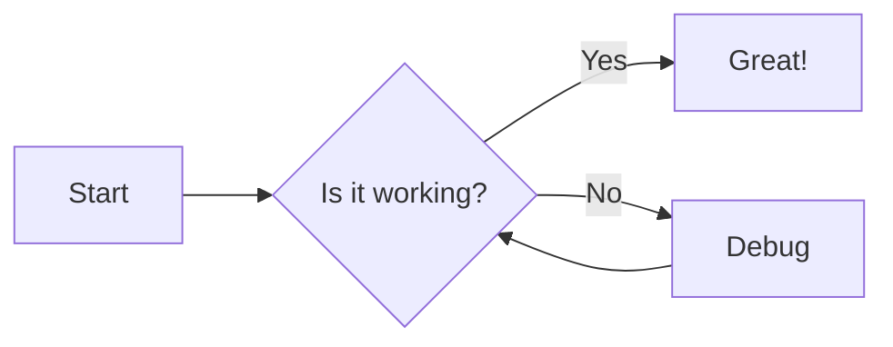

````markdown

````

### 시퀀스 다이어그램

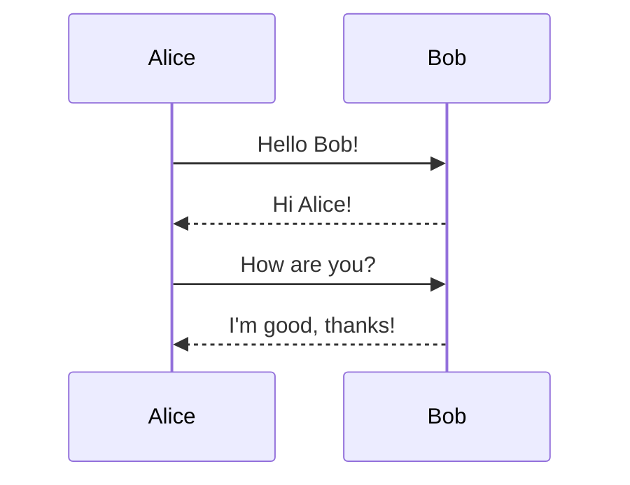

````markdown
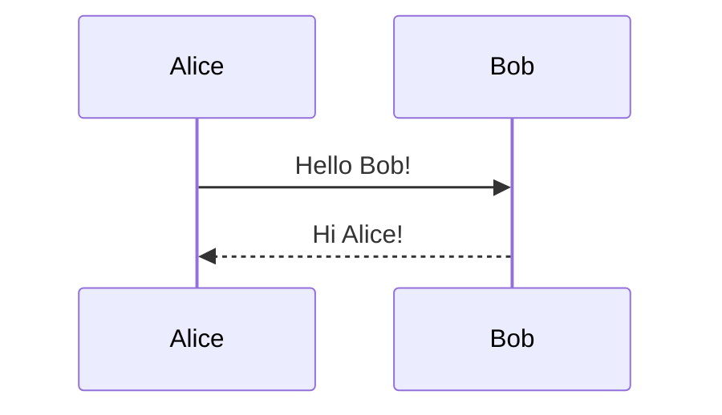
````

### 클래스 다이어그램

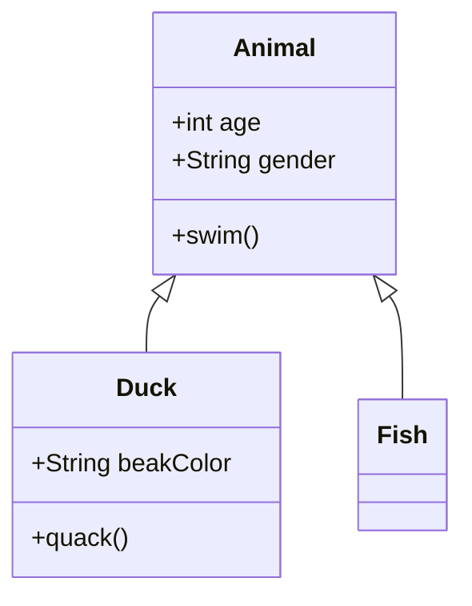

````markdown
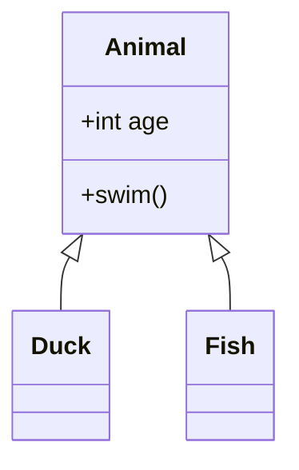
````

### 상태 다이어그램

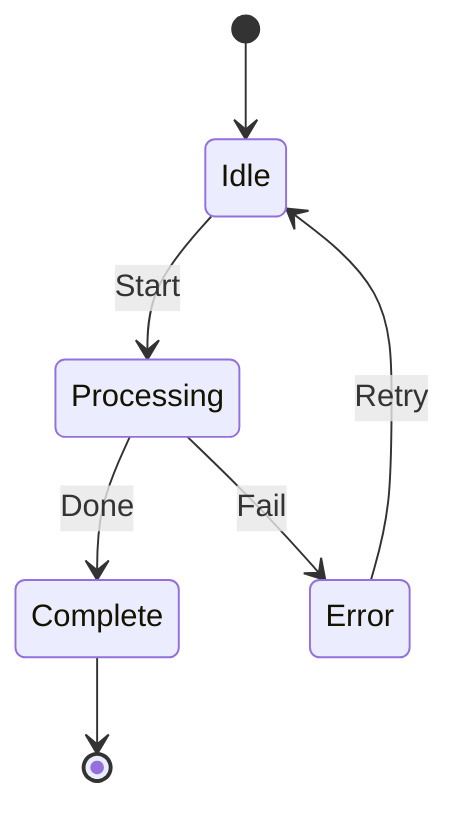

````markdown
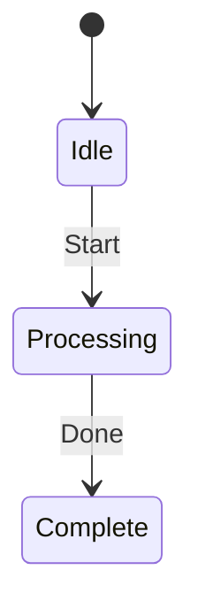
````

### 엔티티 관계 다이어그램

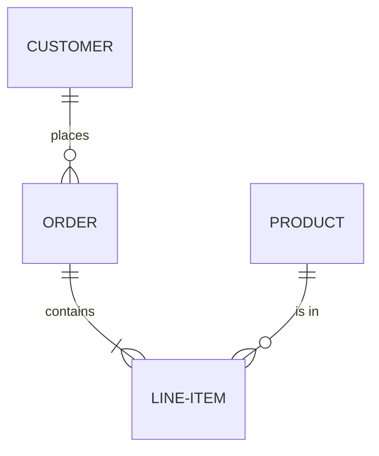

````markdown
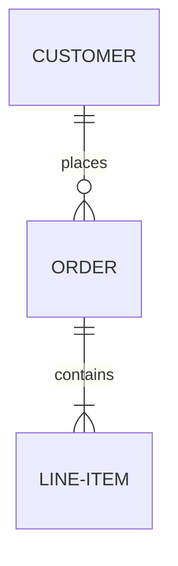
````

### 간트 차트

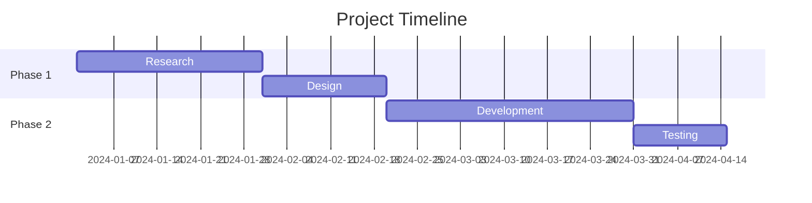

````markdown
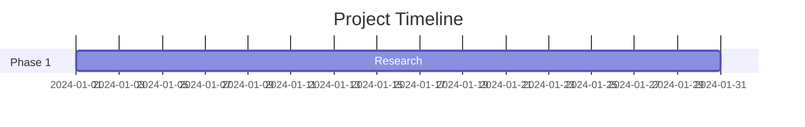
````

### 파이 차트

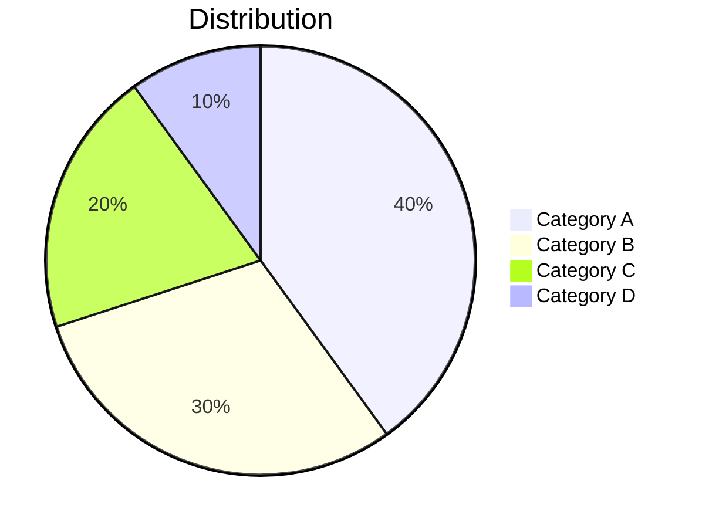

````markdown
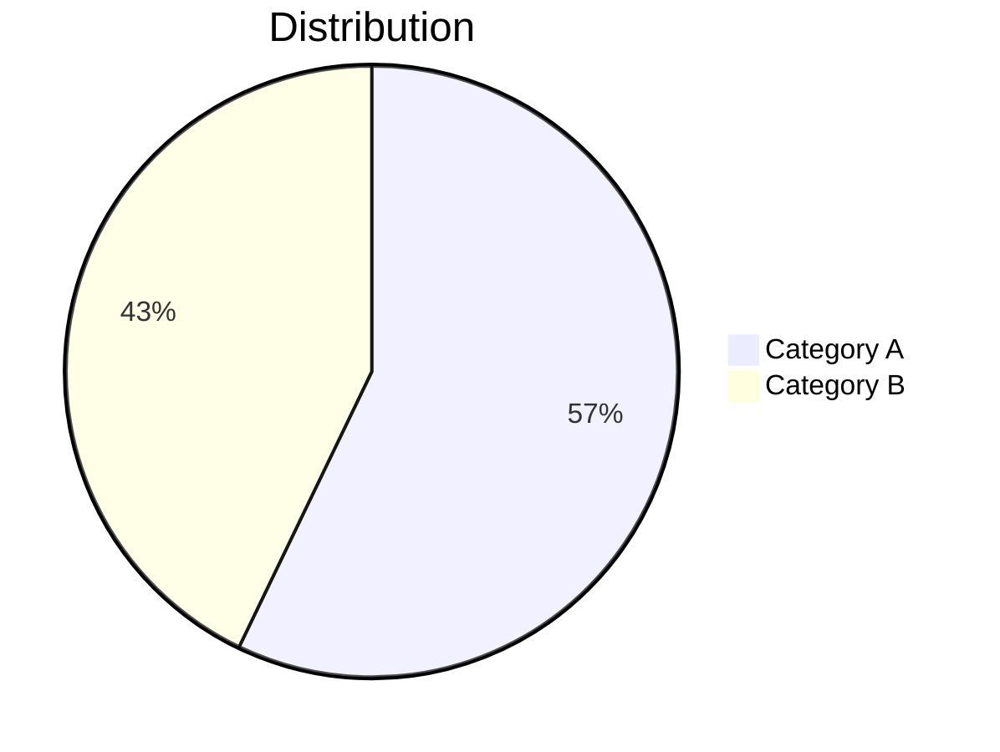
````

### Git 그래프

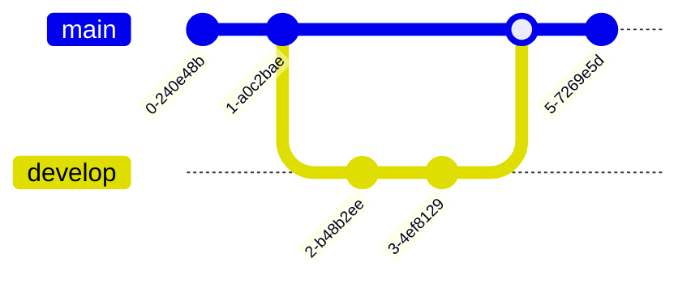

````markdown
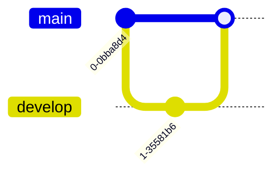
````

## 팁

### 구문 오류

다이어그램에 구문 오류가 있는 경우:
- WYSIWYG 모드: 코드 블록이 원시 소스를 표시합니다
- 소스 모드: 미리보기가 "유효하지 않은 mermaid 구문"을 표시합니다

올바른 구문은 [Mermaid 문서](https://mermaid.js.org/intro/)를 참조하세요.

### 패닝 및 줌

WYSIWYG 모드에서 렌더링된 다이어그램은 대화형 탐색을 지원합니다:

| 동작 | 방법 |
|------|------|
| **패닝** | 다이어그램을 스크롤하거나 클릭하여 드래그 |
| **줌** | `Cmd` (macOS) 또는 `Ctrl` (Windows/Linux) 을 누르고 스크롤 |
| **초기화** | 호버 시 나타나는 초기화 버튼 클릭 (오른쪽 상단 모서리) |

### Mermaid 소스 복사

WYSIWYG 모드에서 mermaid 코드 블록을 편집할 때 편집 헤더에 **복사** 버튼이 나타납니다. 클릭하면 mermaid 소스 코드가 클립보드에 복사됩니다.

### 테마 통합

Mermaid 다이어그램은 VMark의 현재 테마 (White, Paper, Mint, Sepia, Night)에 자동으로 맞춰집니다.

### PNG로 내보내기

WYSIWYG 모드에서 렌더링된 mermaid 다이어그램 위에 마우스를 올리면 **내보내기** 버튼이 나타납니다 (오른쪽 상단, 초기화 버튼 왼쪽). 클릭하여 테마를 선택합니다:

| 테마 | 배경 |
|------|------|
| **밝은** | 흰색 배경 |
| **어두운** | 어두운 배경 |

다이어그램은 시스템 저장 대화상자를 통해 2x 해상도 PNG로 내보내집니다. 내보낸 이미지는 구체적인 시스템 폰트 스택을 사용하므로 뷰어 머신에 설치된 폰트에 관계없이 텍스트가 올바르게 렌더링됩니다.

### HTML/PDF로 내보내기

전체 문서를 HTML 또는 PDF로 내보낼 때 Mermaid 다이어그램은 어떤 해상도에서도 선명하게 표시되는 SVG 이미지로 렌더링됩니다.

## AI 생성 다이어그램 수정

VMark는 이전 버전보다 엄격한 파서 (Langium)를 가진 **Mermaid v11** 을 사용합니다. AI 도구 (ChatGPT, Claude, Copilot 등)는 종종 이전 Mermaid 버전에서는 작동했지만 v11에서는 실패하는 구문을 생성합니다. 다음은 가장 일반적인 문제와 해결 방법입니다.

### 1. 특수 문자가 있는 따옴표 없는 레이블

**가장 자주 발생하는 문제.** 노드 레이블에 괄호, 어포스트로피, 콜론, 따옴표가 포함된 경우 큰따옴표로 감싸야 합니다.

````markdown
<!-- 실패 -->
```mermaid
flowchart TD
    A[User's Dashboard] --> B[Step (optional)]
    C[Status: Active] --> D[Say "Hello"]
```

<!-- 작동 -->
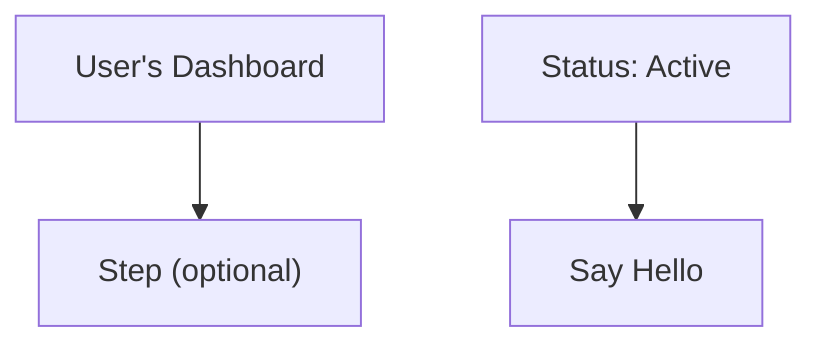
````

**규칙:** 레이블에 다음 문자 중 하나라도 포함된 경우 — `' ( ) : " ; # &` — 전체 레이블을 큰따옴표로 감싸세요: `["like this"]`.

### 2. 줄 끝 세미콜론

AI 모델이 때때로 줄 끝에 세미콜론을 추가합니다. Mermaid v11은 이를 허용하지 않습니다.

````markdown
<!-- 실패 -->
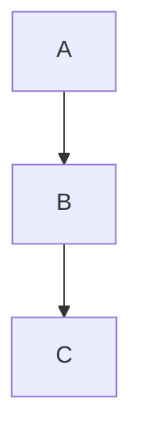

<!-- 작동 -->
```mermaid
flowchart TD
    A --> B
    B --> C
```
````

### 3. `flowchart` 대신 `graph` 사용

`graph` 키워드는 레거시 구문입니다. 일부 최신 기능은 `flowchart`에서만 작동합니다. 모든 새 다이어그램에 `flowchart`를 사용하세요.

````markdown
<!-- 최신 구문에서 실패할 수 있음 -->
```mermaid
graph TD
    A --> B
```

<!-- 권장 -->
```mermaid
flowchart TD
    A --> B
```
````

### 4. 특수 문자가 있는 서브그래프 제목

서브그래프 제목은 노드 레이블과 동일한 따옴표 규칙을 따릅니다.

````markdown
<!-- 실패 -->
```mermaid
flowchart TD
    subgraph Service Layer (Backend)
        A --> B
    end
```

<!-- 작동 -->
```mermaid
flowchart TD
    subgraph "Service Layer (Backend)"
        A --> B
    end
```
````

### 5. 빠른 수정 체크리스트

AI 생성 다이어그램에 "유효하지 않은 구문"이 표시될 때:

1. 특수 문자가 포함된 **모든 레이블에 따옴표 추가**: `["Label (with parens)"]`
2. 모든 줄에서 **후행 세미콜론 제거**
3. 최신 구문 기능을 사용하는 경우 **`graph`를 `flowchart`로 교체**
4. 특수 문자가 포함된 **서브그래프 제목에 따옴표 추가**
5. **[Mermaid Live Editor](https://mermaid.live/)에서 테스트** 하여 정확한 오류 찾기

::: tip
AI에게 Mermaid 다이어그램 생성을 요청할 때 프롬프트에 다음을 추가하세요: *"Mermaid v11 구문을 사용하세요. 특수 문자가 포함된 노드 레이블을 항상 큰따옴표로 감싸세요. 후행 세미콜론을 사용하지 마세요."*
:::

## AI가 유효한 Mermaid를 작성하도록 가르치기

매번 다이어그램을 수동으로 수정하는 대신 AI 코딩 어시스턴트가 처음부터 올바른 Mermaid v11 구문을 생성하도록 도구를 설치할 수 있습니다.

### Mermaid 스킬 (구문 참조)

스킬을 통해 AI가 23가지 다이어그램 타입 모두에 대한 최신 Mermaid 구문 문서에 접근할 수 있어 추측 대신 올바른 코드를 생성합니다.

**소스:** [WH-2099/mermaid-skill](https://github.com/WH-2099/mermaid-skill)

#### Claude Code

```bash
# 스킬 클론
git clone https://github.com/WH-2099/mermaid-skill.git /tmp/mermaid-skill

# 전역 설치 (모든 프로젝트에서 사용 가능)
mkdir -p ~/.claude/skills/mermaid
cp -r /tmp/mermaid-skill/.claude/skills/mermaid/* ~/.claude/skills/mermaid/

# 또는 프로젝트별 설치
mkdir -p .claude/skills/mermaid
cp -r /tmp/mermaid-skill/.claude/skills/mermaid/* .claude/skills/mermaid/
```

설치 후 Claude Code에서 `/mermaid <설명>`을 사용하여 올바른 구문으로 다이어그램을 생성합니다.

#### Codex (OpenAI)

```bash
# 동일한 파일, 다른 위치
mkdir -p ~/.codex/skills/mermaid
cp -r /tmp/mermaid-skill/.claude/skills/mermaid/* ~/.codex/skills/mermaid/
```

#### Gemini CLI (Google)

Gemini CLI는 `~/.gemini/` 또는 프로젝트별 `.gemini/`에서 스킬을 읽습니다. 참조 파일을 복사하고 `GEMINI.md`에 지침을 추가합니다:

```bash
mkdir -p ~/.gemini/skills/mermaid
cp -r /tmp/mermaid-skill/.claude/skills/mermaid/references ~/.gemini/skills/mermaid/
```

그런 다음 `GEMINI.md` (전역 `~/.gemini/GEMINI.md` 또는 프로젝트별)에 추가합니다:

```markdown
## Mermaid Diagrams

When generating Mermaid diagrams, read the syntax reference in
~/.gemini/skills/mermaid/references/ for the diagram type you are
generating. Use Mermaid v11 syntax: always quote node labels containing
special characters, do not use trailing semicolons, prefer "flowchart"
over "graph".
```

### Mermaid Validator MCP 서버 (구문 검사)

MCP 서버를 통해 AI가 다이어그램을 사용자에게 제시하기 전에 **검증** 할 수 있습니다. Mermaid v11이 내부적으로 사용하는 동일한 파서 (Jison + Langium)를 사용하여 오류를 잡아냅니다.

**소스:** [fast-mermaid-validator-mcp](https://github.com/ai-of-mine/fast-mermaid-validator-mcp)

#### Claude Code

```bash
# 단 하나의 명령 — 전역으로 설치
claude mcp add -s user --transport stdio mermaid-validator \
  -- npx -y @ai-of-mine/fast-mermaid-validator-mcp --mcp-stdio
```

이는 세 가지 도구를 제공하는 `mermaid-validator` MCP 서버를 등록합니다:

| 도구 | 목적 |
|------|------|
| `validate_mermaid` | 단일 다이어그램의 구문 확인 |
| `validate_file` | 마크다운 파일 내 다이어그램 검증 |
| `get_examples` | 지원되는 28가지 타입 모두의 샘플 다이어그램 가져오기 |

#### Codex (OpenAI)

```bash
codex mcp add --transport stdio mermaid-validator \
  -- npx -y @ai-of-mine/fast-mermaid-validator-mcp --mcp-stdio
```

#### Claude Desktop

`claude_desktop_config.json`에 추가합니다 (설정 > 개발자 > 설정 편집):

```json
{
  "mcpServers": {
    "mermaid-validator": {
      "command": "npx",
      "args": ["-y", "@ai-of-mine/fast-mermaid-validator-mcp", "--mcp-stdio"]
    }
  }
}
```

#### Gemini CLI (Google)

`~/.gemini/settings.json` (또는 프로젝트별 `.gemini/settings.json`)에 추가합니다:

```json
{
  "mcpServers": {
    "mermaid-validator": {
      "command": "npx",
      "args": ["-y", "@ai-of-mine/fast-mermaid-validator-mcp", "--mcp-stdio"]
    }
  }
}
```

::: info 필수 조건
두 도구 모두 머신에 [Node.js](https://nodejs.org/) (v18 이상)가 설치되어 있어야 합니다. MCP 서버는 처음 사용 시 `npx`를 통해 자동으로 다운로드됩니다.
:::

## Mermaid 구문 배우기

VMark는 표준 Mermaid 구문을 렌더링합니다. 다이어그램 생성을 마스터하려면 공식 Mermaid 문서를 참조하세요:

### 공식 문서

| 다이어그램 타입 | 문서 링크 |
|--------------|---------|
| 순서도 | [Flowchart Syntax](https://mermaid.js.org/syntax/flowchart.html) |
| 시퀀스 다이어그램 | [Sequence Diagram Syntax](https://mermaid.js.org/syntax/sequenceDiagram.html) |
| 클래스 다이어그램 | [Class Diagram Syntax](https://mermaid.js.org/syntax/classDiagram.html) |
| 상태 다이어그램 | [State Diagram Syntax](https://mermaid.js.org/syntax/stateDiagram.html) |
| 엔티티 관계 | [ER Diagram Syntax](https://mermaid.js.org/syntax/entityRelationshipDiagram.html) |
| 간트 차트 | [Gantt Syntax](https://mermaid.js.org/syntax/gantt.html) |
| 파이 차트 | [Pie Chart Syntax](https://mermaid.js.org/syntax/pie.html) |
| Git 그래프 | [Git Graph Syntax](https://mermaid.js.org/syntax/gitgraph.html) |

### 연습 도구

- **[Mermaid Live Editor](https://mermaid.live/)** — VMark에 붙여넣기 전 다이어그램을 테스트하고 미리볼 수 있는 대화형 플레이그라운드
- **[Mermaid Documentation](https://mermaid.js.org/)** — 모든 다이어그램 타입에 대한 예시가 포함된 완전한 참조

::: tip
Live Editor는 복잡한 다이어그램을 실험하기에 좋습니다. 다이어그램이 올바르게 보이면 코드를 VMark에 복사하세요.
:::
