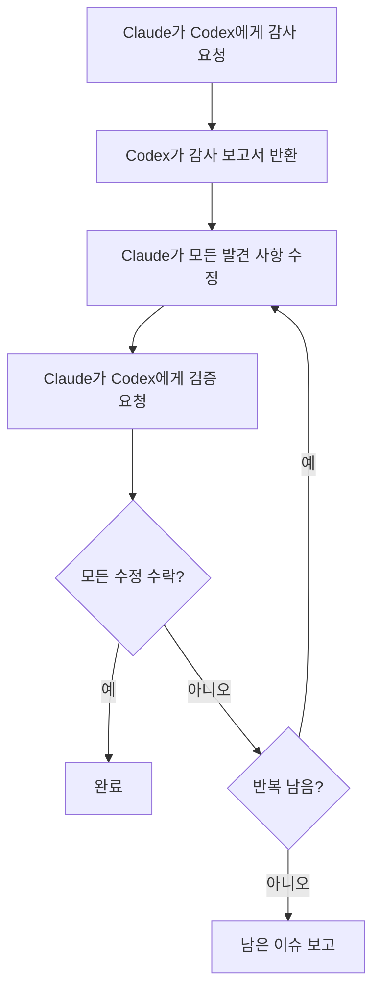

# 교차 모델 검증

VMark는 서로를 도전시키는 두 가지 AI 모델을 사용합니다: **Claude가 코드를 작성하고, Codex가 감사합니다**. 이 대립적 설정은 단일 모델이 놓칠 버그를 잡아냅니다.

## 두 모델이 한 모델보다 나은 이유

모든 AI 모델에는 맹점이 있습니다. 특정 카테고리의 버그를 일관되게 놓치거나, 더 안전한 대안보다 특정 패턴을 선호하거나, 자신의 가정을 의문시하지 못할 수 있습니다. 동일한 모델이 코드를 작성하고 검토할 때, 그 맹점은 두 번의 검사 모두를 통과합니다.

교차 모델 검증은 이것을 끊습니다:

1. **Claude** (Anthropic)가 구현을 작성합니다 — 전체 컨텍스트를 이해하고, 프로젝트 규약을 따르고, TDD를 적용합니다.
2. **Codex** (OpenAI)가 결과를 독립적으로 감사합니다 — 다른 데이터로 훈련된 신선한 눈으로 코드를 읽고, 다른 실패 모드를 가집니다.

모델들은 진정으로 다릅니다. 별도의 팀이 다른 데이터셋으로 다른 아키텍처와 최적화 목표로 만들었습니다. 두 모델이 코드가 올바르다는 것에 동의할 때, 단일 모델의 "좋아 보입니다"보다 훨씬 높은 신뢰도를 가집니다.

연구는 여러 각도에서 이 접근 방식을 지지합니다. 다중 에이전트 토론 — 여러 LLM 인스턴스가 서로의 응답을 도전하는 — 은 사실성과 추론 정확도를 크게 향상시킵니다[^1]. 역할 놀이 프롬프팅은 모델이 특정 전문가 역할을 할당받을 때 추론 벤치마크에서 표준 제로샷 프롬프팅보다 일관되게 더 나은 성능을 보입니다[^2]. 그리고 최근 연구에서 프론티어 LLM이 평가를 받고 있다는 것을 감지하고 그에 따라 동작을 조정할 수 있다는 것을 보여줍니다[^3] — 출력이 다른 AI에 의해 검토된다는 것을 아는 모델은 더 신중하고 덜 아첨하는 작업을 생성할 가능성이 높습니다[^4].

### 교차 모델이 잡는 것

실제로 두 번째 모델은 다음 같은 이슈를 찾습니다:

- 첫 번째 모델이 자신 있게 도입한 **논리 오류**
- 첫 번째 모델이 고려하지 않은 **엣지 케이스** (null, 비어 있음, 유니코드, 동시 접근)
- 리팩터링 후 남겨진 **죽은 코드**
- 한 모델의 훈련이 플래그 하지 않은 **보안 패턴** (경로 순회, 인젝션)
- 작성 모델이 합리화한 **규약 위반**
- 모델이 미묘한 오류로 코드를 복제한 **복사-붙여넣기 버그**

이것은 인간 코드 리뷰 뒤에 있는 동일한 원칙입니다 — 두 번째 쌍의 눈이 저자가 볼 수 없는 것을 잡아냅니다 — 단, "리뷰어"와 "저자" 모두 지칠 줄 모르고 초 단위로 전체 코드베이스를 처리할 수 있습니다.

## VMark에서 작동하는 방법

### Codex 툴킷 플러그인

VMark는 Codex를 MCP 서버로 번들링하는 `codex-toolkit@xiaolai` Claude Code 플러그인을 사용합니다. 플러그인이 활성화되면 Claude Code는 자동으로 `codex` MCP 도구 — Codex에 프롬프트를 보내고 구조화된 응답을 받는 채널 — 에 접근합니다. Codex는 **샌드박스된 읽기 전용 컨텍스트** 에서 실행됩니다: 코드베이스를 읽을 수 있지만 파일을 수정할 수 없습니다. 모든 변경 사항은 Claude가 만듭니다.

### 설정

1. Codex CLI를 전역으로 설치하고 인증:

```bash
npm install -g @openai/codex
codex login                   # ChatGPT 구독으로 로그인 (권장)
```

2. xiaolai 플러그인 마켓플레이스 추가 (처음 한 번만):

```bash
claude plugin marketplace add xiaolai/claude-plugin-marketplace
```

3. Claude Code에 codex-toolkit 플러그인 설치 및 활성화:

```bash
claude plugin install codex-toolkit@xiaolai --scope project
```

4. Codex가 사용 가능한지 확인:

```bash
codex --version
```

이것이 전부입니다. 플러그인이 Codex MCP 서버를 자동으로 등록합니다 — 수동 `.mcp.json` 항목이 필요 없습니다.

::: tip 구독 vs API
극적으로 낮은 비용을 위해 `OPENAI_API_KEY` 대신 `codex login` (ChatGPT 구독)을 사용하세요. [구독 vs API 가격 책정](/ko/guide/users-as-developers/subscription-vs-api)을 참조하세요.
:::

::: tip macOS GUI 앱을 위한 PATH
macOS GUI 앱은 최소한의 PATH를 가집니다. `codex --version`이 터미널에서는 작동하지만 Claude Code가 찾을 수 없다면 Codex 바이너리 위치를 셸 프로필 (`~/.zshrc` 또는 `~/.bashrc`)에 추가하세요.
:::

::: tip 프로젝트 구성
`/codex-toolkit:init`를 실행하여 프로젝트별 기본값 (감사 집중, 노력 수준, 건너뛰기 패턴)이 있는 `.codex-toolkit.md` 구성 파일을 생성하세요.
:::

## 슬래시 명령어

`codex-toolkit` 플러그인은 Claude + Codex 워크플로우를 조율하는 미리 만들어진 슬래시 명령어를 제공합니다. 상호 작용을 수동으로 관리할 필요가 없습니다 — 그냥 명령어를 호출하면 모델이 자동으로 조율됩니다.

### `/codex-toolkit:audit` — 코드 감사

주요 감사 명령어. 두 가지 모드를 지원합니다:

- **미니 (기본값)** — 빠른 5차원 검사: 논리, 중복, 죽은 코드, 리팩터링 부채, 단축키
- **전체 (`--full`)** — 보안, 성능, 준수, 종속성, 문서를 추가하는 철저한 9차원 감사

| 차원 | 확인 내용 |
|------|----------|
| 1. 중복 코드 | 죽은 코드, 중복, 사용하지 않는 임포트 |
| 2. 보안 | 인젝션, 경로 순회, XSS, 하드코딩된 시크릿 |
| 3. 정확성 | 논리 오류, 경쟁 조건, null 처리 |
| 4. 준수 | 프로젝트 규약, Zustand 패턴, CSS 토큰 |
| 5. 유지 관리성 | 복잡도, 파일 크기, 명명, 임포트 위생 |
| 6. 성능 | 불필요한 재렌더링, 블로킹 작업 |
| 7. 테스팅 | 커버리지 격차, 누락된 엣지 케이스 테스트 |
| 8. 종속성 | 알려진 CVE, 구성 보안 |
| 9. 문서 | 누락된 문서, 오래된 주석, 웹사이트 동기화 |

사용법:

```
/codex-toolkit:audit                  # 커밋되지 않은 변경 사항에 대한 미니 감사
/codex-toolkit:audit --full           # 전체 9차원 감사
/codex-toolkit:audit commit -3        # 마지막 3개 커밋 감사
/codex-toolkit:audit src/stores/      # 특정 디렉터리 감사
```

출력은 모든 발견 사항에 대한 심각도 등급 (Critical / High / Medium / Low)과 제안된 수정 사항이 있는 구조화된 보고서입니다.

### `/codex-toolkit:verify` — 이전 수정 사항 검증

감사 발견 사항을 수정한 후, Codex가 수정이 올바른지 확인하도록 합니다:

```
/codex-toolkit:verify                 # 마지막 감사에서 수정 사항 검증
```

Codex가 보고된 위치에서 각 파일을 다시 읽고 각 이슈를 수정됨, 수정 안 됨, 또는 부분적으로 수정됨으로 표시합니다. 또한 수정에 의해 도입된 새 이슈도 확인합니다.

### `/codex-toolkit:audit-fix` — 전체 루프

가장 강력한 명령어. 감사 → 수정 → 검증을 루프로 연결합니다:

```
/codex-toolkit:audit-fix              # 커밋되지 않은 변경 사항에 대한 루프
/codex-toolkit:audit-fix commit -1    # 마지막 커밋에 대한 루프
```

일어나는 일:



루프는 Codex가 모든 심각도에서 발견 사항이 없다고 보고하거나 3번의 반복 후에 종료됩니다 (이 시점에서 남은 이슈가 보고됩니다).

### `/codex-toolkit:implement` — 자율 구현

Codex에게 계획을 완전한 자율 구현으로 전송합니다:

```
/codex-toolkit:implement              # 계획에서 구현
```

### `/codex-toolkit:bug-analyze` — 근본 원인 분석

사용자가 설명한 버그에 대한 근본 원인 분석:

```
/codex-toolkit:bug-analyze            # 버그 분석
```

### `/codex-toolkit:review-plan` — 계획 검토

Codex에게 아키텍처 검토를 위해 계획을 전송합니다:

```
/codex-toolkit:review-plan            # 일관성 및 위험을 위해 계획 검토
```

### `/codex-toolkit:continue` — 세션 계속

발견 사항을 반복하기 위해 이전 Codex 세션을 계속합니다:

```
/codex-toolkit:continue               # 중단한 곳에서 계속
```

### `/fix-issue` — 엔드투엔드 이슈 해결자

이 프로젝트별 명령어는 GitHub 이슈에 대한 전체 파이프라인을 실행합니다:

```
/fix-issue #123               # 단일 이슈 수정
/fix-issue #123 #456 #789     # 병렬로 여러 이슈 수정
```

파이프라인:
1. **가져오기** — GitHub에서 이슈 가져오기
2. **분류** — 버그, 기능, 또는 질문
3. **브랜치** 설명적인 이름으로 생성
4. **수정** — TDD로 (RED → GREEN → REFACTOR)
5. **Codex 감사 루프** — (최대 3라운드의 감사 → 수정 → 검증)
6. **게이트** — (`pnpm check:all` + Rust가 변경된 경우 `cargo check`)
7. **PR** 구조화된 설명으로 생성

교차 모델 감사는 5단계에 내장되어 있습니다 — 모든 수정이 PR이 생성되기 전에 대립적 검토를 거칩니다.

## 특화 에이전트와 계획

감사 명령어 외에도, VMark의 AI 설정에는 상위 수준 조율이 포함됩니다:

### `/feature-workflow` — 에이전트 기반 개발

복잡한 기능을 위해 이 명령어는 특화된 서브에이전트 팀을 배포합니다:

| 에이전트 | 역할 |
|---------|------|
| **플래너** | 모범 사례 조사, 엣지 케이스 브레인스토밍, 모듈식 계획 생성 |
| **사양 수호자** | 프로젝트 규칙 및 사양에 대해 계획 검증 |
| **영향 분석가** | 최소 변경 세트와 종속성 엣지 매핑 |
| **구현자** | 사전 조사를 통한 TDD 기반 구현 |
| **감사자** | 정확성과 규칙 위반에 대한 diff 검토 |
| **테스트 러너** | 게이트 실행, E2E 테스트 조율 |
| **검증자** | 릴리스 전 최종 체크리스트 |
| **릴리스 관리자** | 커밋 메시지와 릴리스 노트 |

사용법:

```
/feature-workflow sidebar-redesign
```

### 계획 스킬

계획 스킬은 다음을 포함하는 구조화된 구현 계획을 만듭니다:

- 명시적인 작업 항목 (WI-001, WI-002, ...)
- 각 항목에 대한 수락 기준
- 먼저 작성할 테스트 (TDD)
- 위험 완화 및 롤백 전략
- 데이터 변경이 관련될 때의 마이그레이션 계획

계획은 구현 중 참조를 위해 `dev-docs/plans/`에 저장됩니다.

## 임시 Codex 상담

구조화된 명령어 외에도 언제든지 Claude에게 Codex와 상담하도록 요청할 수 있습니다:

```
지금 해결하지 못한 문제를 요약하고 Codex에게 도움을 요청하세요.
```

Claude가 질문을 만들어 MCP를 통해 Codex에게 보내고 응답을 통합합니다. Claude가 문제에 막혀 있거나 접근법에 대한 두 번째 의견을 원할 때 유용합니다.

구체적으로 할 수도 있습니다:

```
Codex에게 이 Zustand 패턴이 오래된 상태를 야기할 수 있는지 물어보세요.
```

```
Codex가 이 마이그레이션의 SQL을 엣지 케이스에 대해 검토하도록 하세요.
```

## 대체: Codex를 사용할 수 없을 때

모든 명령어는 Codex MCP를 사용할 수 없을 때 (설치되지 않음, 네트워크 이슈 등) gracefully 저하됩니다:

1. 명령어가 먼저 Codex를 핑합니다 (`Respond with 'ok'`)
2. 응답 없음: **수동 감사** 가 자동으로 시작됩니다
3. Claude가 각 파일을 직접 읽고 동일한 차원 분석을 수행합니다
4. 감사는 여전히 발생합니다 — 단지 교차 모델이 아닌 단일 모델 대신

Codex가 다운될 때 명령어가 실패할 걱정이 없습니다. 항상 결과를 생성합니다.

## 철학

아이디어는 간단합니다: **신뢰하되 검증하세요 — 다른 두뇌로.**

인간 팀은 이것을 자연스럽게 합니다. 개발자가 코드를 작성하고, 동료가 검토하고, QA 엔지니어가 테스트합니다. 각 사람은 다른 경험, 다른 맹점, 다른 멘탈 모델을 가져옵니다. VMark는 동일한 원칙을 AI 도구에 적용합니다:

- **다른 훈련 데이터** → 다른 지식 격차
- **다른 아키텍처** → 다른 추론 패턴
- **다른 실패 모드** → 하나가 놓치고 다른 것이 잡는 버그

비용은 최소화됩니다 (감사당 몇 초의 API 시간), 하지만 품질 향상은 상당합니다. VMark의 경험에서, 두 번째 모델은 일반적으로 감사당 첫 번째 모델이 놓친 2–5개의 추가 이슈를 찾습니다.

[^1]: Du, Y., Li, S., Torralba, A., Tenenbaum, J.B., & Mordatch, I. (2024). [Improving Factuality and Reasoning in Language Models through Multiagent Debate](https://arxiv.org/abs/2305.14325). *ICML 2024*. 여러 라운드에 걸쳐 여러 LLM 인스턴스가 응답을 제안하고 토론하면 모든 모델이 처음에 잘못된 답을 생성할 때도 사실성과 추론이 크게 향상됩니다.

[^2]: Kong, A., Zhao, S., Chen, H., Li, Q., Qin, Y., Sun, R., & Zhou, X. (2024). [Better Zero-Shot Reasoning with Role-Play Prompting](https://arxiv.org/abs/2308.07702). *NAACL 2024*. LLM에 작업별 전문가 역할을 할당하면 12개의 추론 벤치마크에서 표준 제로샷 및 제로샷 연쇄 사고 프롬프팅보다 일관되게 더 나은 성능을 보입니다.

[^3]: Needham, J., Edkins, G., Pimpale, G., Bartsch, H., & Hobbhahn, M. (2025). [Large Language Models Often Know When They Are Being Evaluated](https://arxiv.org/abs/2505.23836). 프론티어 모델은 평가 컨텍스트를 실제 배포와 구별할 수 있으며 (Gemini-2.5-Pro는 AUC 0.83에 도달), 다른 AI가 출력을 검토한다는 것을 알 때 모델이 어떻게 행동하는지에 대한 함의를 제기합니다.

[^4]: Sharma, M., Tong, M., Korbak, T., et al. (2024). [Towards Understanding Sycophancy in Language Models](https://arxiv.org/abs/2310.13548). *ICLR 2024*. 인간 피드백으로 훈련된 LLM은 진실한 응답을 제공하는 대신 사용자의 기존 믿음에 동의하는 경향이 있습니다. 평가자가 인간이 아닌 다른 AI일 때, 이 아첨적 압력이 제거되어 더 정직하고 엄격한 출력으로 이어집니다.
