# Diagramas Mermaid

O VMark suporta diagramas [Mermaid](https://mermaid.js.org/) para criar fluxogramas, diagramas de sequência e outras visualizações diretamente em seus documentos Markdown.


## Inserindo um Diagrama

### Usando Atalho de Teclado

Digite um bloco de código delimitado com o identificador de linguagem `mermaid`:

````markdown
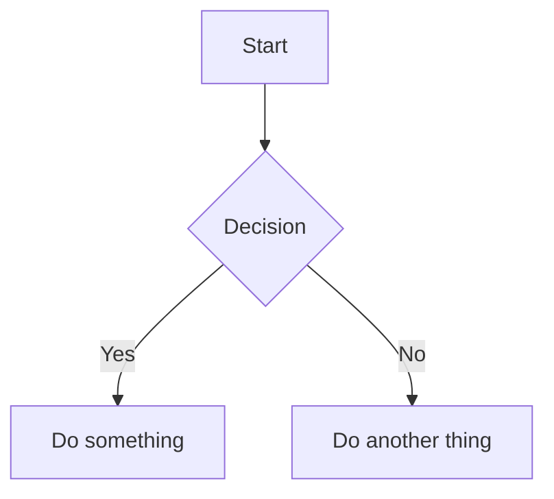
````

### Usando Comando Slash

1. Digite `/` para abrir o menu de comandos
2. Selecione **Diagrama Mermaid**
3. Um diagrama modelo é inserido para você editar

## Modos de Edição

### Modo Texto Rico (WYSIWYG)

No modo WYSIWYG, os diagramas Mermaid são renderizados inline enquanto você digita. Clique em um diagrama para editar seu código-fonte.

### Modo Fonte com Prévia ao Vivo

No modo Fonte, um painel de prévia flutuante aparece quando o cursor está dentro de um bloco de código mermaid:


| Recurso | Descrição |
|---------|-----------|
| **Prévia ao Vivo** | Veja o diagrama renderizado enquanto digita (debounce de 200ms) |
| **Arrastar para Mover** | Arraste o cabeçalho para reposicionar a prévia |
| **Redimensionar** | Arraste qualquer borda ou canto para redimensionar |
| **Zoom** | Use os botões `−` e `+` (10% a 300%) |

O painel de prévia lembra sua posição se você o mover, facilitando a organização do espaço de trabalho.

## Tipos de Diagrama Suportados

O VMark suporta todos os tipos de diagrama Mermaid:

### Fluxograma

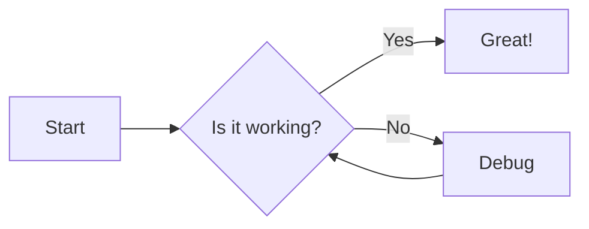

````markdown

````

### Diagrama de Sequência

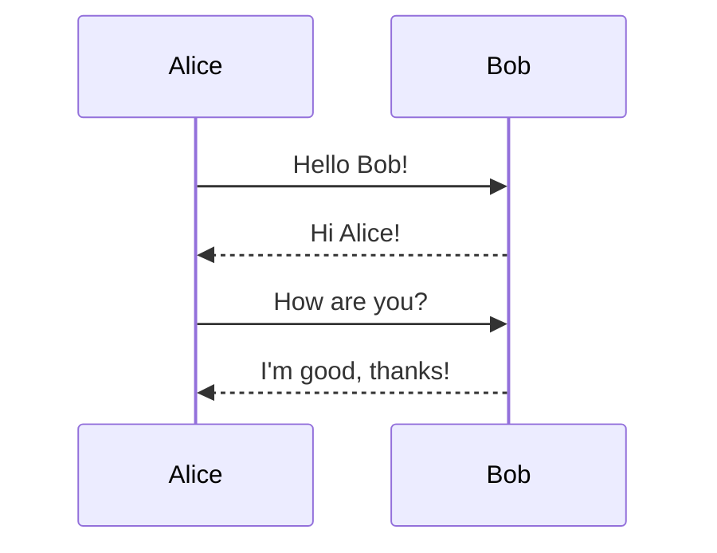

````markdown
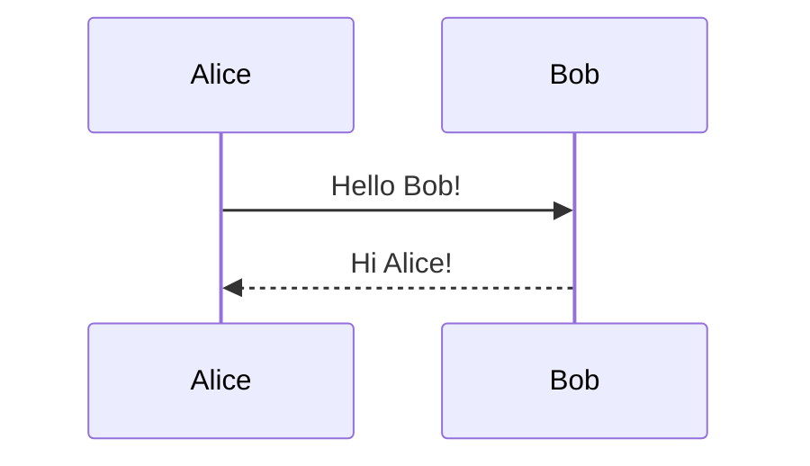
````

### Diagrama de Classes

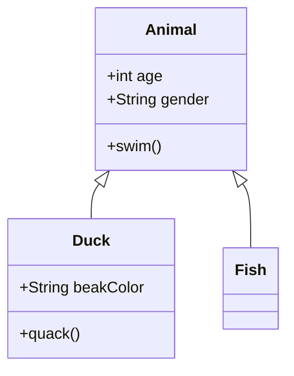

````markdown
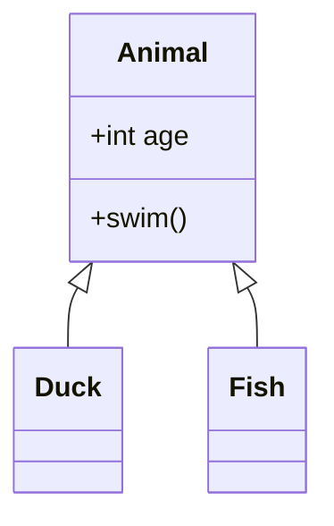
````

### Diagrama de Estado

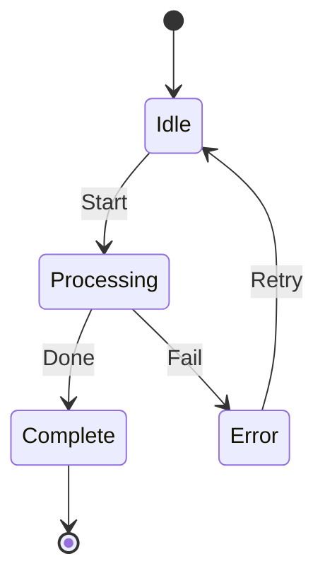

````markdown
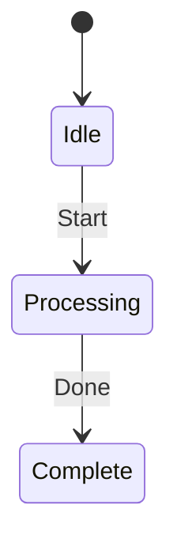
````

### Diagrama de Relacionamento de Entidades

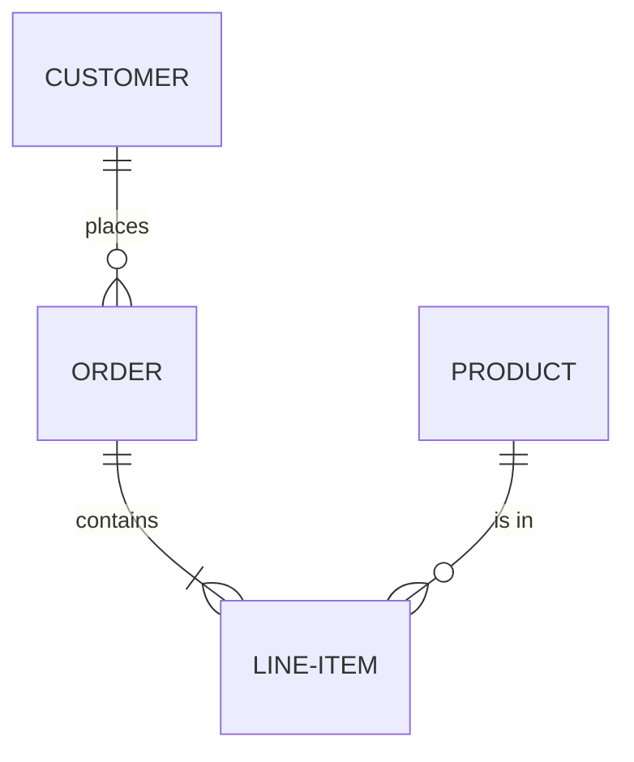

````markdown
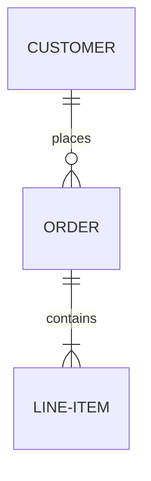
````

### Gráfico de Gantt

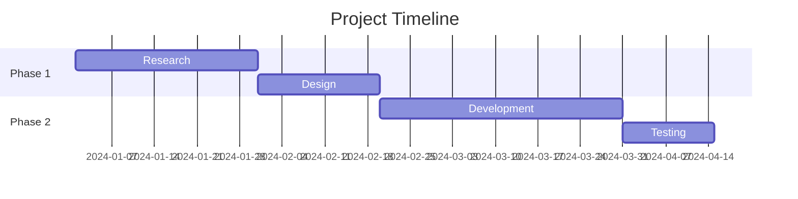

````markdown
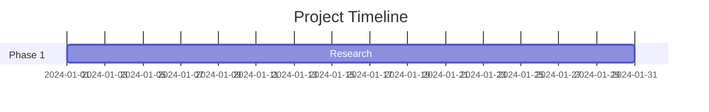
````

### Gráfico de Pizza

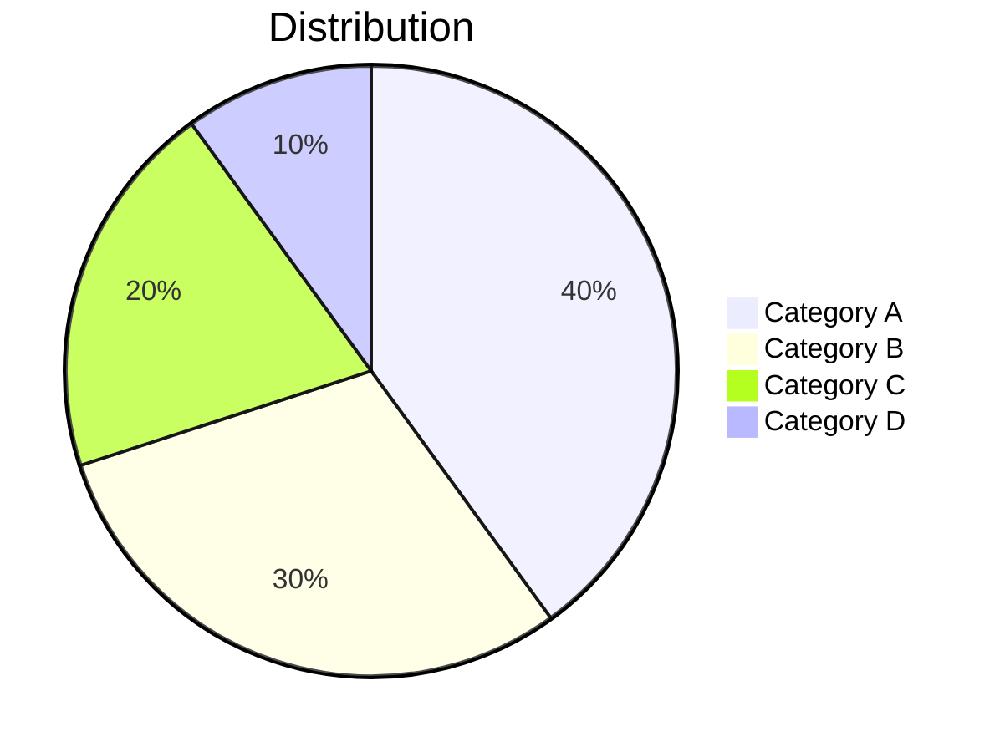

````markdown
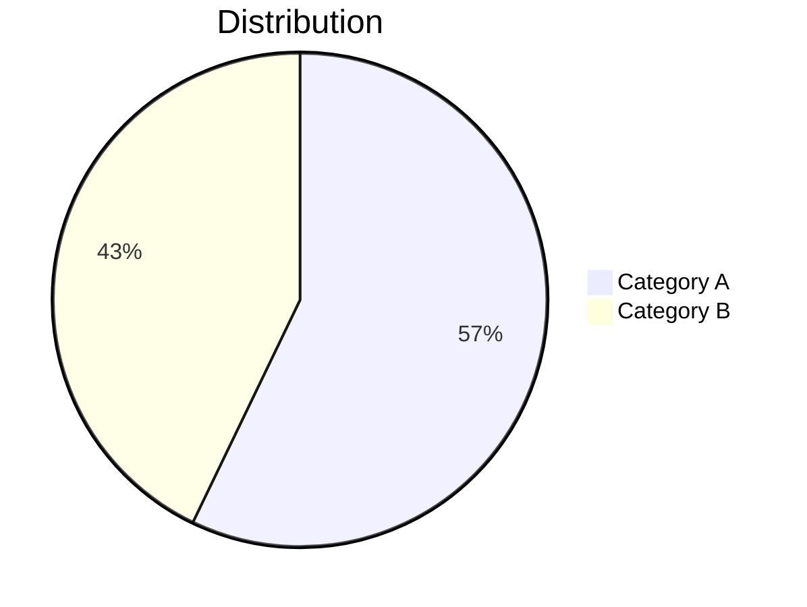
````

### Gráfico Git

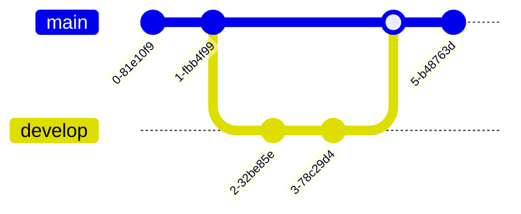

````markdown
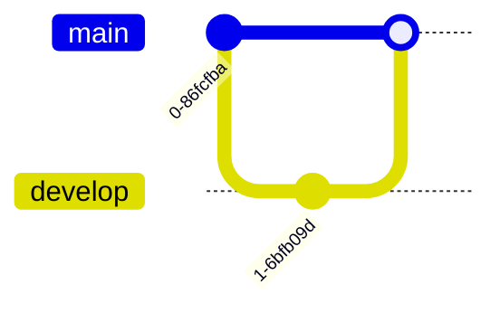
````

## Dicas

### Erros de Sintaxe

Se seu diagrama tiver um erro de sintaxe:
- No modo WYSIWYG: o bloco de código mostra o código-fonte bruto
- No modo Fonte: a prévia mostra "Sintaxe mermaid inválida"

Consulte a [documentação do Mermaid](https://mermaid.js.org/intro/) para a sintaxe correta.

### Pan e Zoom

No modo WYSIWYG, diagramas renderizados suportam navegação interativa:

| Ação | Como |
|------|------|
| **Pan** | Role ou clique e arraste o diagrama |
| **Zoom** | Segure `Cmd` (macOS) ou `Ctrl` (Windows/Linux) e role |
| **Resetar** | Clique no botão de reset que aparece ao passar o mouse (canto superior direito) |

### Copiar Código-Fonte Mermaid

Ao editar um bloco de código mermaid no modo WYSIWYG, um botão de **cópia** aparece no cabeçalho de edição. Clique nele para copiar o código-fonte mermaid para a área de transferência.

### Integração de Tema

Os diagramas Mermaid se adaptam automaticamente ao tema atual do VMark (White, Paper, Mint, Sepia ou Night).

### Exportar como PNG

Passe o mouse sobre um diagrama mermaid renderizado no modo WYSIWYG para revelar um botão de **exportação** (canto superior direito, à esquerda do botão de reset). Clique nele para escolher um tema:

| Tema | Fundo |
|------|-------|
| **Claro** | Fundo branco |
| **Escuro** | Fundo escuro |

O diagrama é exportado como um PNG de resolução 2x via diálogo de salvamento do sistema. A imagem exportada usa uma pilha de fontes de sistema concretas, para que o texto seja renderizado corretamente independentemente das fontes instaladas na máquina do visualizador.

### Exportar como HTML/PDF

Ao exportar o documento completo para HTML ou PDF, os diagramas Mermaid são renderizados como imagens SVG para exibição nítida em qualquer resolução.

## Corrigindo Diagramas Gerados por IA

O VMark usa **Mermaid v11**, que tem um parser mais estrito (Langium) do que versões mais antigas. Ferramentas de IA (ChatGPT, Claude, Copilot, etc.) frequentemente geram sintaxe que funcionava em versões mais antigas do Mermaid, mas falha na v11. Aqui estão os problemas mais comuns e como corrigi-los.

### 1. Rótulos sem Aspas com Caracteres Especiais

**O problema mais frequente.** Se um rótulo de nó contiver parênteses, apóstrofos, dois-pontos ou aspas, ele deve ser encapsulado em aspas duplas.

````markdown
<!-- Falha -->
```mermaid
flowchart TD
    A[User's Dashboard] --> B[Step (optional)]
    C[Status: Active] --> D[Say "Hello"]
```

<!-- Funciona -->
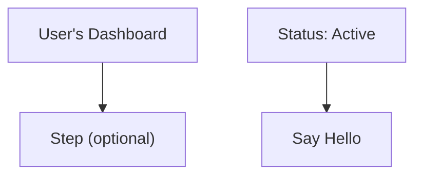
````

**Regra:** Se um rótulo contiver qualquer um destes caracteres — `' ( ) : " ; # &` — encapsule o rótulo inteiro em aspas duplas: `["assim"]`.

### 2. Ponto e Vírgula no Final

Modelos de IA às vezes adicionam ponto e vírgula no final das linhas. O Mermaid v11 não os permite.

````markdown
<!-- Falha -->
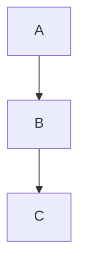

<!-- Funciona -->
```mermaid
flowchart TD
    A --> B
    B --> C
```
````

### 3. Usando `graph` em Vez de `flowchart`

A palavra-chave `graph` é sintaxe legada. Alguns recursos mais novos só funcionam com `flowchart`. Prefira `flowchart` para todos os novos diagramas.

````markdown
<!-- Pode falhar com sintaxe mais nova -->
```mermaid
graph TD
    A --> B
```

<!-- Preferido -->
```mermaid
flowchart TD
    A --> B
```
````

### 4. Títulos de Subgráficos com Caracteres Especiais

Os títulos de subgráficos seguem as mesmas regras de citação que os rótulos de nós.

````markdown
<!-- Falha -->
```mermaid
flowchart TD
    subgraph Service Layer (Backend)
        A --> B
    end
```

<!-- Funciona -->
```mermaid
flowchart TD
    subgraph "Service Layer (Backend)"
        A --> B
    end
```
````

### 5. Lista de Verificação de Correção Rápida

Quando um diagrama gerado por IA mostrar "Sintaxe inválida":

1. **Coloque aspas em todos os rótulos** que contenham caracteres especiais: `["Rótulo (com parênteses)"]`
2. **Remova ponto e vírgula no final** de cada linha
3. **Substitua `graph` por `flowchart`** se usar recursos de sintaxe mais nova
4. **Coloque aspas nos títulos de subgráficos** que contêm caracteres especiais
5. **Teste no [Mermaid Live Editor](https://mermaid.live/)** para identificar o erro exato

::: tip
Ao pedir que uma IA gere diagramas Mermaid, adicione isso ao seu prompt: *"Use sintaxe Mermaid v11. Sempre encapsule os rótulos de nós em aspas duplas se contiverem caracteres especiais. Não use ponto e vírgula no final."*
:::

## Ensine Sua IA a Escrever Mermaid Válido

Em vez de corrigir diagramas manualmente toda vez, você pode instalar ferramentas que ensinam seu assistente de codificação IA a gerar sintaxe Mermaid v11 correta desde o início.

### Skill Mermaid (Referência de Sintaxe)

Uma skill dá à sua IA acesso à documentação de sintaxe Mermaid atualizada para todos os 23 tipos de diagrama, para que ela gere código correto em vez de adivinhar.

**Fonte:** [WH-2099/mermaid-skill](https://github.com/WH-2099/mermaid-skill)

#### Claude Code

```bash
# Clonar a skill
git clone https://github.com/WH-2099/mermaid-skill.git /tmp/mermaid-skill

# Instalar globalmente (disponível em todos os projetos)
mkdir -p ~/.claude/skills/mermaid
cp -r /tmp/mermaid-skill/.claude/skills/mermaid/* ~/.claude/skills/mermaid/

# Ou instalar apenas por projeto
mkdir -p .claude/skills/mermaid
cp -r /tmp/mermaid-skill/.claude/skills/mermaid/* .claude/skills/mermaid/
```

Após a instalação, use `/mermaid <descrição>` no Claude Code para gerar diagramas com sintaxe correta.

#### Codex (OpenAI)

```bash
# Mesmos arquivos, local diferente
mkdir -p ~/.codex/skills/mermaid
cp -r /tmp/mermaid-skill/.claude/skills/mermaid/* ~/.codex/skills/mermaid/
```

#### Gemini CLI (Google)

O Gemini CLI lê skills de `~/.gemini/` ou por projeto `.gemini/`. Copie os arquivos de referência e adicione uma instrução ao seu `GEMINI.md`:

```bash
mkdir -p ~/.gemini/skills/mermaid
cp -r /tmp/mermaid-skill/.claude/skills/mermaid/references ~/.gemini/skills/mermaid/
```

Em seguida, adicione ao seu `GEMINI.md` (global `~/.gemini/GEMINI.md` ou por projeto):

```markdown
## Mermaid Diagrams

When generating Mermaid diagrams, read the syntax reference in
~/.gemini/skills/mermaid/references/ for the diagram type you are
generating. Use Mermaid v11 syntax: always quote node labels containing
special characters, do not use trailing semicolons, prefer "flowchart"
over "graph".
```

### Servidor MCP Mermaid Validator (Verificação de Sintaxe)

Um servidor MCP permite que sua IA **valide** diagramas antes de apresentá-los a você. Ele detecta erros usando os mesmos parsers (Jison + Langium) que o Mermaid v11 usa internamente.

**Fonte:** [fast-mermaid-validator-mcp](https://github.com/ai-of-mine/fast-mermaid-validator-mcp)

#### Claude Code

```bash
# Um comando — instala globalmente
claude mcp add -s user --transport stdio mermaid-validator \
  -- npx -y @ai-of-mine/fast-mermaid-validator-mcp --mcp-stdio
```

Isso registra um servidor MCP `mermaid-validator` que fornece três ferramentas:

| Ferramenta | Objetivo |
|-----------|---------|
| `validate_mermaid` | Verificar a sintaxe de um único diagrama |
| `validate_file` | Validar diagramas dentro de arquivos Markdown |
| `get_examples` | Obter diagramas de exemplo para todos os 28 tipos suportados |

#### Codex (OpenAI)

```bash
codex mcp add --transport stdio mermaid-validator \
  -- npx -y @ai-of-mine/fast-mermaid-validator-mcp --mcp-stdio
```

#### Claude Desktop

Adicione ao seu `claude_desktop_config.json` (Configurações > Desenvolvedor > Editar Config):

```json
{
  "mcpServers": {
    "mermaid-validator": {
      "command": "npx",
      "args": ["-y", "@ai-of-mine/fast-mermaid-validator-mcp", "--mcp-stdio"]
    }
  }
}
```

#### Gemini CLI (Google)

Adicione ao seu `~/.gemini/settings.json` (ou por projeto `.gemini/settings.json`):

```json
{
  "mcpServers": {
    "mermaid-validator": {
      "command": "npx",
      "args": ["-y", "@ai-of-mine/fast-mermaid-validator-mcp", "--mcp-stdio"]
    }
  }
}
```

::: info Pré-requisitos
Ambas as ferramentas requerem [Node.js](https://nodejs.org/) (v18 ou posterior) instalado na sua máquina. O servidor MCP é baixado automaticamente via `npx` no primeiro uso.
:::

## Aprendendo a Sintaxe Mermaid

O VMark renderiza a sintaxe Mermaid padrão. Para dominar a criação de diagramas, consulte a documentação oficial do Mermaid:

### Documentação Oficial

| Tipo de Diagrama | Link da Documentação |
|------------------|---------------------|
| Fluxograma | [Sintaxe de Fluxograma](https://mermaid.js.org/syntax/flowchart.html) |
| Diagrama de Sequência | [Sintaxe de Diagrama de Sequência](https://mermaid.js.org/syntax/sequenceDiagram.html) |
| Diagrama de Classes | [Sintaxe de Diagrama de Classes](https://mermaid.js.org/syntax/classDiagram.html) |
| Diagrama de Estado | [Sintaxe de Diagrama de Estado](https://mermaid.js.org/syntax/stateDiagram.html) |
| Relacionamento de Entidades | [Sintaxe de Diagrama ER](https://mermaid.js.org/syntax/entityRelationshipDiagram.html) |
| Gráfico de Gantt | [Sintaxe de Gantt](https://mermaid.js.org/syntax/gantt.html) |
| Gráfico de Pizza | [Sintaxe de Gráfico de Pizza](https://mermaid.js.org/syntax/pie.html) |
| Gráfico Git | [Sintaxe de Gráfico Git](https://mermaid.js.org/syntax/gitgraph.html) |

### Ferramentas de Prática

- **[Mermaid Live Editor](https://mermaid.live/)** — Playground interativo para testar e visualizar diagramas antes de colá-los no VMark
- **[Documentação Mermaid](https://mermaid.js.org/)** — Referência completa com exemplos para todos os tipos de diagrama

::: tip
O Live Editor é ótimo para experimentar com diagramas complexos. Uma vez que seu diagrama esteja correto, copie o código para o VMark.
:::
