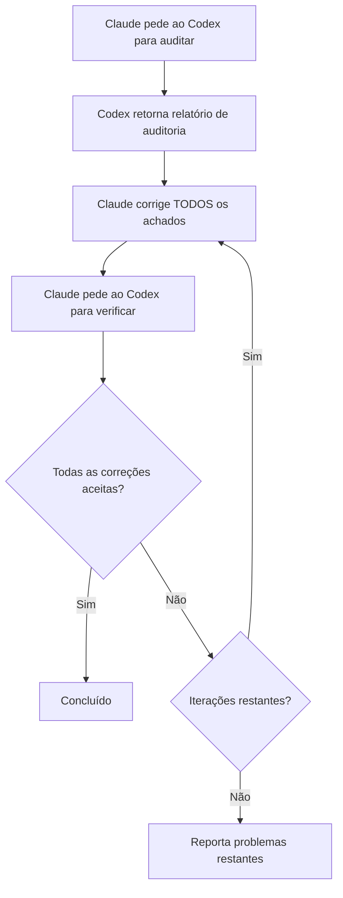

# Verificação entre Modelos

O VMark usa dois modelos de IA que se desafiam mutuamente: **Claude escreve o código, o Codex o audita**. Essa configuração adversarial detecta bugs que um único modelo perderia.

## Por que Dois Modelos São Melhores do que Um

Todo modelo de IA tem pontos cegos. Ele pode perder consistentemente uma categoria de bugs, favorecer certos padrões em detrimento de alternativas mais seguras ou deixar de questionar seus próprios pressupostos. Quando o mesmo modelo escreve e revisa o código, esses pontos cegos sobrevivem a ambas as passagens.

A verificação entre modelos quebra isso:

1. **Claude** (Anthropic) escreve a implementação — ele entende o contexto completo, segue as convenções do projeto e aplica TDD.
2. **Codex** (OpenAI) audita o resultado independentemente — ele lê o código com olhos frescos, treinado em dados diferentes, com modos de falha diferentes.

Os modelos são genuinamente diferentes. Foram construídos por equipes separadas, treinados em conjuntos de dados diferentes, com arquiteturas e objetivos de otimização diferentes. Quando ambos concordam que o código está correto, sua confiança é muito maior do que o "parece bom para mim" de um único modelo.

A pesquisa apoia essa abordagem por múltiplos ângulos. O debate entre múltiplos agentes — onde múltiplas instâncias de LLM desafiam as respostas umas das outras — melhora significativamente a precisão factual e o raciocínio[^1]. O prompting com role-play, onde os modelos recebem papéis de especialistas específicos, supera consistentemente o prompting padrão zero-shot em benchmarks de raciocínio[^2]. E trabalhos recentes mostram que os LLMs de fronteira conseguem detectar quando estão sendo avaliados e ajustar seu comportamento em conformidade[^3] — o que significa que um modelo que sabe que sua saída será examinada por outra IA provavelmente produz trabalho mais cuidadoso e menos sycophantic[^4].

### O que a Verificação entre Modelos Detecta

Na prática, o segundo modelo encontra problemas como:

- **Erros de lógica** que o primeiro modelo introduziu com confiança
- **Casos extremos** que o primeiro modelo não considerou (nulo, vazio, Unicode, acesso concorrente)
- **Código morto** deixado para trás após refatoração
- **Padrões de segurança** que o treinamento de um modelo não sinalizou (path traversal, injeção)
- **Violações de convenção** que o modelo que escreveu racionalizou
- **Bugs de copiar-colar** onde o modelo duplicou código com erros sutis

Este é o mesmo princípio por trás da revisão de código humano — um segundo par de olhos detecta coisas que o autor não consegue ver — exceto que ambos o "revisor" e o "autor" são incansáveis e podem processar bases de código inteiras em segundos.

## Como Funciona no VMark

### O Plugin Codex Toolkit

O VMark usa o plugin `codex-toolkit@xiaolai` do Claude Code, que inclui o Codex como um servidor MCP. Quando o plugin está habilitado, o Claude Code automaticamente obtém acesso a uma ferramenta MCP `codex` — um canal para enviar prompts ao Codex e receber respostas estruturadas. O Codex roda em um **contexto sandboxed e somente leitura**: pode ler a base de código mas não pode modificar arquivos. Todas as mudanças são feitas pelo Claude.

### Configuração

1. Instale o Codex CLI globalmente e autentique:

```bash
npm install -g @openai/codex
codex login                   # Login com assinatura ChatGPT (recomendado)
```

2. Instale e habilite o plugin codex-toolkit no Claude Code:

```bash
claude plugin install codex-toolkit@xiaolai --scope project
```

3. Verifique se o Codex está disponível:

```bash
codex --version
```

É isso. O plugin registra o servidor MCP do Codex automaticamente — nenhuma entrada manual no `.mcp.json` é necessária.

::: tip Assinatura vs API
Use `codex login` (assinatura ChatGPT) em vez de `OPENAI_API_KEY` para custos dramaticamente mais baixos. Veja [Assinatura vs Preços de API](/pt-BR/guide/users-as-developers/subscription-vs-api).
:::

::: tip PATH para Apps GUI no macOS
Apps GUI do macOS têm um PATH mínimo. Se `codex --version` funciona no seu terminal mas o Claude Code não consegue encontrá-lo, adicione a localização do binário do Codex ao seu perfil de shell (`~/.zshrc` ou `~/.bashrc`).
:::

::: tip Configuração do Projeto
Execute `/codex-toolkit:init` para gerar um arquivo de configuração `.codex-toolkit.md` com padrões específicos do projeto (foco de auditoria, nível de esforço, padrões de skip).
:::

## Comandos Slash

O plugin `codex-toolkit` fornece comandos slash pré-construídos que orquestram fluxos de trabalho Claude + Codex. Você não precisa gerenciar a interação manualmente — basta invocar o comando e os modelos se coordenam automaticamente.

### `/codex-toolkit:audit` — Auditoria de Código

O comando de auditoria primário. Suporta dois modos:

- **Mini (padrão)** — Verificação rápida de 5 dimensões: lógica, duplicação, código morto, dívida de refatoração, atalhos
- **Full (`--full`)** — Auditoria completa de 9 dimensões adicionando segurança, desempenho, conformidade, deps, docs

| Dimensão | O que Verifica |
|----------|----------------|
| 1. Código Redundante | Código morto, duplicatas, importações não utilizadas |
| 2. Segurança | Injeção, path traversal, XSS, segredos hardcoded |
| 3. Correção | Erros de lógica, condições de corrida, tratamento de nulo |
| 4. Conformidade | Convenções do projeto, padrões Zustand, tokens CSS |
| 5. Manutenibilidade | Complexidade, tamanho de arquivo, nomenclatura, higiene de importação |
| 6. Desempenho | Re-renderizações desnecessárias, operações bloqueantes |
| 7. Testes | Lacunas de cobertura, testes de casos extremos ausentes |
| 8. Dependências | CVEs conhecidos, segurança de configuração |
| 9. Documentação | Docs ausentes, comentários desatualizados, sincronização com o site |

Uso:

```
/codex-toolkit:audit                  # Auditoria mini nas mudanças não commitadas
/codex-toolkit:audit --full           # Auditoria completa de 9 dimensões
/codex-toolkit:audit commit -3        # Audita os últimos 3 commits
/codex-toolkit:audit src/stores/      # Audita um diretório específico
```

A saída é um relatório estruturado com classificações de severidade (Crítico / Alto / Médio / Baixo) e correções sugeridas para cada achado.

### `/codex-toolkit:verify` — Verificar Correções Anteriores

Após corrigir os achados da auditoria, peça ao Codex para confirmar que as correções estão corretas:

```
/codex-toolkit:verify                 # Verifica correções da última auditoria
```

O Codex relê cada arquivo nos locais relatados e marca cada problema como corrigido, não corrigido ou parcialmente corrigido. Ele também verifica pontos específicos em busca de novos problemas introduzidos pelas correções.

### `/codex-toolkit:audit-fix` — O Loop Completo

O comando mais poderoso. Ele encadeia auditoria → correção → verificação em um loop:

```
/codex-toolkit:audit-fix              # Loop nas mudanças não commitadas
/codex-toolkit:audit-fix commit -1    # Loop no último commit
```

Veja o que acontece:



O loop termina quando o Codex reporta zero achados em todas as severidades, ou após 3 iterações (quando os problemas restantes são reportados a você).

### `/codex-toolkit:implement` — Implementação Autônoma

Envie um plano ao Codex para implementação autônoma completa:

```
/codex-toolkit:implement              # Implementa a partir de um plano
```

### `/codex-toolkit:bug-analyze` — Análise de Causa Raiz

Análise de causa raiz para bugs descritos pelo usuário:

```
/codex-toolkit:bug-analyze            # Analisa um bug
```

### `/codex-toolkit:review-plan` — Revisão de Plano

Envie um plano ao Codex para revisão arquitetural:

```
/codex-toolkit:review-plan            # Revisa um plano quanto à consistência e riscos
```

### `/codex-toolkit:continue` — Continuar uma Sessão

Continua uma sessão anterior do Codex para iterar sobre os achados:

```
/codex-toolkit:continue               # Continua de onde parou
```

### `/fix-issue` — Resolvedor de Issues de Ponta a Ponta

Este comando específico do projeto executa o pipeline completo para uma issue do GitHub:

```
/fix-issue #123               # Corrige uma única issue
/fix-issue #123 #456 #789     # Corrige múltiplas issues em paralelo
```

O pipeline:
1. **Busca** a issue no GitHub
2. **Classifica** (bug, recurso ou pergunta)
3. **Criação de branch** com um nome descritivo
4. **Correção** com TDD (RED → GREEN → REFACTOR)
5. **Loop de auditoria do Codex** (até 3 rodadas de auditoria → correção → verificação)
6. **Gate** (`pnpm check:all` + `cargo check` se Rust mudou)
7. **Criação de PR** com descrição estruturada

A auditoria entre modelos está embutida na etapa 5 — cada correção passa por revisão adversarial antes que o PR seja criado.

## Agentes Especializados e Planejamento

Além dos comandos de auditoria, a configuração de IA do VMark inclui orquestração de nível superior:

### `/feature-workflow` — Desenvolvimento Orientado por Agentes

Para recursos complexos, este comando implanta uma equipe de subagentes especializados:

| Agente | Função |
|--------|--------|
| **Planejador** | Pesquisa melhores práticas, faz brainstorming de casos extremos, produz planos modulares |
| **Guardião de Spec** | Valida o plano contra as regras e specs do projeto |
| **Analista de Impacto** | Mapeia conjuntos de mudanças mínimas e arestas de dependência |
| **Implementador** | Implementação orientada por TDD com investigação prévia |
| **Auditor** | Revisa diffs para correção e violações de regras |
| **Executor de Testes** | Executa gates, coordena testes E2E |
| **Verificador** | Lista de verificação final pré-lançamento |
| **Gestor de Release** | Mensagens de commit e notas de release |

Uso:

```
/feature-workflow sidebar-redesign
```

### Skill de Planejamento

A skill de planejamento cria planos de implementação estruturados com:

- Itens de trabalho explícitos (WI-001, WI-002, ...)
- Critérios de aceitação para cada item
- Testes para escrever primeiro (TDD)
- Mitigações de risco e estratégias de rollback
- Planos de migração quando mudanças de dados estão envolvidas

Os planos são salvos em `dev-docs/plans/` para referência durante a implementação.

## Consulta ad-hoc ao Codex

Além dos comandos estruturados, você pode pedir ao Claude para consultar o Codex a qualquer momento:

```
Summarize your trouble, and ask Codex for help.
```

O Claude formula uma pergunta, envia ao Codex via MCP e incorpora a resposta. Isso é útil quando o Claude está preso em um problema ou você quer uma segunda opinião sobre uma abordagem.

Você também pode ser específico:

```
Ask Codex whether this Zustand pattern could cause stale state.
```

```
Have Codex review the SQL in this migration for edge cases.
```

## Fallback: Quando o Codex Está Indisponível

Todos os comandos degradam graciosamente se o MCP do Codex estiver indisponível (não instalado, problemas de rede, etc.):

1. O comando faz ping no Codex primeiro (`Respond with 'ok'`)
2. Se não houver resposta: a **auditoria manual** entra automaticamente
3. O Claude lê cada arquivo diretamente e realiza a mesma análise dimensional
4. A auditoria ainda acontece — é apenas de modelo único em vez de entre modelos

Você nunca precisa se preocupar que os comandos falhem porque o Codex está fora. Eles sempre produzem um resultado.

## A Filosofia

A ideia é simples: **confie, mas verifique — com um cérebro diferente.**

Equipes humanas fazem isso naturalmente. Um desenvolvedor escreve código, um colega o revisa e um engenheiro de QA o testa. Cada pessoa traz experiência diferente, pontos cegos diferentes e modelos mentais diferentes. O VMark aplica o mesmo princípio às ferramentas de IA:

- **Dados de treinamento diferentes** → Lacunas de conhecimento diferentes
- **Arquiteturas diferentes** → Padrões de raciocínio diferentes
- **Modos de falha diferentes** → Bugs detectados por um que o outro perde

O custo é mínimo (alguns segundos de tempo de API por auditoria), mas a melhoria de qualidade é substancial. Na experiência do VMark, o segundo modelo normalmente encontra 2–5 problemas adicionais por auditoria que o primeiro modelo perdeu.

[^1]: Du, Y., Li, S., Torralba, A., Tenenbaum, J.B., & Mordatch, I. (2024). [Improving Factuality and Reasoning in Language Models through Multiagent Debate](https://arxiv.org/abs/2305.14325). *ICML 2024*. Múltiplas instâncias de LLM propondo e debatendo respostas ao longo de várias rodadas melhoram significativamente a precisão factual e o raciocínio, mesmo quando todos os modelos inicialmente produzem respostas incorretas.

[^2]: Kong, A., Zhao, S., Chen, H., Li, Q., Qin, Y., Sun, R., & Zhou, X. (2024). [Better Zero-Shot Reasoning with Role-Play Prompting](https://arxiv.org/abs/2308.07702). *NAACL 2024*. Atribuir papéis de especialistas específicos da tarefa a LLMs supera consistentemente o prompting padrão zero-shot e zero-shot com cadeia de pensamento em 12 benchmarks de raciocínio.

[^3]: Needham, J., Edkins, G., Pimpale, G., Bartsch, H., & Hobbhahn, M. (2025). [Large Language Models Often Know When They Are Being Evaluated](https://arxiv.org/abs/2505.23836). Os modelos de fronteira conseguem distinguir contextos de avaliação de implantação no mundo real (Gemini-2.5-Pro atinge AUC 0,83), levantando implicações sobre como os modelos se comportam quando sabem que outra IA revisará sua saída.

[^4]: Sharma, M., Tong, M., Korbak, T., et al. (2024). [Towards Understanding Sycophancy in Language Models](https://arxiv.org/abs/2310.13548). *ICLR 2024*. LLMs treinados com feedback humano tendem a concordar com as crenças existentes dos usuários em vez de fornecer respostas verdadeiras. Quando o avaliador é outra IA em vez de um humano, essa pressão sycophantic é removida, levando a saídas mais honestas e rigorosas.
