# Mermaid 图表

VMark 支持 [Mermaid](https://mermaid.js.org/) 图表，可在 Markdown 文档中直接创建流程图、时序图和其他可视化图形。


## 插入图表

### 使用键盘快捷键

输入带有 `mermaid` 语言标识符的围栏代码块：

````markdown
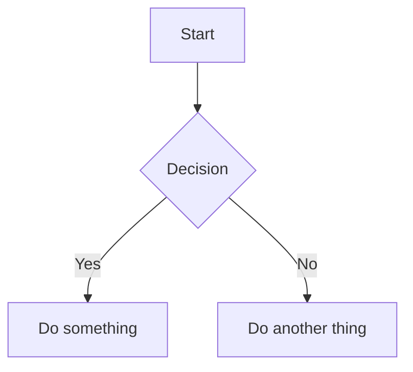
````

### 使用斜杠命令

1. 输入 `/` 打开命令菜单
2. 选择 **Mermaid 图表**
3. 系统会插入一个模板图表供你编辑

## 编辑模式

### 富文本模式（所见即所得）

在所见即所得模式中，Mermaid 图表会在输入时实时内联渲染。点击图表即可编辑其源代码。

### 带实时预览的源码模式

在源码模式中，当光标位于 mermaid 代码块内时，会出现一个浮动预览面板：


| 功能 | 描述 |
|------|------|
| **实时预览** | 输入时即时查看渲染后的图表（200ms 防抖） |
| **拖动移动** | 拖动标题栏重新定位预览 |
| **调整大小** | 拖动任意边缘或角落调整大小 |
| **缩放** | 使用 `−` 和 `+` 按钮（10% 至 300%） |

预览面板会记住你移动后的位置，方便你调整工作区布局。

## 支持的图表类型

VMark 支持所有 Mermaid 图表类型：

### 流程图

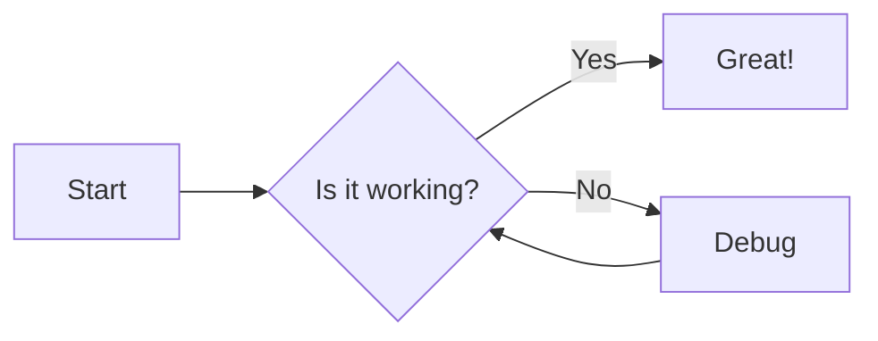

````markdown

````

### 时序图

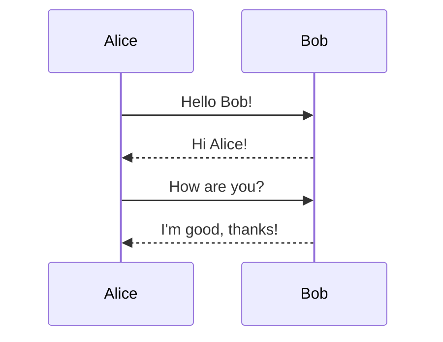

````markdown
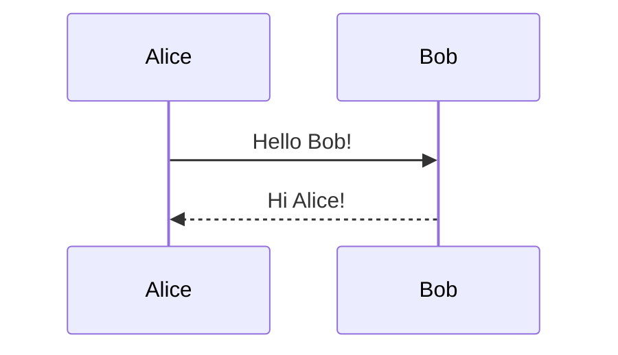
````

### 类图

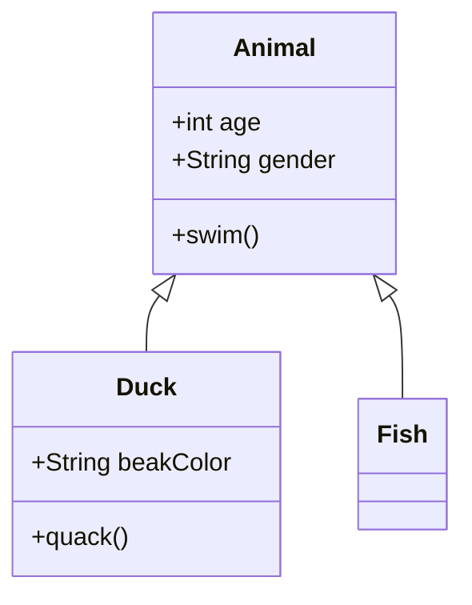

````markdown
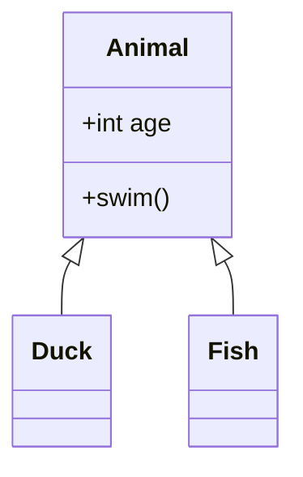
````

### 状态图

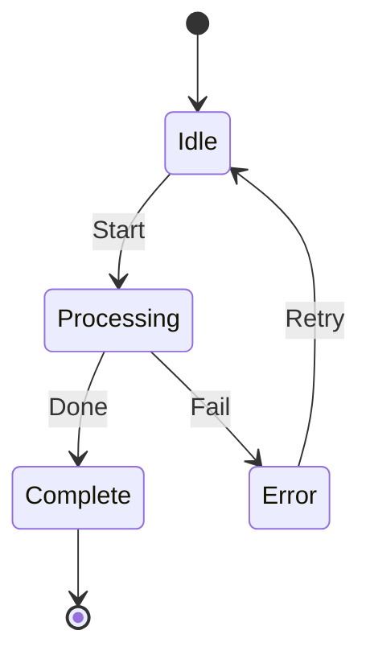

````markdown
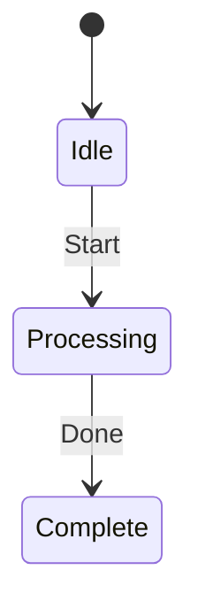
````

### 实体关系图

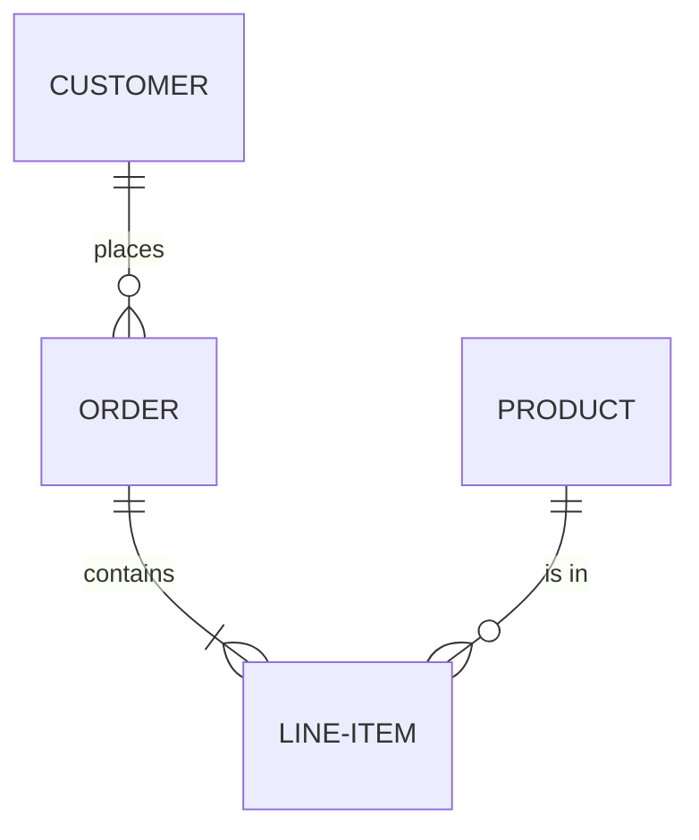

````markdown
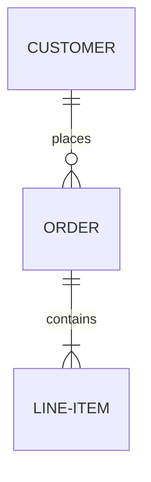
````

### 甘特图

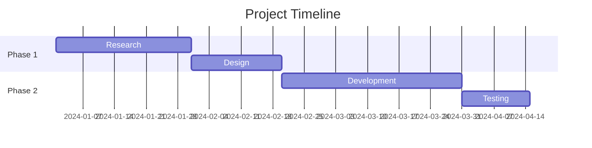

````markdown
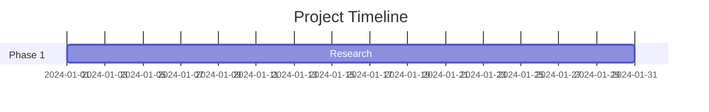
````

### 饼图

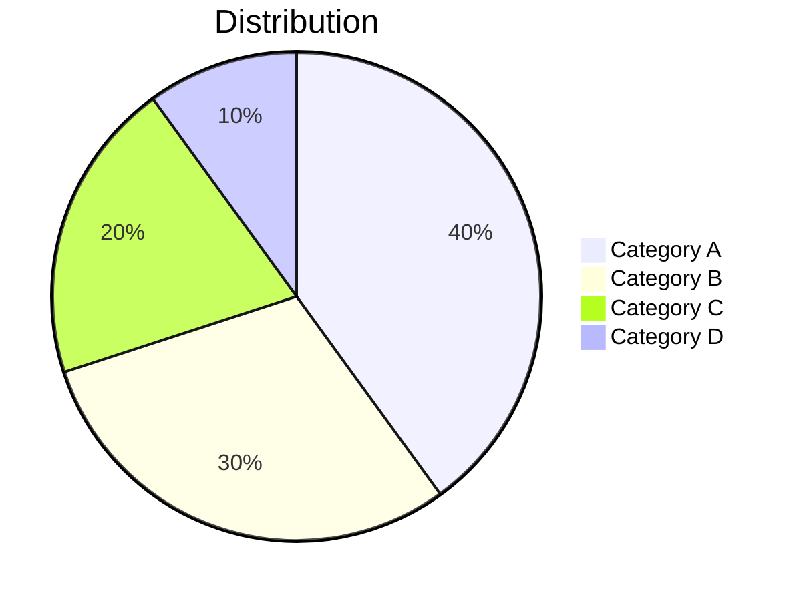

````markdown
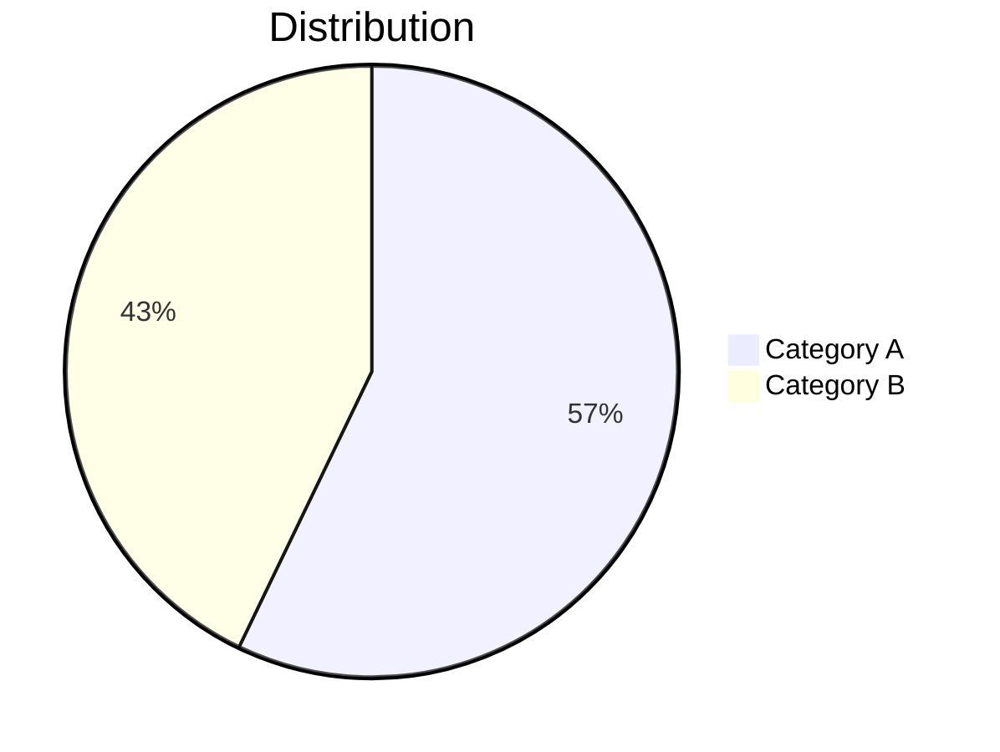
````

### Git 图

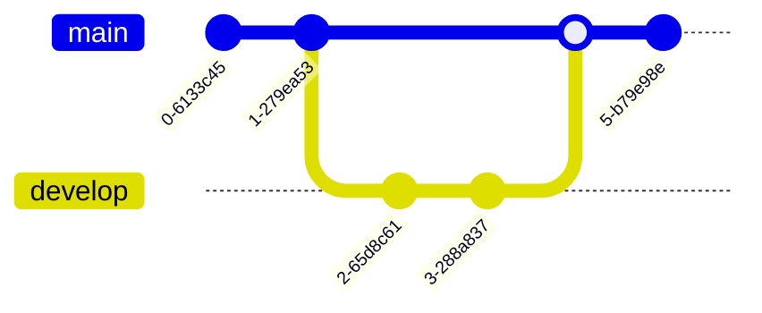

````markdown
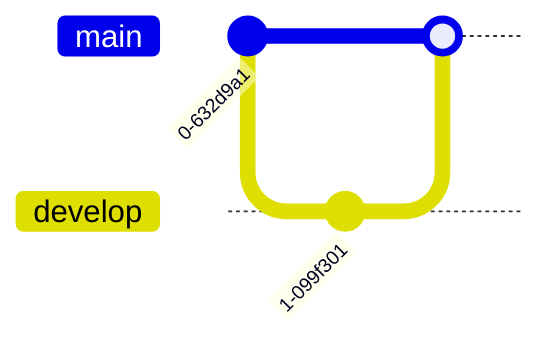
````

## 使用技巧

### 语法错误

如果图表存在语法错误：
- 在所见即所得模式中：代码块显示原始源码
- 在源码模式中：预览显示"无效的 mermaid 语法"

请查阅 [Mermaid 文档](https://mermaid.js.org/intro/)了解正确语法。

### 平移与缩放

在所见即所得模式中，渲染后的图表支持交互式导航：

| 操作 | 方法 |
|------|------|
| **平移** | 滚动或点击拖动图表 |
| **缩放** | 按住 `Cmd`（macOS）或 `Ctrl`（Windows/Linux）并滚动 |
| **重置** | 点击悬停时出现的重置按钮（右上角） |

### 复制 Mermaid 源码

在所见即所得模式中编辑 mermaid 代码块时，编辑标题栏会出现一个**复制**按钮。点击它可将 mermaid 源码复制到剪贴板。

### 主题集成

Mermaid 图表会自动适应 VMark 的当前主题（浅色或深色模式）。

### 导出为 PNG

在所见即所得模式中，悬停在已渲染的 mermaid 图表上会显示一个**导出**按钮（右上角，位于重置按钮左侧）。点击它可选择主题：

| 主题 | 背景 |
|------|------|
| **浅色** | 白色背景 |
| **深色** | 深色背景 |

图表通过系统保存对话框以 2 倍分辨率 PNG 格式导出。导出的图像使用具体的系统字体栈，因此无论查看者机器上安装了哪些字体，文字都能正确渲染。

### 导出为 HTML/PDF

将完整文档导出为 HTML 或 PDF 时，Mermaid 图表会渲染为 SVG 图像，在任何分辨率下都能清晰显示。

## 修复 AI 生成的图表

VMark 使用 **Mermaid v11**，其解析器（Langium）比旧版本更严格。AI 工具（ChatGPT、Claude、Copilot 等）通常生成在旧版 Mermaid 中有效但在 v11 中失败的语法。以下是最常见的问题及修复方法。

### 1. 含特殊字符的未引用标签

**最常见的问题。**如果节点标签包含括号、撇号、冒号或引号，必须用双引号括起来。

````markdown
<!-- 失败 -->
```mermaid
flowchart TD
    A[User's Dashboard] --> B[Step (optional)]
    C[Status: Active] --> D[Say "Hello"]
```

<!-- 有效 -->
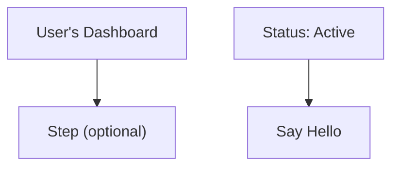
````

**规则：**如果标签包含以下任何字符——`' ( ) : " ; # &`——请将整个标签用双引号括起来：`["像这样"]`。

### 2. 行尾分号

AI 模型有时会在行尾添加分号。Mermaid v11 不允许这样做。

````markdown
<!-- 失败 -->
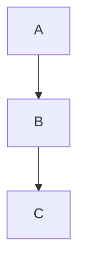

<!-- 有效 -->
```mermaid
flowchart TD
    A --> B
    B --> C
```
````

### 3. 使用 `graph` 而非 `flowchart`

`graph` 关键字是旧版语法。一些较新的功能只能与 `flowchart` 配合使用。建议所有新图表都使用 `flowchart`。

````markdown
<!-- 使用新语法时可能失败 -->
```mermaid
graph TD
    A --> B
```

<!-- 推荐写法 -->
```mermaid
flowchart TD
    A --> B
```
````

### 4. 含特殊字符的子图标题

子图标题遵循与节点标签相同的引号规则。

````markdown
<!-- 失败 -->
```mermaid
flowchart TD
    subgraph Service Layer (Backend)
        A --> B
    end
```

<!-- 有效 -->
```mermaid
flowchart TD
    subgraph "Service Layer (Backend)"
        A --> B
    end
```
````

### 5. 快速修复清单

当 AI 生成的图表显示"无效语法"时：

1. **为所有标签添加引号**（如果包含特殊字符）：`["标签（带括号）"]`
2. **移除每行的行尾分号**
3. **将 `graph` 替换为 `flowchart`**（如果使用了新版语法功能）
4. **为子图标题添加引号**（如果包含特殊字符）
5. **在 [Mermaid 在线编辑器](https://mermaid.live/)中测试**以精确定位错误

::: tip
向 AI 请求生成 Mermaid 图表时，在提示中加上这句话：*"使用 Mermaid v11 语法。如果节点标签包含特殊字符，务必用双引号括起来。不要使用行尾分号。"*
:::

## 教你的 AI 编写有效的 Mermaid

与其每次手动修复图表，不如安装工具，让你的 AI 编程助手从一开始就能生成正确的 Mermaid v11 语法。

### Mermaid 技能（语法参考）

技能为你的 AI 提供所有 23 种图表类型的最新 Mermaid 语法文档，让它生成正确的代码而不是瞎猜。

**来源：**[WH-2099/mermaid-skill](https://github.com/WH-2099/mermaid-skill)

#### Claude Code

```bash
# 克隆技能
git clone https://github.com/WH-2099/mermaid-skill.git /tmp/mermaid-skill

# 全局安装（在所有项目中可用）
mkdir -p ~/.claude/skills/mermaid
cp -r /tmp/mermaid-skill/.claude/skills/mermaid/* ~/.claude/skills/mermaid/

# 或仅安装到当前项目
mkdir -p .claude/skills/mermaid
cp -r /tmp/mermaid-skill/.claude/skills/mermaid/* .claude/skills/mermaid/
```

安装后，在 Claude Code 中使用 `/mermaid <描述>` 来生成语法正确的图表。

#### Codex（OpenAI）

```bash
# 相同文件，不同位置
mkdir -p ~/.codex/skills/mermaid
cp -r /tmp/mermaid-skill/.claude/skills/mermaid/* ~/.codex/skills/mermaid/
```

#### Gemini CLI（Google）

Gemini CLI 从 `~/.gemini/` 或每个项目的 `.gemini/` 目录读取技能。复制参考文件并在 `GEMINI.md` 中添加说明：

```bash
mkdir -p ~/.gemini/skills/mermaid
cp -r /tmp/mermaid-skill/.claude/skills/mermaid/references ~/.gemini/skills/mermaid/
```

然后在你的 `GEMINI.md`（全局 `~/.gemini/GEMINI.md` 或每个项目）中添加：

```markdown
## Mermaid Diagrams

When generating Mermaid diagrams, read the syntax reference in
~/.gemini/skills/mermaid/references/ for the diagram type you are
generating. Use Mermaid v11 syntax: always quote node labels containing
special characters, do not use trailing semicolons, prefer "flowchart"
over "graph".
```

### Mermaid 验证器 MCP 服务器（语法检查）

MCP 服务器让你的 AI 能在向你展示图表之前**验证**语法。它使用 Mermaid v11 内部使用的相同解析器（Jison + Langium）来捕获错误。

**来源：**[fast-mermaid-validator-mcp](https://github.com/ai-of-mine/fast-mermaid-validator-mcp)

#### Claude Code

```bash
# 一条命令——全局安装
claude mcp add -s user --transport stdio mermaid-validator \
  -- npx -y @ai-of-mine/fast-mermaid-validator-mcp --mcp-stdio
```

这会注册一个 `mermaid-validator` MCP 服务器，提供以下三个工具：

| 工具 | 用途 |
|------|------|
| `validate_mermaid` | 检查单个图表的语法 |
| `validate_file` | 验证 Markdown 文件中的图表 |
| `get_examples` | 获取所有 28 种支持类型的示例图表 |

#### Codex（OpenAI）

```bash
codex mcp add --transport stdio mermaid-validator \
  -- npx -y @ai-of-mine/fast-mermaid-validator-mcp --mcp-stdio
```

#### Claude Desktop

在你的 `claude_desktop_config.json` 中添加（设置 > 开发者 > 编辑配置）：

```json
{
  "mcpServers": {
    "mermaid-validator": {
      "command": "npx",
      "args": ["-y", "@ai-of-mine/fast-mermaid-validator-mcp", "--mcp-stdio"]
    }
  }
}
```

#### Gemini CLI（Google）

在你的 `~/.gemini/settings.json`（或每个项目的 `.gemini/settings.json`）中添加：

```json
{
  "mcpServers": {
    "mermaid-validator": {
      "command": "npx",
      "args": ["-y", "@ai-of-mine/fast-mermaid-validator-mcp", "--mcp-stdio"]
    }
  }
}
```

::: info 前提条件
两个工具都需要在你的机器上安装 [Node.js](https://nodejs.org/)（v18 或更高版本）。MCP 服务器在首次使用时会通过 `npx` 自动下载。
:::

## 学习 Mermaid 语法

VMark 渲染标准 Mermaid 语法。要精通图表创建，请参阅 Mermaid 官方文档：

### 官方文档

| 图表类型 | 文档链接 |
|----------|---------|
| 流程图 | [流程图语法](https://mermaid.js.org/syntax/flowchart.html) |
| 时序图 | [时序图语法](https://mermaid.js.org/syntax/sequenceDiagram.html) |
| 类图 | [类图语法](https://mermaid.js.org/syntax/classDiagram.html) |
| 状态图 | [状态图语法](https://mermaid.js.org/syntax/stateDiagram.html) |
| 实体关系图 | [ER 图语法](https://mermaid.js.org/syntax/entityRelationshipDiagram.html) |
| 甘特图 | [甘特图语法](https://mermaid.js.org/syntax/gantt.html) |
| 饼图 | [饼图语法](https://mermaid.js.org/syntax/pie.html) |
| Git 图 | [Git 图语法](https://mermaid.js.org/syntax/gitgraph.html) |

### 练习工具

- **[Mermaid 在线编辑器](https://mermaid.live/)**——交互式演练场，在粘贴到 VMark 之前测试和预览图表
- **[Mermaid 文档](https://mermaid.js.org/)**——所有图表类型的完整参考及示例

::: tip
在线编辑器非常适合试验复杂图表。一旦图表看起来正确，就把代码复制到 VMark 中。
:::
