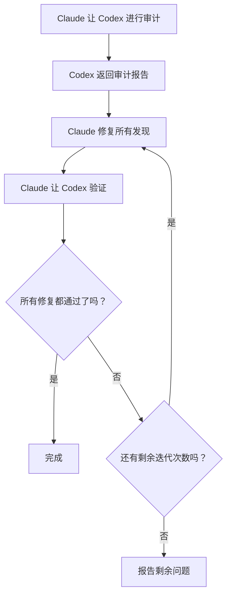

# 跨模型验证

VMark 使用两个相互挑战的 AI 模型：**Claude 编写代码，Codex 审计代码**。这种对抗性设置能捕捉到单一模型会遗漏的 bug。

## 为什么两个模型比一个好

每个 AI 模型都有盲点。它可能持续性地错过某类 bug、偏爱某些模式而非更安全的替代方案，或者无法质疑自己的假设。当同一个模型既写代码又审查代码时，那些盲点在两次检查中都会存活。

跨模型验证打破了这一点：

1. **Claude**（Anthropic）编写实现——它理解完整的上下文，遵循项目约定，并应用 TDD。
2. **Codex**（OpenAI）独立审计结果——它用全新的眼光阅读代码，基于不同的数据训练，有不同的失效模式。

这两个模型是真正不同的。它们由独立的团队构建，在不同的数据集上训练，架构和优化目标各异。当两个模型都认为代码正确时，你的信心远高于单一模型的"看起来没问题"。

研究从多个角度支持这一方法。多智能体辩论——多个 LLM 实例相互挑战彼此的回应——显著提升了事实准确性和推理精度[^1]。角色扮演提示词（给模型指定特定的专家角色）在推理基准测试中持续优于标准零样本提示词[^2]。近期研究还表明，前沿 LLM 能够检测到自己正在被评估并相应调整行为[^3]——这意味着知道输出将被另一个 AI 审查的模型，很可能会产出更谨慎、更少逢迎的工作[^4]。

### 跨模型能发现什么

在实践中，第二个模型会发现如下问题：

- 第一个模型自信地引入的**逻辑错误**
- 第一个模型没有考虑的**边界情况**（null、空值、Unicode、并发访问）
- 重构后遗留的**死代码**
- 某个模型的训练未能标记的**安全模式**（路径遍历、注入）
- 编写模型合理化掉的**约定违反**
- 模型带着细微错误复制代码的**复制粘贴 bug**

这与人类代码审查的原理相同——第二双眼睛能捕捉到作者看不到的东西——只不过"审查者"和"作者"都不知疲倦，能在几秒钟内处理整个代码库。

## 在 VMark 中的工作原理

### Codex Toolkit 插件

VMark 使用 `codex-toolkit@xiaolai` Claude Code 插件，该插件将 Codex 作为 MCP 服务器捆绑在一起。启用插件后，Claude Code 自动获得对 `codex` MCP 工具的访问权——一个向 Codex 发送提示词并接收结构化响应的通道。Codex 在**沙盒化的只读上下文**中运行：它可以读取代码库，但不能修改文件。所有变更由 Claude 执行。

### 设置

1. 全局安装 Codex CLI 并认证：

```bash
npm install -g @openai/codex
codex login                   # 使用 ChatGPT 订阅登录（推荐）
```

2. 在 Claude Code 中安装并启用 codex-toolkit 插件：

```bash
claude plugin install codex-toolkit@xiaolai --scope project
```

3. 验证 Codex 可用：

```bash
codex --version
```

就这些。插件会自动注册 Codex MCP 服务器——无需手动添加 `.mcp.json` 条目。

::: tip 订阅制与 API 密钥
使用 `codex login`（ChatGPT 订阅）而非 `OPENAI_API_KEY`，成本会大幅降低。参见[订阅制与按量计费的对比](/zh-CN/guide/users-as-developers/subscription-vs-api)。
:::

::: tip macOS GUI 应用的 PATH 问题
macOS GUI 应用的 PATH 很简短。如果 `codex --version` 在你的终端中能用，但 Claude Code 找不到它，请将 Codex 二进制文件的位置添加到你的 shell 配置文件（`~/.zshrc` 或 `~/.bashrc`）。
:::

::: tip 项目配置
运行 `/codex-toolkit:init` 可生成带有项目特定默认值（审计重点、努力程度、跳过模式）的 `.codex-toolkit.md` 配置文件。
:::

## 斜杠命令

`codex-toolkit` 插件提供了预构建的斜杠命令，可以编排 Claude + Codex 工作流。你不需要手动管理这种交互——只需调用命令，模型会自动协调。

### `/codex-toolkit:audit` — 代码审计

主要的审计命令。支持两种模式：

- **Mini（默认）** — 快速 5 维检查：逻辑、重复、死代码、重构债务、捷径
- **Full（`--full`）** — 全面 9 维审计，额外涵盖安全性、性能、合规性、依赖项、文档

| 维度 | 检查内容 |
|-----------|---------------|
| 1. 冗余代码 | 死代码、重复、未使用的导入 |
| 2. 安全性 | 注入、路径遍历、XSS、硬编码密钥 |
| 3. 正确性 | 逻辑错误、竞态条件、null 处理 |
| 4. 合规性 | 项目约定、Zustand 模式、CSS token |
| 5. 可维护性 | 复杂度、文件大小、命名、导入规范 |
| 6. 性能 | 不必要的重渲染、阻塞操作 |
| 7. 测试 | 覆盖率缺口、缺少边界情况测试 |
| 8. 依赖项 | 已知 CVE、配置安全 |
| 9. 文档 | 缺少文档、过时注释、网站同步 |

用法：

```
/codex-toolkit:audit                  # 对未提交的变更进行 Mini 审计
/codex-toolkit:audit --full           # 完整 9 维审计
/codex-toolkit:audit commit -3        # 审计最近 3 次提交
/codex-toolkit:audit src/stores/      # 审计特定目录
```

输出是一份带有严重程度评级（严重 / 高 / 中 / 低）的结构化报告，每个发现都附带建议的修复方案。

### `/codex-toolkit:verify` — 验证前次修复

修复审计发现的问题后，让 Codex 确认修复是否正确：

```
/codex-toolkit:verify                 # 验证上次审计的修复
```

Codex 重新读取报告位置处的每个文件，并将每个问题标记为已修复、未修复或部分修复。它还会抽查修复引入的新问题。

### `/codex-toolkit:audit-fix` — 完整循环

最强大的命令。它将审计 → 修复 → 验证链接成一个循环：

```
/codex-toolkit:audit-fix              # 对未提交变更循环执行
/codex-toolkit:audit-fix commit -1    # 对上次提交循环执行
```

执行流程：



当 Codex 报告所有严重程度均零发现时循环退出，或在 3 次迭代后退出（此时剩余问题会报告给你）。

### `/codex-toolkit:implement` — 自主实现

将计划发送给 Codex 进行完整的自主实现：

```
/codex-toolkit:implement              # 根据计划实现
```

### `/codex-toolkit:bug-analyze` — 根因分析

针对用户描述的 bug 进行根因分析：

```
/codex-toolkit:bug-analyze            # 分析一个 bug
```

### `/codex-toolkit:review-plan` — 计划审查

将计划发送给 Codex 进行架构审查：

```
/codex-toolkit:review-plan            # 审查计划的一致性和风险
```

### `/codex-toolkit:continue` — 继续会话

继续上一个 Codex 会话以迭代发现：

```
/codex-toolkit:continue               # 从上次中断处继续
```

### `/fix-issue` — 端到端 Issue 解决器

这个项目特定命令运行 GitHub Issue 的完整流程：

```
/fix-issue #123               # 修复单个 issue
/fix-issue #123 #456 #789     # 并行修复多个 issue
```

流程：
1. **获取** GitHub issue
2. **分类**（bug、功能或问题）
3. **创建分支**，使用描述性名称
4. **修复**，采用 TDD（红 → 绿 → 重构）
5. **Codex 审计循环**（最多 3 轮审计 → 修复 → 验证）
6. **门控检查**（`pnpm check:all` + 若有 Rust 变更则 `cargo check`）
7. **创建 PR**，附带结构化说明

跨模型审计内置于第 5 步——每次修复都经过对抗性审查后才创建 PR。

## 专项 Agent 与规划

除了审计命令，VMark 的 AI 设置还包括更高级别的编排：

### `/feature-workflow` — Agent 驱动的开发

对于复杂功能，此命令会部署一个专项子 Agent 团队：

| Agent | 职责 |
|-------|------|
| **规划师** | 研究最佳实践，头脑风暴边界情况，生成模块化计划 |
| **规范守护者** | 对照项目规则和规范验证计划 |
| **影响分析师** | 映射最小变更集和依赖边缘 |
| **实施者** | TDD 驱动的实现，附带预检调查 |
| **审计师** | 审查 diff 的正确性和规则违反情况 |
| **测试运行者** | 运行门控，协调 E2E 测试 |
| **验证者** | 发布前的最终检查清单 |
| **发布管理员** | 提交消息和发布说明 |

用法：

```
/feature-workflow sidebar-redesign
```

### 规划技能

规划技能创建结构化的实现计划，包含：

- 明确的工作项（WI-001、WI-002、……）
- 每个工作项的验收标准
- 首先编写的测试（TDD）
- 风险缓解和回滚策略
- 涉及数据变更时的迁移计划

计划保存到 `dev-docs/plans/` 以供实现期间参考。

## 临时 Codex 咨询

除了结构化命令，你可以随时让 Claude 咨询 Codex：

```
Summarize your trouble, and ask Codex for help.
```

Claude 会拟定一个问题，通过 MCP 发送给 Codex，并将回应整合进来。这在 Claude 遇到问题或你想对某个方案获得第二意见时很有用。

你也可以更具体：

```
Ask Codex whether this Zustand pattern could cause stale state.
```

```
Have Codex review the SQL in this migration for edge cases.
```

## 备选方案：Codex 不可用时

如果 Codex MCP 不可用（未安装、网络问题等），所有命令都会优雅降级：

1. 命令首先 ping Codex（`Respond with 'ok'`）
2. 如果没有响应：自动切换到**手动审计**
3. Claude 直接读取每个文件并执行相同的维度分析
4. 审计仍然进行——只是变成单一模型而非跨模型

你永远不需要担心因 Codex 宕机而导致命令失败。它们始终会产出结果。

## 哲学

这个想法很简单：**信任，但要用不同的大脑来验证。**

人类团队自然而然地这样做。开发者写代码，同事审查，QA 工程师测试。每个人带来不同的经验、不同的盲点和不同的心智模型。VMark 将同样的原则应用于 AI 工具：

- **不同的训练数据** → 不同的知识缺口
- **不同的架构** → 不同的推理模式
- **不同的失效模式** → 一个捕获另一个遗漏的 bug

成本极低（每次审计只需几秒钟的 API 时间），但质量提升是实质性的。VMark 的经验表明，第二个模型通常每次审计额外发现 2–5 个第一个模型遗漏的问题。

[^1]: Du, Y., Li, S., Torralba, A., Tenenbaum, J.B., & Mordatch, I. (2024). [Improving Factuality and Reasoning in Language Models through Multiagent Debate](https://arxiv.org/abs/2305.14325). *ICML 2024*. 多个 LLM 实例在多轮中提议和辩论响应，显著提升了事实准确性和推理能力，即使所有模型最初都给出了错误答案。

[^2]: Kong, A., Zhao, S., Chen, H., Li, Q., Qin, Y., Sun, R., & Zhou, X. (2024). [Better Zero-Shot Reasoning with Role-Play Prompting](https://arxiv.org/abs/2308.07702). *NAACL 2024*. 为 LLM 指定特定任务的专家角色，在 12 个推理基准测试中持续优于标准零样本和零样本思维链提示词。

[^3]: Needham, J., Edkins, G., Pimpale, G., Bartsch, H., & Hobbhahn, M. (2025). [Large Language Models Often Know When They Are Being Evaluated](https://arxiv.org/abs/2505.23836). 前沿模型能够区分评估上下文和真实世界部署（Gemini-2.5-Pro 达到 AUC 0.83），这对模型在知道另一个 AI 将审查其输出时的行为方式有重要影响。

[^4]: Sharma, M., Tong, M., Korbak, T., et al. (2024). [Towards Understanding Sycophancy in Language Models](https://arxiv.org/abs/2310.13548). *ICLR 2024*. 经过人类反馈训练的 LLM 倾向于迎合用户现有的信念，而非提供真实的回应。当评估者是另一个 AI 而非人类时，这种逢迎压力被消除，从而产生更诚实、更严格的输出。
