# Mermaid 圖表

VMark 支援 [Mermaid](https://mermaid.js.org/) 圖表，讓你直接在 Markdown 文件中建立流程圖、時序圖和其他視覺化圖表。


## 插入圖表

### 使用鍵盤快捷鍵

輸入帶有 `mermaid` 語言識別符的圍欄程式碼區塊：

````markdown
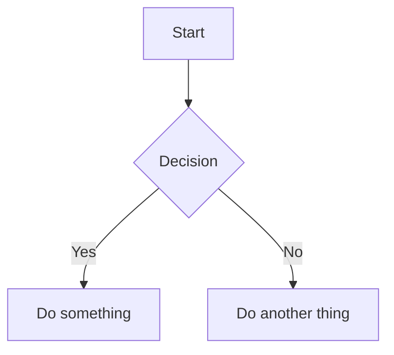
````

### 使用斜線指令

1. 輸入 `/` 開啟指令選單
2. 選取 **Mermaid 圖表**
3. 插入範本圖表供你編輯

## 編輯模式

### 富文字模式（所見即所得）

在所見即所得模式中，Mermaid 圖表會在你輸入時即時行內渲染。點擊圖表即可編輯其原始碼。

### 原始碼模式搭配即時預覽

在原始碼模式中，當游標位於 mermaid 程式碼區塊內時，會顯示浮動預覽面板：


| 功能 | 說明 |
|------|------|
| **即時預覽** | 輸入時即時查看渲染後的圖表（200ms 防抖） |
| **拖曳移動** | 拖曳標題列重新定位預覽面板 |
| **調整大小** | 拖曳任意邊緣或角落調整大小 |
| **縮放** | 使用 `−` 和 `+` 按鈕（10% 至 300%） |

移動預覽面板後，其位置會被記憶，方便你調整工作區佈局。

## 支援的圖表類型

VMark 支援所有 Mermaid 圖表類型：

### 流程圖

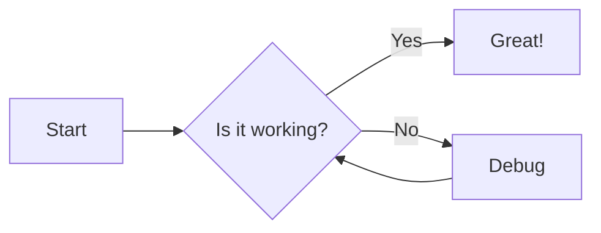

````markdown

````

### 時序圖

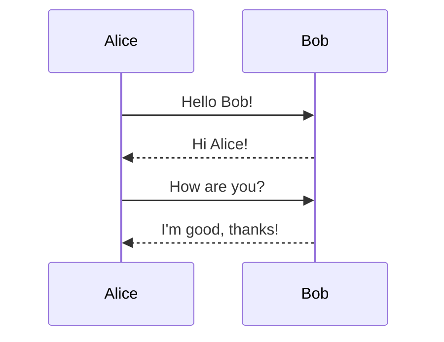

````markdown
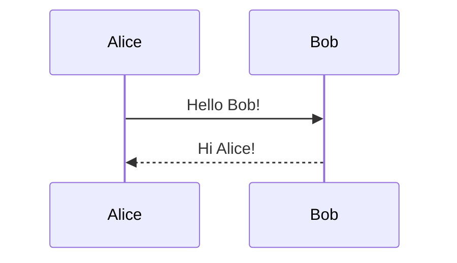
````

### 類別圖

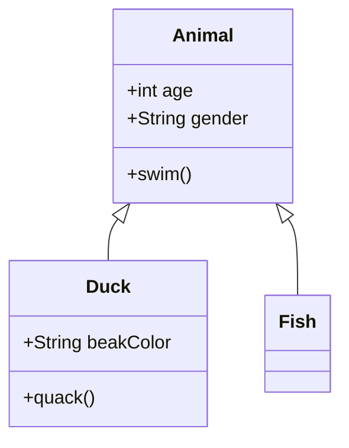

````markdown
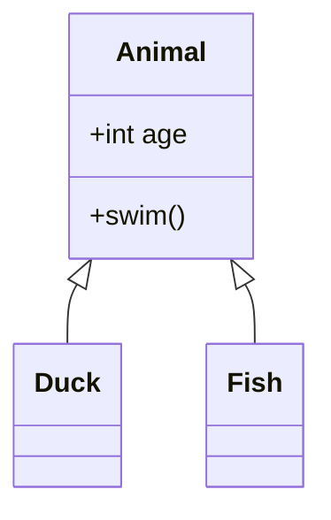
````

### 狀態圖

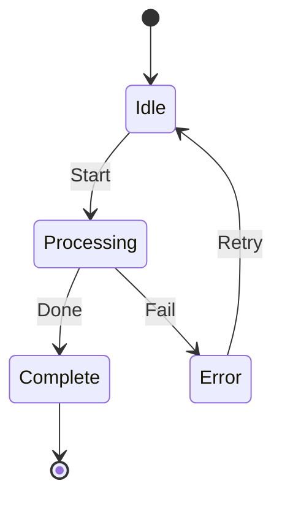

````markdown
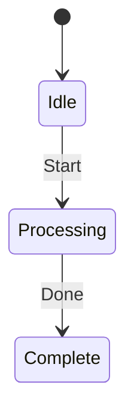
````

### 實體關係圖

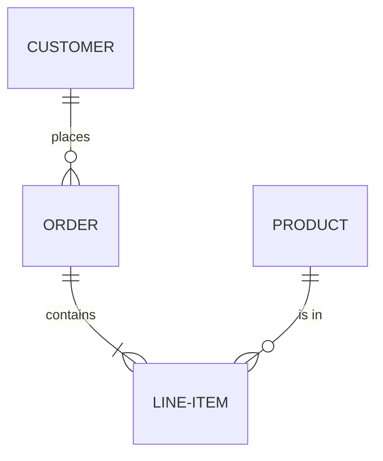

````markdown
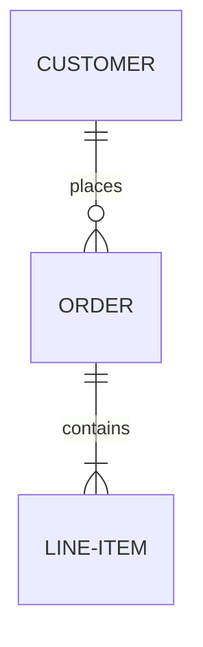
````

### 甘特圖

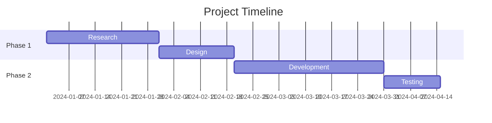

````markdown
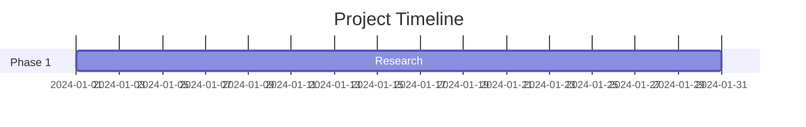
````

### 圓餅圖

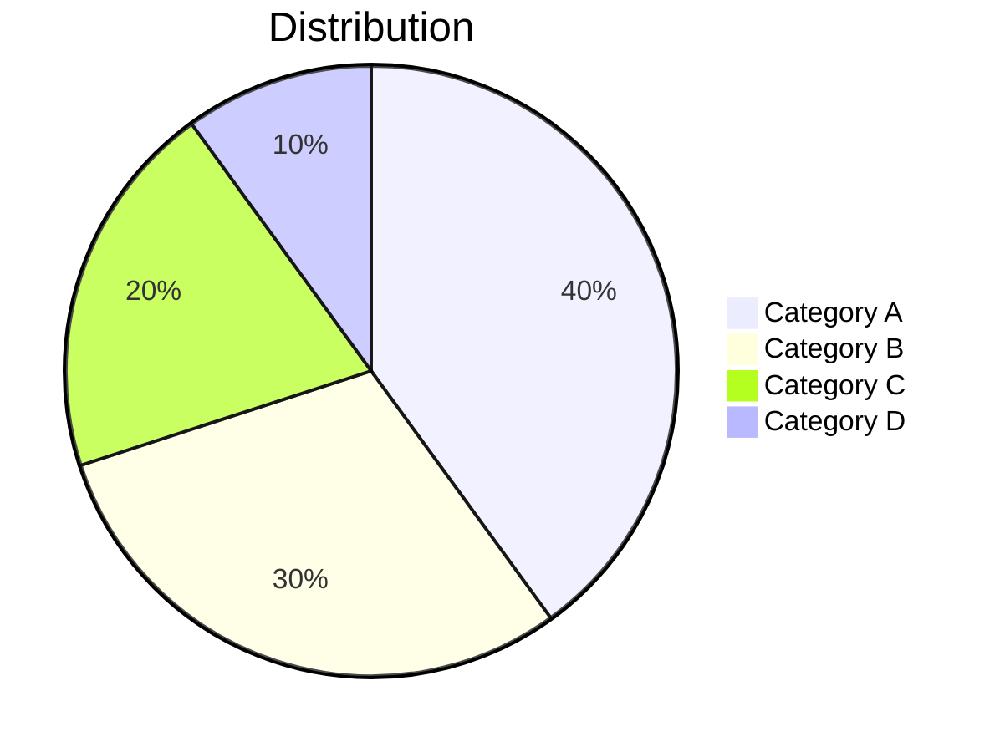

````markdown
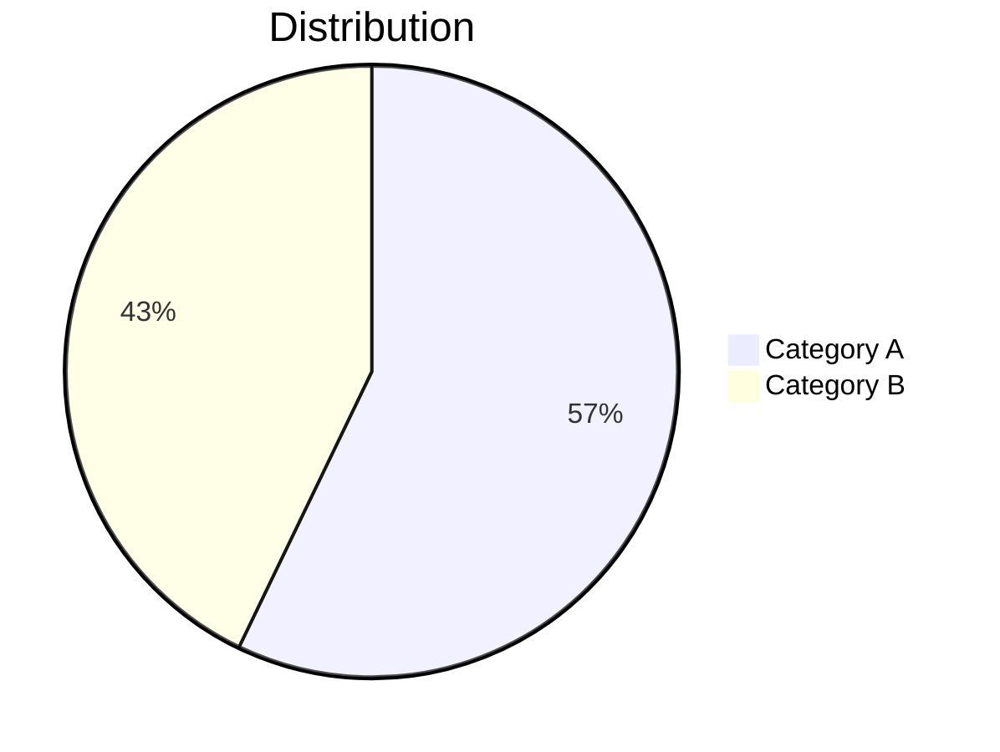
````

### Git 圖

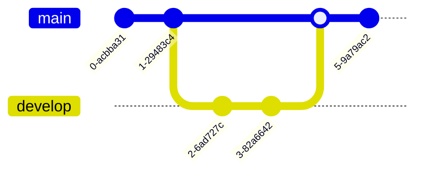

````markdown
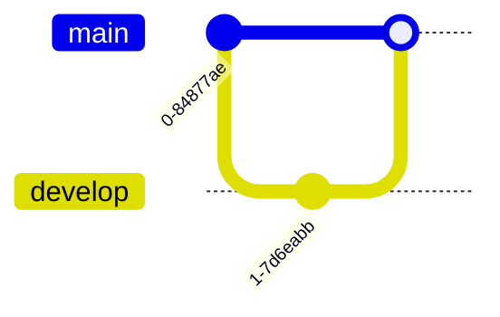
````

## 技巧

### 語法錯誤

若圖表有語法錯誤：
- 在所見即所得模式：程式碼區塊顯示原始碼
- 在原始碼模式：預覽顯示「Invalid mermaid syntax」

請參閱 [Mermaid 文件](https://mermaid.js.org/intro/)了解正確語法。

### 平移與縮放

在所見即所得模式中，渲染後的圖表支援互動式導覽：

| 操作 | 方式 |
|------|------|
| **平移** | 滾動或點擊拖曳圖表 |
| **縮放** | 按住 `Cmd`（macOS）或 `Ctrl`（Windows/Linux）並滾動 |
| **重置** | 點擊懸停時出現的重置按鈕（右上角） |

### 複製 Mermaid 原始碼

在所見即所得模式中編輯 mermaid 程式碼區塊時，編輯標題列會出現 **複製** 按鈕。點擊即可將 mermaid 原始碼複製至剪貼簿。

### 主題整合

Mermaid 圖表會自動適應 VMark 目前的主題（White、Paper、Mint、Sepia 或 Night）。

### 匯出為 PNG

在所見即所得模式中，懸停在渲染後的 mermaid 圖表上，可顯示 **匯出** 按鈕（右上角，位於重置按鈕左側）。點擊以選擇主題：

| 主題 | 背景 |
|------|------|
| **明亮** | 白色背景 |
| **深色** | 深色背景 |

圖表以 2x 解析度 PNG 格式透過系統儲存對話框匯出。匯出的圖片使用具體的系統字型堆疊，確保文字在各平台正確渲染。

### 匯出為 HTML/PDF

將完整文件匯出為 HTML 或 PDF 時，Mermaid 圖表會渲染為 SVG 圖片，在任何解析度下均清晰顯示。

## 修復 AI 生成的圖表

VMark 使用 **Mermaid v11**，其解析器（Langium）比舊版更嚴格。AI 工具（ChatGPT、Claude、Copilot 等）常生成適用於舊版 Mermaid 的語法，但在 v11 中會失敗。以下是最常見的問題及修復方式。

### 1. 含特殊字元的標籤未加引號

**最常見的問題。** 若節點標籤包含括號、單引號、冒號或引號，必須用雙引號包覆。

````markdown
<!-- 失敗 -->
```mermaid
flowchart TD
    A[User's Dashboard] --> B[Step (optional)]
    C[Status: Active] --> D[Say "Hello"]
```

<!-- 成功 -->
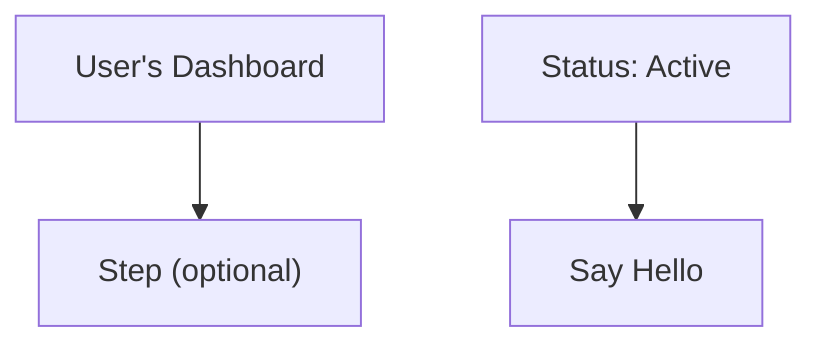
````

**規則：** 若標籤包含以下任一字元 — `' ( ) : " ; # &` — 請將整個標籤用雙引號包覆：`["像這樣"]`。

### 2. 行尾分號

AI 模型有時會在行尾加上分號。Mermaid v11 不允許這樣做。

````markdown
<!-- 失敗 -->
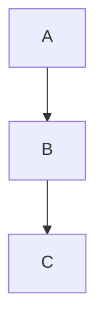

<!-- 成功 -->
```mermaid
flowchart TD
    A --> B
    B --> C
```
````

### 3. 使用 `graph` 代替 `flowchart`

`graph` 關鍵字是舊版語法。某些較新的功能僅適用於 `flowchart`。建議所有新圖表使用 `flowchart`。

````markdown
<!-- 可能因較新語法而失敗 -->
```mermaid
graph TD
    A --> B
```

<!-- 建議使用 -->
```mermaid
flowchart TD
    A --> B
```
````

### 4. 子圖標題含特殊字元

子圖標題遵循與節點標籤相同的引號規則。

````markdown
<!-- 失敗 -->
```mermaid
flowchart TD
    subgraph Service Layer (Backend)
        A --> B
    end
```

<!-- 成功 -->
```mermaid
flowchart TD
    subgraph "Service Layer (Backend)"
        A --> B
    end
```
````

### 5. 快速修復清單

當 AI 生成的圖表顯示「Invalid syntax」時：

1. **為所有含特殊字元的標籤加引號**：`["Label (with parens)"]`
2. **移除每行末尾的分號**
3. **若使用較新語法功能，將 `graph` 替換為 `flowchart`**
4. **為含特殊字元的子圖標題加引號**
5. **在 [Mermaid 線上編輯器](https://mermaid.live/)測試** 以精確定位錯誤

::: tip
向 AI 請求生成 Mermaid 圖表時，可在提示中加入：*「使用 Mermaid v11 語法。若節點標籤含特殊字元，請一律用雙引號包覆。不要使用行尾分號。」*
:::

## 訓練 AI 生成有效的 Mermaid 語法

與其每次手動修復圖表，不如安裝工具教導你的 AI 程式設計助手從一開始就生成正確的 Mermaid v11 語法。

### Mermaid 技能（語法參考）

技能可讓你的 AI 存取所有 23 種圖表類型的最新 Mermaid 語法文件，讓它生成正確的程式碼而非瞎猜。

**來源：** [WH-2099/mermaid-skill](https://github.com/WH-2099/mermaid-skill)

#### Claude Code

```bash
# 複製技能
git clone https://github.com/WH-2099/mermaid-skill.git /tmp/mermaid-skill

# 全域安裝（在所有專案中可用）
mkdir -p ~/.claude/skills/mermaid
cp -r /tmp/mermaid-skill/.claude/skills/mermaid/* ~/.claude/skills/mermaid/

# 或僅安裝至目前專案
mkdir -p .claude/skills/mermaid
cp -r /tmp/mermaid-skill/.claude/skills/mermaid/* .claude/skills/mermaid/
```

安裝後，在 Claude Code 中使用 `/mermaid <描述>` 生成語法正確的圖表。

#### Codex（OpenAI）

```bash
# 相同檔案，不同位置
mkdir -p ~/.codex/skills/mermaid
cp -r /tmp/mermaid-skill/.claude/skills/mermaid/* ~/.codex/skills/mermaid/
```

#### Gemini CLI（Google）

Gemini CLI 從 `~/.gemini/` 或每個專案的 `.gemini/` 讀取技能。複製參考檔案並在 `GEMINI.md` 中加入說明：

```bash
mkdir -p ~/.gemini/skills/mermaid
cp -r /tmp/mermaid-skill/.claude/skills/mermaid/references ~/.gemini/skills/mermaid/
```

然後加入你的 `GEMINI.md`（全域 `~/.gemini/GEMINI.md` 或每個專案）：

```markdown
## Mermaid Diagrams

When generating Mermaid diagrams, read the syntax reference in
~/.gemini/skills/mermaid/references/ for the diagram type you are
generating. Use Mermaid v11 syntax: always quote node labels containing
special characters, do not use trailing semicolons, prefer "flowchart"
over "graph".
```

### Mermaid 驗證器 MCP 伺服器（語法檢查）

MCP 伺服器可讓你的 AI 在呈現給你之前 **驗證** 圖表。它使用 Mermaid v11 內部使用的相同解析器（Jison + Langium）捕捉錯誤。

**來源：** [fast-mermaid-validator-mcp](https://github.com/ai-of-mine/fast-mermaid-validator-mcp)

#### Claude Code

```bash
# 一行指令 — 全域安裝
claude mcp add -s user --transport stdio mermaid-validator \
  -- npx -y @ai-of-mine/fast-mermaid-validator-mcp --mcp-stdio
```

此指令註冊一個 `mermaid-validator` MCP 伺服器，提供三個工具：

| 工具 | 用途 |
|------|------|
| `validate_mermaid` | 檢查單一圖表的語法 |
| `validate_file` | 驗證 Markdown 檔案中的圖表 |
| `get_examples` | 取得所有 28 種支援類型的範例圖表 |

#### Codex（OpenAI）

```bash
codex mcp add --transport stdio mermaid-validator \
  -- npx -y @ai-of-mine/fast-mermaid-validator-mcp --mcp-stdio
```

#### Claude Desktop

加入你的 `claude_desktop_config.json`（設定 > 開發人員 > 編輯設定）：

```json
{
  "mcpServers": {
    "mermaid-validator": {
      "command": "npx",
      "args": ["-y", "@ai-of-mine/fast-mermaid-validator-mcp", "--mcp-stdio"]
    }
  }
}
```

#### Gemini CLI（Google）

加入你的 `~/.gemini/settings.json`（或每個專案的 `.gemini/settings.json`）：

```json
{
  "mcpServers": {
    "mermaid-validator": {
      "command": "npx",
      "args": ["-y", "@ai-of-mine/fast-mermaid-validator-mcp", "--mcp-stdio"]
    }
  }
}
```

::: info 前置需求
兩個工具均需在你的電腦上安裝 [Node.js](https://nodejs.org/)（v18 或更新版本）。MCP 伺服器會在首次使用時透過 `npx` 自動下載。
:::

## 學習 Mermaid 語法

VMark 渲染標準的 Mermaid 語法。要掌握圖表建立技巧，請參閱官方 Mermaid 文件：

### 官方文件

| 圖表類型 | 文件連結 |
|----------|---------|
| 流程圖 | [流程圖語法](https://mermaid.js.org/syntax/flowchart.html) |
| 時序圖 | [時序圖語法](https://mermaid.js.org/syntax/sequenceDiagram.html) |
| 類別圖 | [類別圖語法](https://mermaid.js.org/syntax/classDiagram.html) |
| 狀態圖 | [狀態圖語法](https://mermaid.js.org/syntax/stateDiagram.html) |
| 實體關係圖 | [ER 圖語法](https://mermaid.js.org/syntax/entityRelationshipDiagram.html) |
| 甘特圖 | [甘特圖語法](https://mermaid.js.org/syntax/gantt.html) |
| 圓餅圖 | [圓餅圖語法](https://mermaid.js.org/syntax/pie.html) |
| Git 圖 | [Git 圖語法](https://mermaid.js.org/syntax/gitgraph.html) |

### 練習工具

- **[Mermaid 線上編輯器](https://mermaid.live/)** — 互動式測試場，在貼入 VMark 前測試和預覽圖表
- **[Mermaid 文件](https://mermaid.js.org/)** — 包含所有圖表類型範例的完整參考

::: tip
線上編輯器非常適合試驗複雜圖表。待圖表效果滿意後，再將程式碼複製到 VMark。
:::
