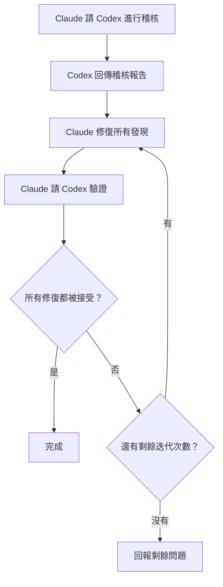

# 跨模型驗證

VMark 使用兩個相互挑戰的 AI 模型：**Claude 撰寫程式碼，Codex 稽核它**。這種對抗性設定能捕捉到單一模型會遺漏的 Bug。

## 為什麼兩個模型勝過一個

每個 AI 模型都有盲點。它可能系統性地遺漏某類 Bug、偏愛某些模式而忽略更安全的替代方案，或無法質疑自己的假設。當同一個模型撰寫並審閱程式碼時，這些盲點在兩次過程中都會倖存。

跨模型驗證打破了這個問題：

1. **Claude**（Anthropic）撰寫實作 — 它了解完整情境、遵循專案慣例並應用 TDD。
2. **Codex**（OpenAI）獨立稽核結果 — 它以全新的眼光閱讀程式碼，基於不同的訓練資料，帶著不同的失敗模式。

這兩個模型是真正不同的。它們由不同的團隊建置，在不同的資料集上訓練，具有不同的架構和最佳化目標。當兩者都認同程式碼是正確的，你的信心遠高於單一模型的「看起來沒問題」。

研究從多個角度支持這種方法。多代理辯論 — 多個 LLM 實例相互挑戰各自的回應 — 能顯著提升事實準確性和推理能力[^1]。角色扮演提示，即為模型分配特定的專家角色，在推理基準測試上始終優於標準零樣本提示[^2]。而近期研究顯示，前沿 LLM 能偵測到自己正在被評估，並相應調整行為[^3] — 這意味著一個知道其輸出將被另一個 AI 審查的模型，很可能會生產更謹慎、更少諂媚的工作成果[^4]。

### 跨模型能發現什麼

在實際使用中，第二個模型會發現以下問題：

- 第一個模型自信地引入的 **邏輯錯誤**
- 第一個模型沒有考慮到的 **邊界情況**（null、空值、Unicode、並發存取）
- 重構後留下的 **死程式碼**
- 一個模型的訓練沒有標記的 **安全模式**（路徑遍歷、注入攻擊）
- 撰寫模型合理化掉的 **慣例違反**
- 模型以細微錯誤複製程式碼的 **複製貼上 Bug**

這與人工程式碼審閱背後的原則相同 — 第二雙眼睛能發現作者看不見的問題 — 只是「審閱者」和「作者」都是不知疲倦的，而且能在幾秒鐘內處理整個程式碼庫。

## 在 VMark 中如何運作

### Codex Toolkit 插件

VMark 使用 `codex-toolkit@xiaolai` Claude Code 插件，它將 Codex 打包為 MCP 伺服器。啟用插件後，Claude Code 自動獲得一個 `codex` MCP 工具的存取權 — 這是一個向 Codex 發送提示並接收結構化回應的管道。Codex 在 **沙盒化的唯讀情境** 中執行：它可以讀取程式碼庫，但無法修改檔案。所有變更由 Claude 做出。

### 設定

1. 全域安裝 Codex CLI 並進行認證：

```bash
npm install -g @openai/codex
codex login                   # 使用 ChatGPT 訂閱登入（推薦）
```

2. 新增 xiaolai 插件市集（僅首次需要）：

```bash
claude plugin marketplace add xiaolai/claude-plugin-marketplace
```

3. 在 Claude Code 中安裝並啟用 codex-toolkit 插件：

```bash
claude plugin install codex-toolkit@xiaolai --scope project
```

4. 確認 Codex 可用：

```bash
codex --version
```

就這樣。插件會自動註冊 Codex MCP 伺服器 — 不需要手動添加 `.mcp.json` 項目。

::: tip 訂閱制 vs API
使用 `codex login`（ChatGPT 訂閱）而非 `OPENAI_API_KEY`，費用可大幅降低。參見[訂閱制 vs API 計費](/zh-TW/guide/users-as-developers/subscription-vs-api)。
:::

::: tip macOS GUI 應用程式的 PATH 問題
macOS GUI 應用程式只有最基本的 PATH。如果 `codex --version` 在你的終端機中能運作，但 Claude Code 找不到它，請將 Codex 二進位檔的位置加入你的 Shell 設定檔（`~/.zshrc` 或 `~/.bashrc`）。
:::

::: tip 專案設定
執行 `/codex-toolkit:init` 以生成包含專案特定預設值的 `.codex-toolkit.md` 設定檔（稽核重點、努力程度、跳過模式）。
:::

## 斜線指令

`codex-toolkit` 插件提供預建的斜線指令，用於協調 Claude + Codex 工作流程。你不需要手動管理互動 — 只需呼叫指令，模型就會自動協調。

### `/codex-toolkit:audit` — 程式碼稽核

主要稽核指令。支援兩種模式：

- **Mini（預設）** — 快速 5 維度檢查：邏輯、重複、死程式碼、重構債務、捷徑
- **Full（`--full`）** — 深入 9 維度稽核，另加安全性、性能、合規性、依賴項、文件

| 維度 | 檢查內容 |
|------|---------|
| 1. 冗餘程式碼 | 死程式碼、重複、未使用的匯入 |
| 2. 安全性 | 注入攻擊、路徑遍歷、XSS、硬編碼秘密 |
| 3. 正確性 | 邏輯錯誤、競爭條件、null 處理 |
| 4. 合規性 | 專案慣例、Zustand 模式、CSS 令牌 |
| 5. 可維護性 | 複雜度、檔案大小、命名、匯入整潔度 |
| 6. 性能 | 不必要的重新渲染、阻塞操作 |
| 7. 測試 | 覆蓋率差距、缺少邊界情況測試 |
| 8. 依賴項 | 已知 CVE、設定安全性 |
| 9. 文件 | 缺少文件、過時注釋、網站同步 |

使用方式：

```
/codex-toolkit:audit                  # 對未提交的變更進行 Mini 稽核
/codex-toolkit:audit --full           # 完整 9 維度稽核
/codex-toolkit:audit commit -3        # 稽核最後 3 次提交
/codex-toolkit:audit src/stores/      # 稽核特定目錄
```

輸出是一份包含嚴重性評級（Critical / High / Medium / Low）和每個發現的建議修復方案的結構化報告。

### `/codex-toolkit:verify` — 驗證先前的修復

修復稽核發現後，讓 Codex 確認修復是否正確：

```
/codex-toolkit:verify                 # 驗證上次稽核的修復
```

Codex 重新讀取報告位置的每個檔案，並將每個問題標記為已修復、未修復或部分修復。它還會抽查修復是否引入了新問題。

### `/codex-toolkit:audit-fix` — 完整循環

最強大的指令。它將稽核 → 修復 → 驗證串聯成一個循環：

```
/codex-toolkit:audit-fix              # 對未提交的變更執行循環
/codex-toolkit:audit-fix commit -1    # 對最後一次提交執行循環
```

執行過程如下：



當 Codex 所有嚴重性等級都回報零發現時，或經過 3 次迭代後（此時剩餘問題會回報給你），循環才會退出。

### `/codex-toolkit:implement` — 自主實作

將計畫發送給 Codex 進行完整的自主實作：

```
/codex-toolkit:implement              # 依據計畫實作
```

### `/codex-toolkit:bug-analyze` — 根本原因分析

對使用者描述的 Bug 進行根本原因分析：

```
/codex-toolkit:bug-analyze            # 分析一個 Bug
```

### `/codex-toolkit:review-plan` — 計畫審閱

將計畫發送給 Codex 進行架構審閱：

```
/codex-toolkit:review-plan            # 審閱計畫的一致性和風險
```

### `/codex-toolkit:continue` — 繼續工作階段

繼續上一個 Codex 工作階段以迭代發現：

```
/codex-toolkit:continue               # 從你上次離開的地方繼續
```

### `/fix-issue` — 端對端 Issue 解決器

這個專案特定指令針對 GitHub Issue 執行完整流水線：

```
/fix-issue #123               # 修復單一 Issue
/fix-issue #123 #456 #789     # 並行修復多個 Issue
```

流水線：
1. **擷取** GitHub 的 Issue
2. **分類**（Bug、功能或問題）
3. **建立分支**，帶有描述性名稱
4. **修復**，使用 TDD（RED → GREEN → REFACTOR）
5. **Codex 稽核循環**（最多 3 輪稽核 → 修復 → 驗證）
6. **關卡**（`pnpm check:all` + 若 Rust 有變更則執行 `cargo check`）
7. **建立 PR**，帶有結構化描述

跨模型稽核內建於步驟 5 — 每個修復在 PR 建立之前都要經過對抗性審閱。

## 專業代理和規劃

除了稽核指令，VMark 的 AI 設定還包括更高層次的協調：

### `/feature-workflow` — 代理驅動的開發

對於複雜功能，這個指令部署一組專業子代理：

| 代理 | 角色 |
|------|------|
| **規劃者** | 研究最佳實踐、腦力激盪邊界情況、產出模組化計畫 |
| **規格守護者** | 針對專案規則和規格驗證計畫 |
| **影響分析師** | 映射最小變更集和依賴邊緣 |
| **實作者** | TDD 驅動的實作，含預先調查 |
| **稽核者** | 審閱差異以確認正確性和規則遵從性 |
| **測試執行者** | 執行關卡，協調 E2E 測試 |
| **驗證者** | 發布前最終檢查清單 |
| **發布管理員** | 提交訊息和發布說明 |

使用方式：

```
/feature-workflow sidebar-redesign
```

### 規劃技能

規劃技能建立包含以下內容的結構化實作計畫：

- 明確的工作項目（WI-001、WI-002……）
- 每個項目的驗收標準
- 優先撰寫的測試（TDD）
- 風險緩解和回滾策略
- 涉及資料變更時的遷移計畫

計畫儲存到 `dev-docs/plans/`，供實作期間參考。

## 臨時 Codex 諮詢

除了結構化指令，你隨時可以請 Claude 諮詢 Codex：

```
總結你的困難，向 Codex 請求幫助。
```

Claude 會提出一個問題，透過 MCP 發送給 Codex，並將回應納入。當 Claude 陷入某個問題，或你想要對某個方法取得第二意見時，這很有用。

你也可以更具體：

```
請 Codex 評估這個 Zustand 模式是否可能導致過期狀態。
```

```
請 Codex 審閱這個遷移腳本中的 SQL 邊界情況。
```

## 備用：Codex 不可用時

如果 Codex MCP 不可用（未安裝、網路問題等），所有指令都會優雅地降級：

1. 指令首先 ping Codex（`Respond with 'ok'`）
2. 如果沒有回應：**手動稽核** 自動啟動
3. Claude 直接讀取每個檔案並執行相同的維度分析
4. 稽核仍然發生 — 只是單模型而非跨模型

你不必擔心因為 Codex 宕機而導致指令失敗。它們永遠會產生結果。

## 哲學

這個想法很簡單：**信任，但要用不同的大腦來驗證。**

人類團隊自然地這樣做。開發者撰寫程式碼，同事審閱它，QA 工程師測試它。每個人帶來不同的經驗、不同的盲點和不同的心智模型。VMark 將同樣的原則應用於 AI 工具：

- **不同的訓練資料** → 不同的知識差距
- **不同的架構** → 不同的推理模式
- **不同的失敗模式** → 一個捕捉到而另一個遺漏的 Bug

成本極低（每次稽核只需幾秒鐘的 API 時間），但品質提升是實質性的。根據 VMark 的經驗，第二個模型通常每次稽核能發現 2–5 個第一個模型遺漏的額外問題。

[^1]: Du, Y., Li, S., Torralba, A., Tenenbaum, J.B., & Mordatch, I. (2024). [Improving Factuality and Reasoning in Language Models through Multiagent Debate](https://arxiv.org/abs/2305.14325). *ICML 2024*. 多個 LLM 實例在幾輪中相互提出和辯論回應，能顯著提升事實準確性和推理能力，即使所有模型最初都給出錯誤答案。

[^2]: Kong, A., Zhao, S., Chen, H., Li, Q., Qin, Y., Sun, R., & Zhou, X. (2024). [Better Zero-Shot Reasoning with Role-Play Prompting](https://arxiv.org/abs/2308.07702). *NAACL 2024*. 為 LLM 分配任務特定的專家角色，在 12 個推理基準測試上始終優於標準零樣本和零樣本思維鏈提示。

[^3]: Needham, J., Edkins, G., Pimpale, G., Bartsch, H., & Hobbhahn, M. (2025). [Large Language Models Often Know When They Are Being Evaluated](https://arxiv.org/abs/2505.23836). 前沿模型能區分評估情境和真實世界部署（Gemini-2.5-Pro 達到 AUC 0.83），這對模型知道另一個 AI 將審閱其輸出時的行為方式有影響。

[^4]: Sharma, M., Tong, M., Korbak, T., et al. (2024). [Towards Understanding Sycophancy in Language Models](https://arxiv.org/abs/2310.13548). *ICLR 2024*. 經過人類反饋訓練的 LLM 傾向於迎合使用者現有的信念，而不是提供真實的回應。當評估者是另一個 AI 而不是人類時，這種諂媚壓力被消除，導致更誠實和嚴謹的輸出。
